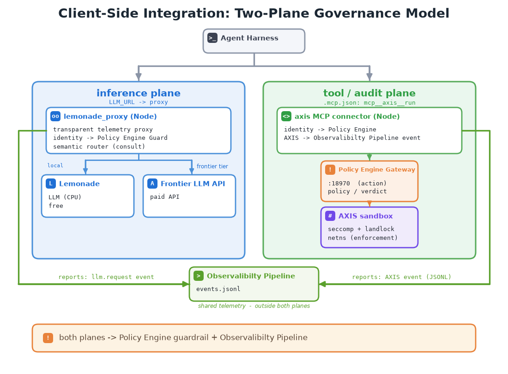

<!--
Copyright © Advanced Micro Devices, Inc., or its affiliates.

SPDX-License-Identifier: MIT
-->

# Architecture deep-dive: Claude Code + Lemonade + AXIS + SQLite



The **deskside secure agent gateway** governs a coding agent entirely on **one
machine** — no orchestrator, no rack control plane. The optional **LLM router**
runs locally as a *consult-only* step inside the inference proxy (see below).

> This is the architecture reference. For the project overview and copy-paste
> quick-starts, start at the [top-level README](../README.md).

**Validated on Strix Halo** — the deskside target (AMD Ryzen AI Max+ 395,
unprivileged). Reproduce from [`platforms/halo/`](./platforms/halo/); setup in
[`SETUP.md`](./SETUP.md); results in [`RESULTS.md`](./RESULTS.md).

A coding agent (**Claude Code**) is governed on **both planes**:

- **Tool / audit plane** — every side-effecting action goes through a **new MCP
  connector** that (1) wraps each tool call in an **AXIS** sandbox
  (Landlock + seccomp + netns) and runs it locally, and (2) builds audit events
  + manages **agent session identity**, writing them to a local **SQLite**
  database.
- **Inference plane** — completions flow through a transparent **Lemonade
  telemetry proxy** ([`lemonade_proxy/`](./lemonade_proxy/)) that forwards each
  request byte-for-byte to the local Lemonade server while, on the side,
  optionally **consulting the vLLM Semantic Router** for a per-prompt tier
  decision (`LEMON_ROUTER=on`), and emitting an `llm.request` audit event (with
  a `routing` block) to the same SQLite database.

## The two-plane model


- **Inference plane** — Claude Code points `ANTHROPIC_BASE_URL` at the
  **lemonade_proxy**, not directly at Lemonade. The proxy forwards each request
  byte-for-byte to Lemonade's Anthropic-compatible API (a quantized Qwen3 model
  served locally on the APU), and on the side emits an `llm.request` event. With
  `LEMON_ROUTER=on` it also **consults** the vLLM Semantic Router per prompt: a
  hard prompt gets a **frontier** decision (escalate to a paid Anthropic-compatible
  gateway, e.g. an Anthropic-compatible `claude-*` endpoint) and a simple prompt stays **local**.
  The router is consult-only and **fail-open** — a router hiccup, or a frontier
  decision with no key configured, keeps the request on the local tier. Full A/B
  in [`../tests/router_test/`](../tests/router_test/).
- **Tool / audit plane** — Claude Code is launched with `Bash`, `Read`,
  `Write`, `Edit`, … **disallowed**, so the *only* way the model can act on the
  machine is the connector's `run` tool. That gives **complete audit coverage**:
  every action flows through AXIS + the SQLite audit event builder.

**AXIS = isolation/enforcement layer. The SQLite events = the audit record.**
AXIS *contains* every call at execution time — a dangerous command (e.g. reading
`~/.ssh`) has its syscall denied, so it exits non-zero and is recorded with
`decision=deny` — and the event records *what happened*.

## Layout

```
stack/
  README.md                 this file
  SETUP.md                  step-by-step bring-up on a Strix Halo deskside
  RESULTS.md                verified run results
  package.json              root npm package (for mcp_probe.mjs)
  axis_mcp_connector/       the NEW MCP connector (Node, @modelcontextprotocol/sdk)
    src/
      server.js             MCP stdio server; registers `run` + `session_info`
      identity.js           agent session identity (session/user/tenant/device, seq)
      axis.js               AXIS argv build + sandboxed exec + log stripping
      sqlite_events.js      SQLite audit event builder + local DB sink
      trace.js              per-turn trace reader (reads the proxy's trace statefile)
      otel.js               OTEL envelope (event_id, schema_version, resource, ...)
    test/                   node --test unit tests
  lemonade_proxy/           the INFERENCE-plane telemetry proxy (Node)
    src/
      server.js             transparent reverse proxy; router + llm.request
      router.js             SemanticRouterClient (consult-only classify, fail-open)
      identity.js           per-session identity for llm.* events
      anthropic.js          request/response + SSE parsing (Anthropic + OpenAI shapes)
      sqlite_events.js      llm.request/session builder (+ routing/gpu/otel blocks) + SQLite sink
      trace.js              per-turn trace authority (mints trace on a new user turn, writes statefile)
      otel.js               OTEL envelope + GenAI (gen_ai.*) span attributes
      gpu.js                amdgpu-sysfs GPU sampling for local inference (busy/mem/power/energy)
    test/                   node --test unit tests (routing, cross-plane, OTEL, trace, GPU)
  lemonade/
    run_lemonade.sh         install Lemonade, serve a local GGUF model on the APU
  mcp.json                  example .mcp.json registering the `axis` connector
  mcp_probe.mjs             scripted MCP client (control-plane test, model-independent)
  run_integration.sh        functional runner: does the governed loop work end-to-end?
  scripts/group_by_trace.py render a capture as a per-turn trace view (by_trace.md)
  platforms/                per-machine bring-up profiles (NOT stack components)
    halo/                   Strix Halo deskside: env/setup/run + native AXIS policy
  artifacts/                test outputs
```

### Functional verification

`run_integration.sh` is the functional runner. Green = the governed loop works:
an allowed command runs sandboxed, a dangerous command is *contained* by AXIS (a
denied syscall makes it exit non-zero, recorded as `decision=deny`), and both
planes audit under one session. Results: [`RESULTS.md`](./RESULTS.md).

## The connector pipeline (per `run` call)

1. **identity** — ensure the session is started (emit `axis.session_start`
   once); assign a `seq`. Session id from `AXIS_SESSION` or a minted `cc-<uuid>`;
   carries `user` / `tenant` / `device_id`.
2. **AXIS exec** — `axis run --policy <p> -- bash -c "<cmd>"`, capturing
   stdout/stderr/exit, with AXIS's own banners stripped. A dangerous command is
   *contained* here: the offending syscall is denied, so it exits non-zero and
   is recorded with `decision=deny`.
3. **SQLite event** — build an `axis.toolcall` event (identity + policy +
   redacted command + `decision` + result exit/duration) and write it to the
   local SQLite audit DB.
4. return stdout/stderr/exit to Claude Code.

On shutdown (stdin close / SIGTERM): emit `axis.session_end`.

The event schema is stable across both planes
(`axis.session_start | toolcall | session_end`, `identity.session`,
`policy.source`, `command.argv_redacted`, `decision`, `result.exit`) so they
land the same shape in SQLite.

## The inference-proxy pipeline (per completion, `lemonade_proxy/`)

The proxy is a transparent reverse proxy: non-message paths (health, model list)
are forwarded silently; only `POST /v1/messages` and `/v1/chat/completions`
produce telemetry. Per audited request:

1. **identity** — emit `llm.session_start` once; assign a `seq`.
2. **routing decision** (only if `LEMON_ROUTER=on`) — `router.route(prompt)`
   POSTs to the semantic-router classify API (`/api/v1/classify/intent`, **no
   inference, no Envoy**) and maps the recommended model to a **tier**: a
   `claude-*` / frontier-model recommendation ⇒ `frontier`, else `local`. Any
   error/timeout ⇒ `local` (fail-open).
3. **forward** — to the local Lemonade upstream **byte-for-byte**; only on a
   *honored* frontier escalation (router says frontier **and** a frontier key is
   set) does the proxy swap the upstream base, attach the frontier auth header,
   and rewrite the body `model`. A frontier decision without a key is **recorded
   but served local** (fail-safe).
4. **additive response headers** — `x-lemon-router`, `x-lemon-tier`,
   `x-lemon-selected-model`, `x-lemon-complexity` (the body is never altered).
5. **SQLite event** — build an `llm.request` event (identity + model + endpoint +
   timing + token counts + a **`routing` block**) into the same SQLite audit DB
   (`sourcetype=axis:llm`); `routing` is `null` on a plain passthrough build
   (router disabled). See [`TELEMETRY_CONTRACT.md`](./TELEMETRY_CONTRACT.md) §8.

On shutdown: emit `llm.session_end`. The two tiers:

| Tier | Backend | Cost | Route |
|------|---------|------|-------|
| local | Lemonade `Qwen3-8B-GGUF` on CPU (`:13305`) | free | simple / factual prompts |
| frontier | Anthropic-compatible gateway `claude-*` (configurable) | paid | hard reasoning / proofs / planning |

## One session id across both planes

The two planes run as **separate processes** with **independent lifecycles**
(each mints its own `*.session_start`/`*.session_end`, and `seq` counts per
plane). They only line up in SQLite if they stamp the **same**
`identity.session` — so a single query returns an agent's LLM calls *and* its
tool calls for one logical run. Getting that shared id is a small env-var
contract.

**How each plane resolves `identity.session`:**

| Plane | Source of truth | Resolution order | Minted fallback |
|-------|-----------------|------------------|-----------------|
| Tool / audit (`axis_mcp_connector`) | `AXIS_SESSION` | `AXIS_SESSION` | `cc-<uuid>` |
| Inference (`lemonade_proxy`) | `AXIS_SESSION` (with an `LLM_SESSION` override) | `LLM_SESSION` → `AXIS_SESSION` | `lp-<uuid>` |

**The contract: export one `AXIS_SESSION` and leave `LLM_SESSION` unset.**
Whatever launches Claude Code sets `AXIS_SESSION`; both planes inherit it (the
connector uses it directly, the proxy falls back to it because `LLM_SESSION` is
unset), so both emit under the same id:

```bash
# launcher sets ONE session id; both planes inherit it (LLM_SESSION stays unset)
export AXIS_SESSION="cc-$(uuidgen)"      # e.g. cc-9f31…
#   tool plane   -> identity.session = $AXIS_SESSION   (connector)
#   inference    -> identity.session = $AXIS_SESSION   (proxy, LLM_SESSION unset)
```

The result in the SQLite audit DB — six events, two planes, **one id**:

```
llm.session_start    cc-9f31…      (sourcetype=axis:llm)
llm.request          cc-9f31…      (sourcetype=axis:llm)
axis.session_start   cc-9f31…      (sourcetype=axis:toolcall)
axis.toolcall        cc-9f31…      (sourcetype=axis:toolcall)
axis.session_end     cc-9f31…
llm.session_end      cc-9f31…
```

```sql
-- both planes for one logical agent run
SELECT * FROM events WHERE json_extract(body, '$.identity.session') = 'cc-9f31…' ORDER BY time;
```

**Footgun:** setting a per-plane `LLM_SESSION` (or a different `AXIS_SESSION` per
process) makes the proxy stamp a *different* id and **breaks** correlation —
`LLM_SESSION` exists only as a deliberate per-plane override. With nothing
injected at all, each plane mints its own prefixed id (`cc-…` vs `lp-…`) so
unrelated runs never collide by accident.

This is proven end-to-end by `run_integration.sh` **stage 5** (boots the proxy
under the connector's `AXIS_SESSION` and asserts both planes emit one
`identity.session`) and locked at the code level by
`lemonade_proxy/test/cross_plane_session.test.js` (a future env-var rename or
fallback-order change fails the unit test). See
[`TELEMETRY_CONTRACT.md`](./TELEMETRY_CONTRACT.md) "the correlation seam".

## Configuration (env)

| Var | Default | Meaning |
|-----|---------|---------|
| `AXIS_BIN` | `axis` | AXIS binary |
| `AXIS_POLICY` | `/etc/axis/coding-agent.yaml` | AXIS policy file |
| `AUDIT_DB` | `$HOME/axis-audit.db` | SQLite audit DB path (written by both planes) |
| `AXIS_SESSION` | minted `cc-<uuid>` | session id |
| `AXIS_TRACE_STATE` | `${TMPDIR}/axis-trace-<session>.json` | shared per-turn trace statefile (proxy writes, connector reads); export the same value to both planes |
| `AXIS_USER` / `AXIS_TENANT` / `AXIS_DEVICE_ID` | derived | identity fields. `AXIS_USER` unset ⇒ the resolved OS login user (`identity.user_source=os`); set ⇒ `user_source=env`. No auth yet, so `user` is asserted — `user_source` records the trust level. |

### Inference proxy (`lemonade_proxy/`)

| Var | Default | Meaning |
|-----|---------|---------|
| `LEMON_PROXY_PORT` | `13399` | proxy listen port |
| `LEMON_UPSTREAM` | `http://127.0.0.1:13305` | local Lemonade upstream |
| `LEMON_ROUTER` | `off` | `on` = consult the semantic router per prompt |
| `SEMANTIC_ROUTER_URL` | `http://127.0.0.1:8088` | classify API base |
| `FRONTIER_UPSTREAM` | `https://<llm-gateway>/Anthropic` | frontier tier base (Anthropic-compatible) |
| `FRONTIER_MODEL` | `claude-opus-4.8` | model id written into the body on escalation |
| `FRONTIER_AUTH_HEADER` | `Ocp-Apim-Subscription-Key` | frontier auth header name (`x-api-key` for Anthropic direct) |
| `FRONTIER_AUTH_KEY` | `$GATEWAY_KEY` | frontier key; **absent ⇒ frontier decisions serve local (fail-safe)** |
| `FRONTIER_EXTRA_HEADERS` | `{}` | JSON of extra headers per frontier call. Anthropic-direct: `{"anthropic-version":"2023-06-01"}`. **Some gateways are account-dependent** — a few require extra headers, e.g. `{"anthropic-version":"vertex-2023-10-16","user":"<username>"}`; others need none. If escalation returns 4xx, set these. |
| `GPU_TELEMETRY` | `on` | `off` disables the local-inference GPU sampling block on `llm.request` |
| `GPU_SYSFS_PATH` | _(auto-discovered)_ | pin the amdgpu card device dir (`/sys/class/drm/cardN/device`) instead of auto-detecting |
| `LLM_USER` | `$AXIS_USER` | inference-plane user override; same `env`/`os` resolution + `user_source` as the tool plane |
| `AXIS_TRACE_STATE` | `${TMPDIR}/axis-trace-<session>.json` | shared per-turn trace statefile (this plane is the trace authority; it writes, the connector reads) |
| `AUDIT_DB` | _(shared)_ | same SQLite audit DB as the tool plane |

## Quick start

See [SETUP.md](./SETUP.md). The fastest validation is the **control-plane
probe** (model-independent):

```bash
cd stack
npm install && (cd axis_mcp_connector && npm install)
(cd axis_mcp_connector && node --test)     # connector unit tests (tool plane)
(cd lemonade_proxy && node --test)         # proxy unit tests (routing + cross-plane + OTEL + trace + GPU)
bash run_integration.sh                    # full end-to-end on one machine
```

The **inference proxy + semantic router A/B** (baseline vs `LEMON_ROUTER=on`,
with the routing block verified in the audit DB) has its own end-to-end runner in
[`../tests/router_test/`](../tests/router_test/).

---

## Terms of Use

AMD Solution Blueprints are released under the MIT License, which governs the parts of the software and materials created by AMD. Third-party Software and Materials used within the Solution Blueprints are governed by their respective licenses.
