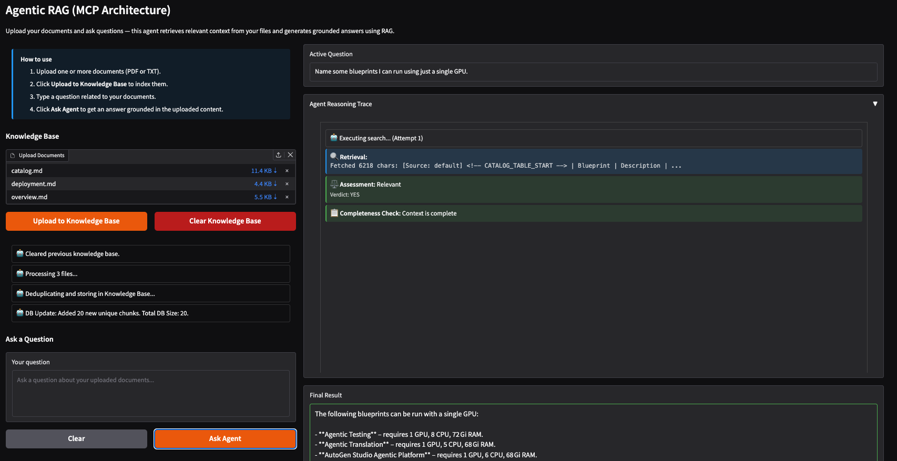

<!--
Copyright © Advanced Micro Devices, Inc., or its affiliates.

SPDX-License-Identifier: MIT
-->

# Agentic RAG

## Overview



This Solution Blueprint is an AI-powered document Q&A system that uses a LangGraph agent with Model Context Protocol (MCP) for modular, tool-based retrieval. The agent interprets user questions, iteratively searches a vector knowledge base via MCP tool calls, grades the retrieved context for relevance, and synthesizes a final answer using an LLM.

The architecture separates the reasoning agent from the data tools, allowing for a more modular and scalable deployment.

To summarize, the system consists of:

- MCP Server: Handles document embeddings, vector storage (ChromaDB), and retrieval tools.
- RAG Agent: The user interface and reasoning engine that connects to the MCP server to fetch context and generate answers.

AMD Solution Blueprints are packaged as [helm charts](https://helm.sh/) for deployment on a Kubernetes cluster. For development or further exploration, the source code is public and available in the [Solution Blueprints GitHub repository](https://github.com/amd-enterprise-ai/solution-blueprints/tree/main/solution-blueprints/agentic-rag).

## Architecture

<picture>
  <source media="(prefers-color-scheme: light)" srcset="architecture-diagram-light-scheme.png">
  <source media="(prefers-color-scheme: dark)" srcset="architecture-diagram-dark-scheme.png">
  
</picture>


The user uploads documents and asks questions through the Gradio web UI. Uploaded documents are chunked and indexed into ChromaDB via the MCP server. For each question, the RAG agent runs a LangGraph loop, reasoning with the LLM, retrieving relevant chunks through MCP tools, grading their relevance, and re-searching if needed, until a complete answer is assembled and streamed back to the UI.

| Component | Role |
| --- | --- |
| LLM Service | OpenAI-compatible endpoint (AIM vLLM or external), used for reasoning, grading, and answer synthesis |
| MCP Server | Exposes document tools (`build_knowledge_base`, `retrieve_documents`, `clear_database`, `get_database_stats`) via Model Context Protocol over SSE |
| Gradio UI | Web interface for uploading documents and asking questions, with live trace output |
| RAG Agent | LangGraph state machine that orchestrates LLM and MCP interactions |
| Embedding Service | vLLM-based embedding server that generates vector embeddings for document chunks and queries |
| ChromaDB | Persistent vector store used for MMR-based semantic retrieval |

### Key Features

* Document ingestion from PDF and TXT files into a persistent vector knowledge base
* Agentic retrieval loop: reason → search → grade → re-search until fully answered (max 3 searches)
* Relevance grading and deduplication of retrieved chunks before answer synthesis
* MCP-based tool separation: retrieval logic runs in an isolated pod, decoupled from the agent
* Real-time streaming of agent reasoning trace and final answer to the UI
* Connects to the MCP server via SSE transport with automatic tool discovery

## Getting Started

This is a quick start guide on how to deploy the blueprint. For advanced options, such as reusing an existing AIM, providing a Hugging Face token, or overriding storage classes, see [Deploying Solution Blueprints with Helm](https://enterprise-ai.docs.amd.com/en/latest/solution-blueprints/deployment.html) or explore the [advanced deployment guide](./DEPLOYMENT.md).

This blueprint supports **AMD Instinct** (default) and **AMD Radeon** platforms. The section below covers the default **Instinct** deployment. For Radeon deployment and other advanced options, see:

- [Deploy on AMD Instinct](DEPLOYMENT.md#amd-instinct-gpu-default)
- [Deploy on AMD Radeon](DEPLOYMENT.md#amd-radeon-gpu)

### Prerequisites

#### System Requirements

The following cluster resources are required by default:

| Resource | Default Configuration |
|--|-------------------|
| GPUs | 2 |
| CPUs | 13 CPU cores |
| RAM | 272 Gi RAM |

To deploy to the Kubernetes cluster, ensure the following prerequisites are met:

- [kubectl](https://kubernetes.io/docs/tasks/tools/): Installed and configured to communicate with the cluster
- [Helm](https://helm.sh/docs/intro/install/) 3.17 or higher installed on your local machine

### Deployment

Solution Blueprints are packaged as OCI-compliant Helm charts in the Docker Hub registry and can be deployed to a Kubernetes cluster with a single command. Define the `name` (deployment name) and the `namespace` (Kubernetes namespace), then pipe the output of `helm template` to `kubectl apply -f -`:

```bash
name="my-deployment"
namespace="my-namespace"
helm template $name oci://registry-1.docker.io/amdenterpriseai/aimsb-agentic-rag \
  | kubectl apply -f - -n $namespace
```

Note: You can create a namespace using `kubectl create namespace $namespace`.

To check the status of the deployment, run:

```bash
kubectl get pods -n $namespace
```

Wait until all pods report `Running` and `Ready`.

### Connect to UI

To connect to the UI, port-forward to any chosen port, e.g., 7860. The UI will then be available at [http://localhost:7860](http://localhost:7860) in your browser.

```bash
kubectl port-forward services/aimsb-agentic-rag-${name}-agent-app 7860:80 -n $namespace
```

### Clean Up

When you are finished, remove the deployed resources:

```bash
helm template $name oci://registry-1.docker.io/amdenterpriseai/aimsb-agentic-rag \
  | kubectl delete -f - -n $namespace
```

## Third-party Components

This Solution Blueprint utilizes multiple components. For third-party license information, refer to each component's documentation. Key third-party components are listed below.

| Component | License |
|---------|---------|
| LangGraph | MIT |
| LangChain | MIT |
| MCP (Model Context Protocol) | MIT |
| FastMCP | Apache-2.0 |
| Gradio | Apache-2.0 |
| ChromaDB | Apache-2.0 |
| vLLM | Apache-2.0 |
| PyMuPDF | AGPL-3.0 |

## Terms of Use

AMD Solution Blueprints are released under the [MIT License](https://opensource.org/license/mit), which governs the parts of the software and materials created by AMD. Third-party software and materials used within the Solution Blueprints are governed by their respective licenses.
