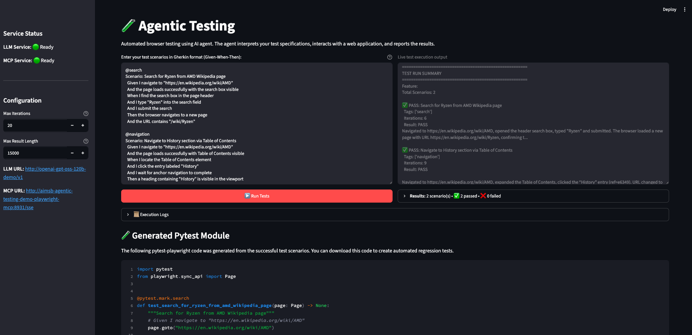

<!--
Copyright © Advanced Micro Devices, Inc., or its affiliates.

SPDX-License-Identifier: MIT
-->

# Agentic Testing

## Overview



This Solution Blueprint is an AI-powered UI testing framework that uses an LLM agent with Model Context Protocol (MCP) for automated web testing. The agent interprets Gherkin-style Given-When-Then test specifications and executes them via MCP tool calls, providing real-time feedback during test execution. After completing the test run, the application generates a downloadable Pytest module that can independently re-run the same browser tests.

AMD Solution Blueprints are packaged as [helm charts](https://helm.sh/) for deployment on a Kubernetes cluster. For development or further exploration, the source code is public and available in the [Solution Blueprints GitHub repository](https://github.com/amd-enterprise-ai/solution-blueprints/tree/main/solution-blueprints/agentic-testing).

## Architecture

<picture>
  <source media="(prefers-color-scheme: light)" srcset="architecture-diagram-light-scheme.png">
  <source media="(prefers-color-scheme: dark)" srcset="architecture-diagram-dark-scheme.png">
  
</picture>

The user enters test specifications in Gherkin format (Given-When-Then syntax) through the Streamlit web UI. The UI provides real-time feedback during test execution, displaying live logs and results as the agent interacts with the browser via Playwright MCP.

| Component | Role |
| --- | --- |
| LLM Service | OpenAI-compatible endpoint (AIM vLLM or external), used for test reasoning and interpretation |
| Playwright MCP Server | Exposes browser automation tools via Model Context Protocol |
| Streamlit UI | Web interface |
| Testing Agent | Python-based orchestrator that connects LLM reasoning with MCP browser automation |

### Key Features

* Web-based UI for entering Gherkin (Given-When-Then) test specifications
* Real-time test execution logs and progress tracking
* Browser automation via Playwright MCP server
* LLM service health monitoring in the UI sidebar
* Connects to MCP server via SSE transport with automatic tool discovery
* Pytest module generation from successful test scenarios

## Getting Started

This is a quick start guide on how to deploy the blueprint. For advanced options, such as reusing an existing AIM, providing a Hugging Face token, or overriding storage classes, see [Deploying Solution Blueprints with Helm](https://enterprise-ai.docs.amd.com/en/latest/solution-blueprints/deployment.html) or explore the [advanced deployment guide](./DEPLOYMENT.md).

This blueprint supports **AMD Instinct** (default) and **AMD Radeon** platforms. The section below covers the default **Instinct** deployment. For Radeon deployment and other advanced options, see:

- [Deploy on AMD Instinct](DEPLOYMENT.md#amd-instinct-gpu-default)
- [Deploy on AMD Radeon](DEPLOYMENT.md#amd-radeon-gpu)

### Prerequisites

#### System Requirements

The following cluster resources are required by default:

| Resource | Default Configuration |
|--|-------------------|
| GPUs | 1 |
| CPUs | 8 CPU cores |
| RAM | 72 Gi RAM |

To deploy to the Kubernetes cluster, ensure the following prerequisites are met:

- [kubectl](https://kubernetes.io/docs/tasks/tools/): Installed and configured to communicate with the cluster
- [Helm](https://helm.sh/docs/intro/install/) 3.17 or higher installed on your local machine

### Deployment

Solution Blueprints are packaged as OCI-compliant Helm charts in the Docker Hub registry and can be deployed to a Kubernetes cluster with a single command. Define the `name` (deployment name) and the `namespace` (Kubernetes namespace), then pipe the output of `helm template` to `kubectl apply -f -`:

```bash
name="my-deployment"
namespace="my-namespace"
helm template $name oci://registry-1.docker.io/amdenterpriseai/aimsb-agentic-testing \
  | kubectl apply -f - -n $namespace
```

Note: You can create a namespace using `kubectl create namespace $namespace`

To check the status of the deployment, run:

```bash
kubectl get pods -n $namespace
```

Wait until all pods report `Running` and `Ready`.

### Connect to UI

To connect to the UI, port-forward to any chosen port, e.g., 8501. The UI will then be available at [http://localhost:8501](http://localhost:8501) in your browser.

```bash
kubectl port-forward services/aimsb-agentic-testing-${name}-ui 8501:8501 -n $namespace
```

### Clean Up

When you are finished, remove the deployed resources:

```bash
helm template $name oci://registry-1.docker.io/amdenterpriseai/aimsb-agentic-testing \
  | kubectl delete -f - -n $namespace
```


## Third-party Components

This Solution Blueprint utilizes multiple components. For third-party license information, refer to each component's documentation. Key third-party components are listed below.

| Component | License |
|---------|---------|
| Playwright MCP | Apache-2.0 |
| OpenAI Python SDK | Apache-2.0 |
| Streamlit | Apache-2.0 |
| MCP (Model Context Protocol) | MIT |

## Terms of Use

AMD Solution Blueprints are released under the [MIT License](https://opensource.org/license/mit), which governs the parts of the software and materials created by AMD. Third-party software and materials used within the Solution Blueprint are governed by their respective licenses.
