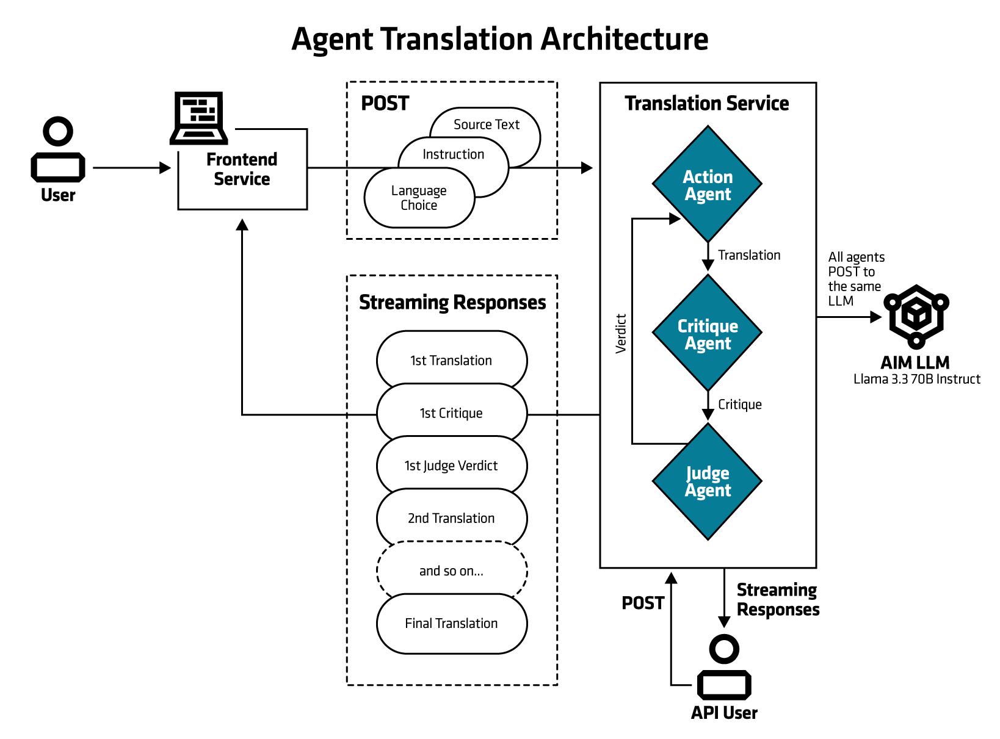

<!--
Copyright © Advanced Micro Devices, Inc., or its affiliates.

SPDX-License-Identifier: MIT
-->

# Agentic translation

This translation blueprint illustrates how language translation can be implemented using AIMs. It is using agentic translation, employing multiple LLM agents agents working collaboratively — where models critique, evaluate, and refine each other's outputs — to improve the overall quality of the translation.

This blueprint follows a trilateral collaboration framework from [arXiv:2405.11804](https://arxiv.org/abs/2405.11804) with an *Action agent*, *Critique agent*, and *Judgment agent* iteratively contributing to the translation task until the Judgment agent approves the output. The prompting strategy is adapted from [andrewyng/translation-agent](https://github.com/andrewyng/translation-agent/tree/main).

## Architecture

<picture>
  <source media="(prefers-color-scheme: light)" srcset="architecture-diagram-light-scheme.png">
  <source media="(prefers-color-scheme: dark)" srcset="architecture-diagram-dark-scheme.png">
  
</picture>

## Key Features

* The agentic translation can incorporate any additional user-provided instructions.
* Users can freely use any languages supported by the underlying LLM
* The conversation between the agents is made visible to the user.
* If the input text exceeds the model’s context window, it is automatically split into smaller chunks for processing.

## Software

 AIM Solution Blueprints are Kubernetes applications packaged with [Helm](https://helm.sh/). It takes one click to launch them in an AMD Enterprise AI cluster and test them out.

 This blueprint primarily uses the following components:

* AIMs - Large enough model for multi-language translation.
    * Default in this blueprint is Llama-3.3-70b
* Streamlit - provides the web-based user interface.
* LangChain - implementation of the agents.

## System Requirements

Kubernetes cluster with AMD GPU nodes (exact number of GPUs depends on AIM LLM)

## Third-party Code and Libraries

* Translation Agent: Agentic translation using reflection workflow
    * Original source: https://github.com/andrewyng/translation-agent
    * License: MIT https://github.com/andrewyng/translation-agent?tab=MIT-1-ov-file

## Terms of Use

AMD Solution Blueprints are released under [MIT License](https://opensource.org/license/mit), which governs the parts of the software and materials created by AMD. Third party Software and Materials used within the Solution Blueprints are governed by their respective licenses.
