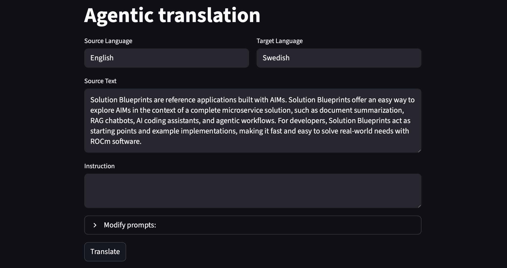
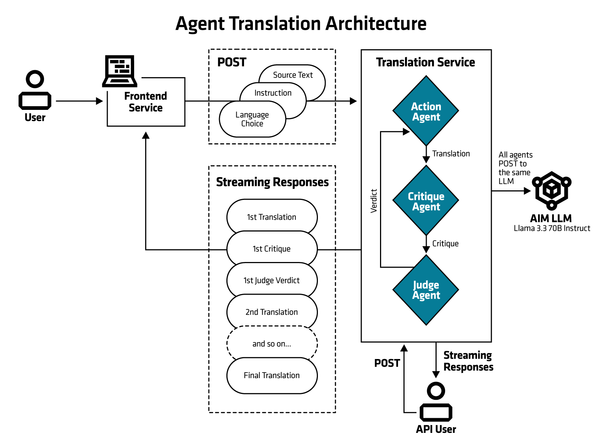

<!--
Copyright © Advanced Micro Devices, Inc., or its affiliates.

SPDX-License-Identifier: MIT
-->

# Agentic Translation

## Overview



This Solution Blueprint illustrates how language translation can be implemented using AIMs. It uses agentic translation, employing multiple LLM agents working collaboratively, where models critique, evaluate, and refine each other's outputs to improve the overall quality of the translation.

The blueprint follows a trilateral collaboration framework from [Wu _et al._](https://arxiv.org/abs/2405.11804) with an *Action agent*, *Critique agent*, and *Judgment agent* iteratively contributing to the translation task until the Judgment agent approves the output. The prompting strategy is adapted from [Andrew Ng's example](https://github.com/andrewyng/translation-agent/tree/main).

AMD Solution Blueprints are packaged as [Helm charts](https://helm.sh/) for deployment on a Kubernetes cluster. For development or further exploration, the source code is public and available in the [Solution Blueprints GitHub repository](https://github.com/amd-enterprise-ai/solution-blueprints/tree/main/solution-blueprints/agentic-translation).

## Architecture

<picture>
  <source media="(prefers-color-scheme: light)" srcset="architecture-diagram-light-scheme.png">
  <source media="(prefers-color-scheme: dark)" srcset="architecture-diagram-dark-scheme.png">
  
</picture>

The blueprint provides a **Streamlit** web application for agentic translation with multi-agent LLM collaboration. By default, an AIM is deployed (Llama-3.3-70B) to power the Action, Critique, and Judgment agents.

| Component | Role |
|-----------|------|
| Streamlit UI | Web interface for entering text, instructions, and languages; reviewing translations and agent dialogue |
| Agentic translation pipeline | Action, Critique, and Judgment agents with iterative refinement |
| AIM LLM | Powers the multi-agent translation workflow (default: Llama-3.3-70B) |
| LangChain | Implementation of the agents |

### Key Features

- Additional instructions: The agentic translation can incorporate additional user-provided instructions
- Multilingual support: Users can freely use any languages supported by the underlying LLM
- Visible agent dialogue: The conversation between the agents is made visible to the user
- Long inputs: If the input text exceeds the model’s context window, it is automatically split into smaller chunks for processing

## Getting Started

This is a quick start guide on how to deploy the blueprint. For advanced options, such as reusing an existing AIM, providing a Hugging Face token, or overriding storage classes, see [Deploying Solution Blueprints with Helm](https://enterprise-ai.docs.amd.com/en/latest/solution-blueprints/deployment.html) or explore the [advanced deployment guide](./DEPLOYMENT.md).

### Prerequisites

#### System Requirements

This blueprint can be deployed on **AMD Instinct** (default) and **AMD Radeon**. The blueprint requires the following cluster resources by default, depending on the hardware being used:

| Resource | Instinct | Radeon |
|--|--|--|
| GPUs | 1 | 1 |
| CPUs | 5 CPU cores | 5 CPU cores |
| RAM | 68 Gi | 36 Gi |

To deploy to the Kubernetes cluster, ensure the following prerequisites are met:

- [kubectl](https://kubernetes.io/docs/tasks/tools/): Installed and configured to communicate with the cluster
- [Helm](https://helm.sh/docs/intro/install/) 3.17 or higher: Installed on your local machine

### Deployment

For advanced deployment options, explore the [advanced deployment guide](./DEPLOYMENT.md). Solution Blueprints are packaged as OCI-compliant Helm charts in the Docker Hub registry and can be deployed to a Kubernetes cluster with a single command. Define the `name` (deployment name) and the `namespace` (Kubernetes namespace), then pipe the output of `helm template` to `kubectl apply -f -`.

Find the deployment command below.

Note: You can create a namespace using `kubectl create namespace <my-namespace>`.

<!-- platform-tabs:start -->

#### AMD Instinct (GPU, default)

```bash
name="my-deployment"
namespace="my-namespace"
helm template $name oci://registry-1.docker.io/amdenterpriseai/aimsb-agentic-translation \
  | kubectl apply -f - -n $namespace
```

#### AMD Radeon (GPU)

```bash
name="my-deployment"
namespace="my-namespace"
helm template $name oci://registry-1.docker.io/amdenterpriseai/aimsb-agentic-translation \
  --set global.platform=radeon \
  | kubectl apply -f - -n $namespace
```

<!-- platform-tabs:end -->

### Verify Deployment

To check the status of the deployment, run:

```bash
kubectl get pods -n $namespace
```

Wait until all pods report `Running` and `Ready`.

### Connect to UI

To connect to the UI, port-forward to 8501. The UI will then be available at [http://localhost:8501](http://localhost:8501) in your browser.

```bash
kubectl port-forward services/aimsb-agentic-translation-${name} 8501:8501 -n $namespace
```

Once connected, use the application as follows:

1. Enter the source text and optional extra instructions
2. Choose source and target languages (any pair supported by the underlying model)
3. Run translation and review the final output and the visible agent conversation

### Clean Up

When you are finished, remove the deployed resources using the same deployment command, with `kubectl delete` instead of `kubectl apply`. For example, for Instinct use the following command:

```bash
helm template $name oci://registry-1.docker.io/amdenterpriseai/aimsb-agentic-translation \
  | kubectl delete -f - -n $namespace
```

## Third-Party Components

This Solution Blueprint uses multiple third-party components. To see the full set of software and Python dependencies, explore the repository source and dependency files. The table below highlights some of the key components. For further license information, refer to each component's official documentation.

| Component | License |
|---------|---------|
| Streamlit | Apache 2.0 |
| LangChain | MIT |
| translation-agent ([andrewyng/translation-agent](https://github.com/andrewyng/translation-agent)) | MIT |

- Translation Agent: Agentic translation using reflection workflow
  - Original source: https://github.com/andrewyng/translation-agent
  - License: MIT https://github.com/andrewyng/translation-agent?tab=MIT-1-ov-file

## Terms of Use

AMD Solution Blueprints are released under the [MIT License](https://opensource.org/license/mit), which governs the parts of the software and materials created by AMD. Third-party Software and Materials used within the Solution Blueprints are governed by their respective licenses.
