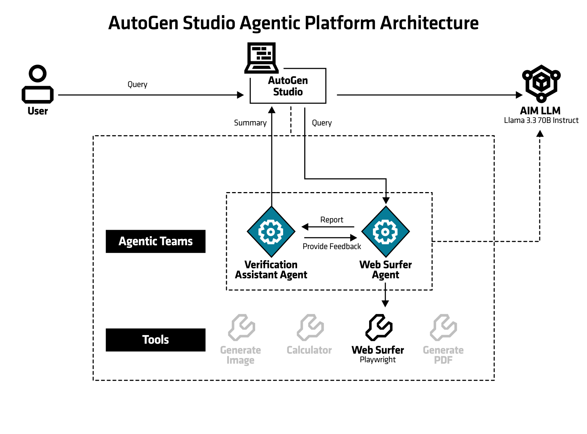

<!--
Copyright © Advanced Micro Devices, Inc., or its affiliates.
SPDX-License-Identifier: MIT
-->

# Product Comparison using AutoGen Studio

This [AutoGen Studio](https://microsoft.github.io/autogen/stable/user-guide/autogenstudio-user-guide/index.html) blueprint provides a web-based interface for creating, configuring, and managing multi-agent AI conversations. It demonstrates how to deploy Microsoft's AutoGen Studio framework on AMD Enterprise AI infrastructure, enabling users to design and orchestrate complex AI agent workflows through an intuitive graphical interface.

[AutoGen Studio](https://microsoft.github.io/autogen/stable/user-guide/autogenstudio-user-guide/index.html) allows users to create sophisticated multi-agent systems where different AI agents can collaborate, debate, and work together to solve complex problems, each with specialized roles and capabilities.

In this blueprint, a product comparison use case is deployed using the Web Surfer team:
1. In the `Team Builder` menu, go to `From Gallery` tab and pick Web Agent Team with `Use As Template` button. The UI switches to the team flowchart. Verify that the correct models as deployed on the cluster are visible in the UI and test the team with `Run`.
2. Go to `Playground` menu and select `New Session` to interact with the team. Ensure the correct team is selected in the drop down.
3. Enter the product comparison query:
    > Compare AMD's MI350 series with MI300.

You will see the actions of web surfer agent and the summary from the verification assistant agent.

## Architecture
<picture>
  <source media="(prefers-color-scheme: light)" srcset="architecture-diagram-light-scheme.png">
  <source media="(prefers-color-scheme: dark)" srcset="architecture-diagram-dark-scheme.png">
  
</picture>

The blueprint deploys AutoGen Studio as a containerized web application with pre-configured agent galleries and integrated LLM connectivity through AIMs for seamless AI agent orchestration.

## Key Features

* **Visual Agent Designer**: Create and configure AI agents with specific roles, personalities, and capabilities through a web interface
* **Multi-Agent Workflows**: Design complex conversation flows between multiple agents working collaboratively
* **Pre-configured Gallery**: Includes default agent templates for common use cases including human-in-the-loop scenarios
* **LLM Integration**: Seamless connection to AMD Instinct Models (AIMs) for powering agent conversations
* **Real-time Monitoring**: View and debug agent conversations as they happen
* **Import/Export Capabilities**: Share and manage agent configurations across deployments
* **Web Agents Support**: Built-in support for agents that can interact with web services and APIs
* **Tools for Agents**: Equip agents with tools such as calculator, web search and python code execution to extend the functionality

## Software

AIM Solution Blueprints are Kubernetes applications packaged with [Helm](https://helm.sh/). It takes one click to launch them in an AMD Enterprise AI cluster and test them out.

This blueprint primarily uses the following components:

* AIMs - Large Language Models for powering agent conversations
    * Default in this blueprint is Llama-3.3-70B model
* AutoGen Studio - Microsoft's framework for multi-agent AI conversations
    * Several teams are pre-configured in the AMD Enterprise AI Component Gallery along with various tools. A product comparison use case is demonstrated with Web Surfer team.
* Python/FastAPI - Backend service for the web interface
* SQLite - Local database for storing agent configurations and conversation histories
* Kubernetes - Container orchestration and deployment platform

## System Requirements

Kubernetes cluster with AMD GPU nodes (exact number of GPUs depends on AIM LLM configuration)

* Minimum: 2 CPU cores, 4Gi memory
* Recommended: 4+ CPU cores, 8Gi+ memory for complex multi-agent workflows

## Terms of Use

AMD Solution Blueprints are released under [MIT License](https://opensource.org/license/mit), which governs the parts of the software and materials created by AMD. Third party Software and Materials used within the Solution Blueprints are governed by their respective licenses.
