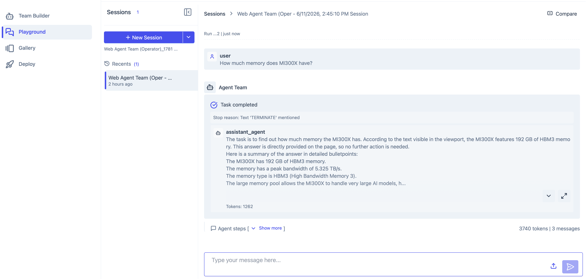
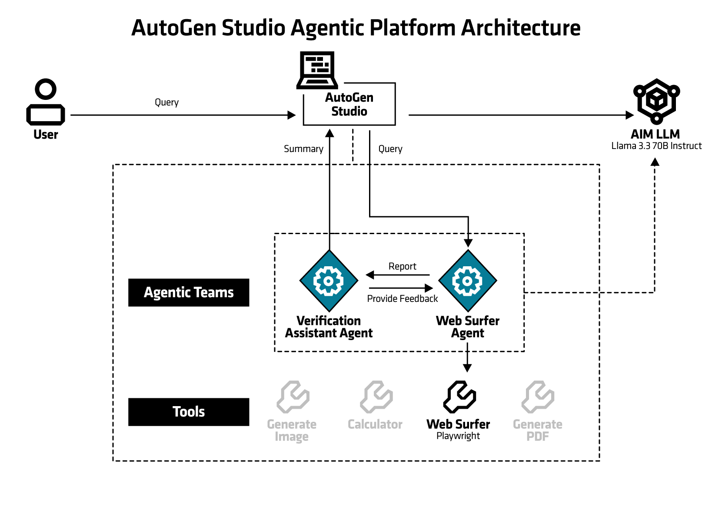

<!--
Copyright © Advanced Micro Devices, Inc., or its affiliates.

SPDX-License-Identifier: MIT
-->

# AutoGen Studio Blueprint

## Overview


*This screenshot shows a portion of the blueprint’s user interface as rendered by AutoGen Studio.*

This Solution Blueprint provides a web-based interface for creating, configuring, and managing multi-agent AI conversations through [AutoGen Studio](https://microsoft.github.io/autogen/stable/user-guide/autogenstudio-user-guide/index.html). It demonstrates how to deploy Microsoft's AutoGen Studio framework on AMD Enterprise AI infrastructure, enabling users to design and orchestrate complex AI agent workflows through an intuitive graphical interface.

[AutoGen Studio](https://microsoft.github.io/autogen/stable/user-guide/autogenstudio-user-guide/index.html) allows users to create sophisticated multi-agent systems where different AI agents can collaborate, debate, and work together to solve complex problems, each with specialized roles and capabilities.

AMD Solution Blueprints are packaged as [Helm charts](https://helm.sh/) for deployment on a Kubernetes cluster. For development or further exploration, the source code is public and available in the [Solution Blueprints GitHub repository](https://github.com/amd-enterprise-ai/solution-blueprints/tree/main/solution-blueprints/autogen-studio).

## Architecture

<picture>
  <source media="(prefers-color-scheme: light)" srcset="architecture-diagram-light-scheme.png">
  <source media="(prefers-color-scheme: dark)" srcset="architecture-diagram-dark-scheme.png">
  
</picture>

The blueprint deploys AutoGen Studio as a containerized web application with pre-configured agent galleries and integrated LLM connectivity through AIMs for seamless AI agent orchestration.

| Component | Role |
|-----------|------|
| AutoGen Studio | Web-based interface for creating, configuring, and managing multi-agent AI conversations |
| Python/FastAPI | Backend service for the web interface |
| Pre-configured galleries | Default agent templates for common use cases, including the Web Surfer team for the product comparison demonstration |
| AIM LLM | Powers agent conversations (default: Llama-3.3-70B) |

### Key Features

- Visual agent designer: Create and configure AI agents with specific roles, personalities, and capabilities through a web interface
- Multi-agent workflows: Design complex conversation flows between multiple agents working collaboratively
- Pre-configured gallery: Includes default agent templates for common use cases including human-in-the-loop scenarios
- LLM integration: AIMs deployed for powering agent conversations
- Real-time monitoring: View and debug agent conversations as they happen
- Import/export capabilities: Share and manage agent configurations across deployments
- Web agents support: Built-in support for agents that can interact with web services and APIs
- Tools for agents: Equip agents with tools such as calculator, web search and Python code execution to extend the functionality

## Getting Started

This is a quick start guide on how to deploy the blueprint. For advanced options, such as reusing an existing AIM, providing a Hugging Face token, or overriding storage classes, see [Deploying Solution Blueprints with Helm](https://enterprise-ai.docs.amd.com/en/latest/solution-blueprints/deployment.html) or explore the [advanced deployment guide](./DEPLOYMENT.md).

This blueprint supports **AMD Instinct** (default) and **AMD Radeon** platforms. The section below covers the default **Instinct** deployment. For Radeon deployment and other advanced options, see:

- [Deploy on AMD Instinct](DEPLOYMENT.md#amd-instinct-gpu-default)
- [Deploy on AMD Radeon](DEPLOYMENT.md#amd-radeon-gpu)

### Prerequisites

#### System Requirements

The blueprint requires the following cluster resources by default:

| Resource | Default Configuration |
|--|-------------------|
| GPUs | 1 |
| CPUs | 6 CPU cores |
| RAM | 68 Gi |

To deploy to the Kubernetes cluster, ensure the following prerequisites are met:

- [kubectl](https://kubernetes.io/docs/tasks/tools/): Installed and configured to communicate with the cluster
- [Helm](https://helm.sh/docs/intro/install/) 3.17 or higher: Installed on your local machine

### Deployment

Solution Blueprints are packaged as OCI-compliant Helm charts in the Docker Hub registry and can be deployed to a Kubernetes cluster with a single command. Define the `name` (deployment name) and the `namespace` (Kubernetes namespace), then pipe the output of `helm template` to `kubectl apply -f -`:

```bash
name="my-deployment"
namespace="my-namespace"
helm template $name oci://registry-1.docker.io/amdenterpriseai/aimsb-autogenstudio \
  | kubectl apply -f - -n $namespace
```

Note: You can create a namespace using `kubectl create namespace $namespace`.

To check the status of the deployment, run:

```bash
kubectl get pods -n $namespace
```

Wait until all pods report `Running` and `Ready`.

### Connect to UI

To connect to the UI, port-forward to 8082. The UI will then be available at [http://localhost:8082](http://localhost:8082) in your browser.

```bash
kubectl port-forward services/aimsb-autogenstudio-${name} 8082:8081 -n $namespace
```

Once connected, use the application as follows:

1. In the `Team Builder` menu, go to the `From Gallery` tab and pick the "Web Agent Team" with the `Use As Template` button. The UI switches to the team flowchart. Verify that the correct models deployed on the cluster are visible in the UI and test the team with `Run`.
2. Go to the `Playground` menu and select `New Session` to interact with the team. Ensure the correct team is selected in the dropdown.
3. Enter a query, for example: "Compare AMD's MI350 series with MI300"

You will see the actions of the Web Surfer agent and the summary from the verification assistant agent.

### Clean Up

When you are finished, remove the deployed resources:

```bash
helm template $name oci://registry-1.docker.io/amdenterpriseai/aimsb-autogenstudio \
  | kubectl delete -f - -n $namespace
```

## Third-Party Components

This Solution Blueprint uses multiple third-party components. To see the full set of software and Python dependencies, explore the repository source and dependency files. The table below highlights some of the key components. For further license information, refer to each component's official documentation.

| Component | License |
|---------|---------|
| AutoGen Studio | MIT |
| FastAPI | MIT |
| SQLite | Public domain |

## Terms of Use

AMD Solution Blueprints are released under the [MIT License](https://opensource.org/license/mit), which governs the parts of the software and materials created by AMD. Third-party Software and Materials used within the Solution Blueprints are governed by their respective licenses.
