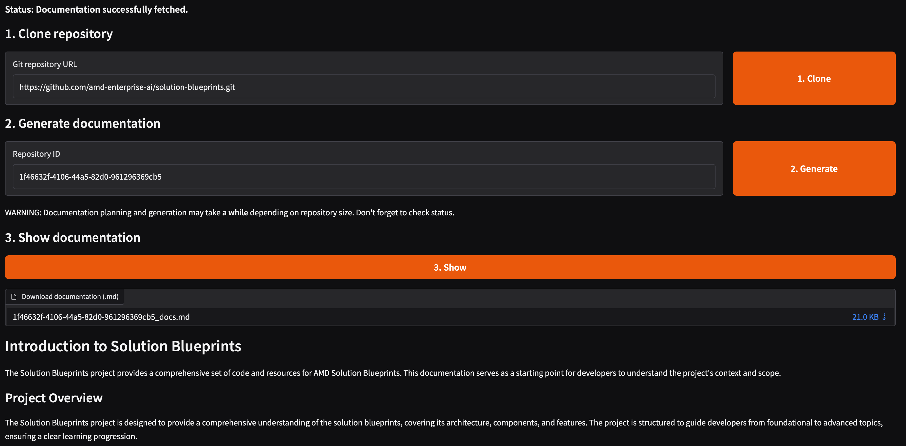

<!--
Copyright © Advanced Micro Devices, Inc., or its affiliates.

SPDX-License-Identifier: MIT
-->

# Code Docs Builder

## Overview



This Solution Blueprint generates technical documentation directly from a GitHub repository using AMD Inference Microservices (AIMs). This addresses the common problem of missing or outdated documentation by keeping generated documentation aligned with the actual implementation.

The system analyzes a Git repository and produces structured documentation that explains the project structure, key components, architectural relationships, and intended system behavior. The blueprint leverages LLMs to reduce manual documentation efforts, while improving code understanding and accelerating developer onboarding.

AMD Solution Blueprints are packaged as [Helm charts](https://helm.sh/) for deployment on a Kubernetes cluster. For development or further exploration, the source code is public and available in the [Solution Blueprints GitHub repository](https://github.com/amd-enterprise-ai/solution-blueprints/tree/main/solution-blueprints/code-docs-builder).

## Architecture

<picture>
  <source media="(prefers-color-scheme: light)" srcset="architecture-diagram-light-scheme.png">
  <source media="(prefers-color-scheme: dark)" srcset="architecture-diagram-dark-scheme.png">
  
</picture>

The blueprint deploys Code Docs Builder as a containerized web application with pre-configured crews (that combine agents and tasks) and integrated LLM connectivity through AIMs for seamless AI agent orchestration.

| Component | Role |
|-----------|------|
| AIM LLM | Large Language Model for powering the agents; default in this blueprint is Llama-3.3-70B |
| CrewAI | Preconfigured agents and tasks that orchestrate repository analysis and LLM-driven documentation generation |
| Python/FastAPI | A backend service that exposes APIs and handles orchestration for the web interface |
| Python/Gradio | A lightweight web interface for interacting with ML models and agent workflows |
| Kubernetes | Container orchestration and deployment platform |

> ⚠️ **Important:**
> This blueprint has been tested and validated with the AIM using Llama 3.3 70B Instruct. While other models may work, their compatibility and performance are not guaranteed.

> ⚠️ **Warning:**
> This blueprint is created for demonstration purposes. It has some limitations when the repository size is large, and processing may take a while (sometimes hours). In such cases, the quality of the generated documentation may be worse than for smaller repositories. Adjust the agent prompts in `config/` to better suit your use case and repository structure.


### Key Features

- Automatic Codebase Analysis: Agents automatically analyze the codebase and generate diagrams that reflect the project’s structure and architecture
- Structured Documentation Output: Documentation is planned and generated in well-defined sections, each serving a specific purpose
- Zero Configuration Required: Documentation generation relies on preconfigured agents and tasks — no manual setup needed
- Simple and Intuitive Workflow: Provide a GitHub repository link and generate documentation in a few clicks
- Ideal for Developer Onboarding: Onboard new developers into projects with little to no existing documentation
- Downloadable Results: Export the final documentation in clean, ready-to-use `.md` format

## Getting Started

This is a quick start guide on how to deploy the blueprint. For advanced options, such as reusing an existing AIM, providing a Hugging Face token, or overriding storage classes, see [Deploying Solution Blueprints with Helm](https://enterprise-ai.docs.amd.com/en/latest/solution-blueprints/deployment.html) or explore the [advanced deployment guide](./DEPLOYMENT.md).

This blueprint supports **AMD Instinct** (default) and **AMD EPYC** platforms. The section below covers the default **Instinct** deployment. For EPYC deployment and other advanced options, see:

- [Deploy on AMD Instinct](DEPLOYMENT.md#amd-instinct-gpu-default)
- [Deploy on AMD EPYC](DEPLOYMENT.md#amd-epyc-cpu)

### Prerequisites

#### System Requirements

The blueprint requires the following cluster resources by default:

| Resource | Default Configuration |
|----------|-------------------------|
| GPUs | 1 |
| CPUs | 4 CPU cores |
| RAM | 64 Gi |

To deploy to the Kubernetes cluster, ensure the following prerequisites are met:

- [kubectl](https://kubernetes.io/docs/tasks/tools/): Installed and configured to communicate with the cluster
- [Helm](https://helm.sh/docs/intro/install/) 3.17 or higher: Installed on your local machine

### Deployment

Solution Blueprints are packaged as OCI-compliant Helm charts in the Docker Hub registry and can be deployed to a Kubernetes cluster with a single command. Define the `name` (deployment name) and the `namespace` (Kubernetes namespace), then pipe the output of `helm template` to `kubectl apply -f -`:

```bash
name="my-deployment"
namespace="my-namespace"
helm template $name oci://registry-1.docker.io/amdenterpriseai/aimsb-codedocs \
  | kubectl apply -f - -n $namespace
```

Note: You can create a namespace using `kubectl create namespace $namespace`.

To check the status of the deployment, run:

```bash
kubectl get pods -n $namespace
```

Wait until all pods report `Running` and `Ready`. Code documentation works only when the LLM service is also up and running. Note that the default model used is large and can take ~10 minutes to start.

### Connect to UI

To connect to the UI, port-forward to 8092. The UI will then be available at [http://localhost:8092](http://localhost:8092) in your browser.

```bash
kubectl port-forward services/${name}-aimsb-codedocs-frontend 8092:8092 -n $namespace
```

Once connected, use the application as follows:

1. Provide a GitHub repository link and generate documentation in a few clicks
2. Export the final documentation in clean, ready-to-use `.md` format

### Clean Up

When you are finished, remove the deployed resources:

```bash
helm template $name oci://registry-1.docker.io/amdenterpriseai/aimsb-codedocs \
  | kubectl delete -f - -n $namespace
```

## Third-Party Components

This Solution Blueprint uses multiple third-party components. To see the full set of software and Python dependencies, explore the repository source and dependency files. The table below highlights some of the key components. For further license information, refer to each component's official documentation.

| Component | License |
|-----------|---------|
| CrewAI | MIT |
| FastAPI | MIT |
| Gradio | Apache 2.0 |

## Terms of Use

AMD Solution Blueprints are released under the [MIT License](https://opensource.org/license/mit), which governs the parts of the software and materials created by AMD. Third-party Software and Materials used within the Solution Blueprints are governed by their respective licenses.
