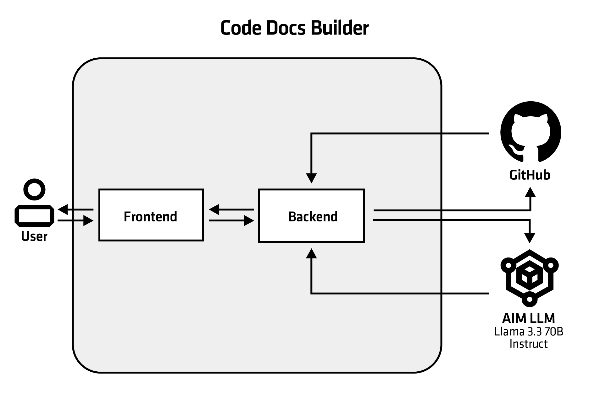

<!--
Copyright © Advanced Micro Devices, Inc., or its affiliates.

SPDX-License-Identifier: MIT
-->

## Code Docs Builder

This blueprint demonstrates how automated technical documentation can be generated directly from a software codebase using AIMs. It addresses the common problem of missing or outdated documentation by keeping generated documentation aligned with the actual implementation.

The system analyzes a Git repository and produces structured documentation that explains the project structure, key components, architectural relationships, and intended system behavior. By leveraging large language models, the blueprint reduces manual documentation effort while improving code understanding and accelerating developer onboarding.

## Architecture
<picture>
  <source media="(prefers-color-scheme: light)" srcset="architecture-diagram-light-scheme.png">
  <source media="(prefers-color-scheme: dark)" srcset="architecture-diagram-dark-scheme.png">
  
</picture>

The blueprint deploys CodeDocs as a containerized web application with pre-configured crews (that combines agents and tasks) and integrated LLM connectivity through AIMs for seamless AI agent orchestration.

> [!IMPORTANT]
> This blueprint has been tested and validated with the AIM using Llama 3.3 70B Instruct. While other models may work, their compatibility and performance are not guaranteed.

> [!WARNING]
> This blueprint is created for demonstration purposes. It has some limitations when the repository size is large, and
> processing may take a while (sometimes hours). In such cases, the quality of the generated documentation may be
> worse than for smaller repositories.

## Key Features

- **Automatic Codebase Analysis**: Agents automatically analyze the codebase and generate diagrams that reflect the project’s structure and architecture.
- **Structured Documentation Output**: Documentation is planned and generated in well-defined sections, each serving a specific purpose.
- **Zero Configuration Required**: Documentation generation relies on preconfigured agents and tasks — no manual setup needed.
- **Simple and Intuitive Workflow**: Just provide a GitHub repository link and generate documentation in a few clicks.
- **Ideal for Developer Onboarding**: A perfect solution for onboarding new developers into projects with little or no existing documentation.
- **Downloadable Results**: Export the final documentation in clean, ready-to-use `.md` format.

## Software

AIM Solution Blueprints are Kubernetes applications packaged with [Helm](https://helm.sh/). It takes one click to launch them in an AMD Enterprise AI cluster and test them out.

This blueprint primarily uses the following components:

* AIMs - Large Language Models for powering agent conversations
    * Default in this blueprint is Llama-3.3-70B model
* Python/FastAPI - A backend service that exposes APIs and handles orchestration for the web interface.
* Python/Gradio - A lightweight web interface for interacting with ML models and agent workflows.
* Kubernetes - Container orchestration and deployment platform

## System Requirements

Kubernetes cluster with AMD GPU nodes (exact number of GPUs depends on AIM LLM configuration)

* Minimum: 2 CPU cores, 6Gi memory
* Recommended: 4+ CPU cores, 8Gi+ memory for complex multi-agent workflows

## Terms of Use

AMD Solution Blueprints are released under [MIT License](https://opensource.org/license/mit), which governs the parts of the software and materials created by AMD. Third party Software and Materials used within the Solution Blueprints are governed by their respective licenses.
