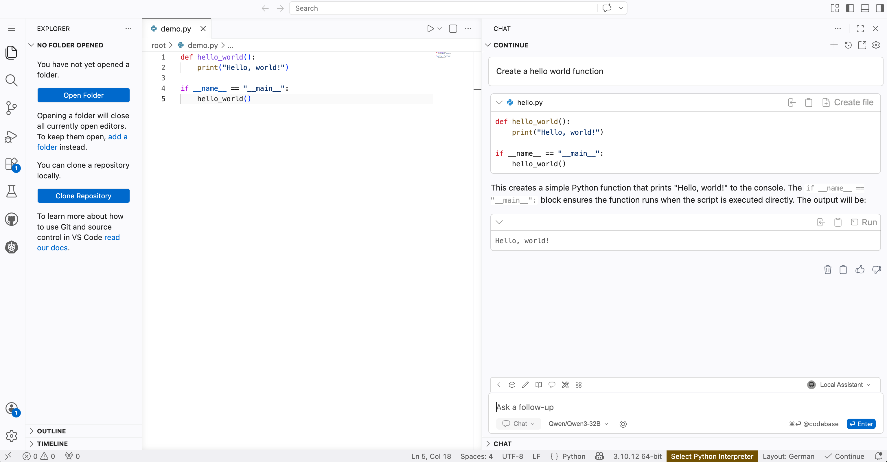

<!--
Copyright © Advanced Micro Devices, Inc., or its affiliates.

SPDX-License-Identifier: MIT
-->

# Continue.dev Coding Assistant

## Overview



The [Continue.dev](https://docs.continue.dev/#core-features) Coding Assistant is an AI pair programmer that integrates into your code editor. Continue.dev uses Large Language Models (LLMs) deployed on your infrastructure to suggest, fix, and discuss code as you are developing. In this Solution Blueprint, the assistant is installed in [code-server](https://github.com/coder/code-server), which runs Visual Studio Code in the browser. The Coding Assistant has multiple interaction modes:

- **Chat**: Conversational interaction with the model
- **Autocomplete**: Inline code completions and suggestions as you type
- **Edit**: Direct changes to selected code (for example, “refactor this function”)
- **Agent mode**: Higher-level planning and automation where the assistant can chain actions together (for example, setting up dependencies, generating tests)

For details, see the [Continue.dev documentation](https://docs.continue.dev/#core-features) and the [quick start guide](https://docs.continue.dev/ide-extensions/quick-start).

AMD Solution Blueprints are packaged as [helm charts](https://helm.sh/) for deployment on a Kubernetes cluster. For development or further exploration, the source code is public and available in the [Solution Blueprints GitHub repository](https://github.com/amd-enterprise-ai/solution-blueprints/tree/main/solution-blueprints/continuedev-assistant).

## Architecture

<picture>
  <source media="(prefers-color-scheme: light)" srcset="architecture-diagram-light-scheme.png">
  <source media="(prefers-color-scheme: dark)" srcset="architecture-diagram-dark-scheme.png">
  
</picture>

The blueprint integrates three components: a **code-server** browser IDE, the **Continue.dev** extension inside it, and **AIM** LLM services. By default, one AIM serves the main assistant (Qwen3-32B), while a second AIM handles autocompletion (Qwen2.5-Coder-7B). The IDE runs in a ROCm/PyTorch container with a dedicated GPU, so you can develop GPU-accelerated workloads in the same environment.

| Component | Role |
|-----------|------|
| code-server | Browser-based IDE |
| Continue.dev extension | AI pair programming assistant  |
| AIM (main) | Primary coding assistant (default: Qwen3-32B) |
| AIM (autocomplete) | Dedicated autocompletion model (default: Qwen2.5-Coder-7B) |

### Key Features

- Full control over your data and privacy — no calls to external APIs
- Ability to choose LLM models for your specific domain or coding style
- No subscription fees or usage limits
- Transparent and inspectable — log, debug, and audit model and application behavior
- Strong fit for experimentation with different models or agents
- Suitable for regulated or proprietary codebases where cloud coding assistants are restricted or disallowed

## Getting Started

This is a quick start guide on how to deploy the blueprint. For advanced options, such as reusing an existing AIM, providing a Hugging Face token, or overriding storage classes, see [Deploying Solution Blueprints with Helm](https://enterprise-ai.docs.amd.com/en/latest/solution-blueprints/deployment.html) or explore the [advanced deployment guide](./DEPLOYMENT.md).

This blueprint is designed to run on **AMD Instinct** GPUs.

### Prerequisites

#### System Requirements

The blueprint requires the following cluster resources by default:

| Resource | Default Configuration |
|--|-------------------|
| GPUs | 3 (one for each component) |
| CPUs | 8 CPU cores |
| RAM | 192 Gi RAM |

To deploy to the Kubernetes cluster, ensure the following prerequisites are met:

- [kubectl](https://kubernetes.io/docs/tasks/tools/): Installed and configured to communicate with the cluster
- [Helm](https://helm.sh/docs/intro/install/) 3.17 or higher: Installed on your local machine

### Deployment

Solution Blueprints are packaged as OCI-compliant Helm charts in the Docker Hub registry and can be deployed to a Kubernetes cluster with a single command. Define the `name` (deployment name) and the `namespace` (Kubernetes namespace), then pipe the output of `helm template` to `kubectl apply -f -`:

```bash
name="my-deployment"
namespace="my-namespace"
helm template $name oci://registry-1.docker.io/amdenterpriseai/aimsb-continuedev-assistant \
  | kubectl apply -f - -n $namespace
```

Note: You can create a namespace using `kubectl create namespace $namespace`.

To check the status of the deployment, run:

```bash
kubectl get pods -n $namespace
```

Wait until all pods report `Running` and `Ready`.

### Connect to UI

To connect to the UI, port-forward to any chosen port, e.g., 8083. The UI will then be available at [http://localhost:8083](http://localhost:8083) in your browser.

```bash
kubectl port-forward services/aimsb-continuedev-assistant-${name} 8083:80 -n $namespace
```

The Continue.dev extension is preinstalled and appears in the Extensions view on the left by default. For a clearer layout, dock Continue.dev on the right ([extension install notes](https://docs.continue.dev/ide-extensions/install)). For a walkthrough of the assistant, see the [Continue.dev quick start](https://docs.continue.dev/ide-extensions/quick-start).

### Clean Up

When you are finished, remove the deployed resources:

```bash
helm template $name oci://registry-1.docker.io/amdenterpriseai/aimsb-continuedev-assistant \
  | kubectl delete -f - -n $namespace
```

## Third-Party Components

This Solution Blueprint utilizes multiple components. For third-party license information, refer to each component's documentation. Key third-party components can be seen below:

| Component | License |
|---------|---------|
| code-server | MIT |
| Continue.dev  | Apache 2.0 |

## Terms of Use

AMD Solution Blueprints are released under the [MIT License](https://opensource.org/license/mit), which governs the parts of the software and materials created by AMD. Third-party software and materials used within the Solution Blueprint are governed by their respective licenses.
