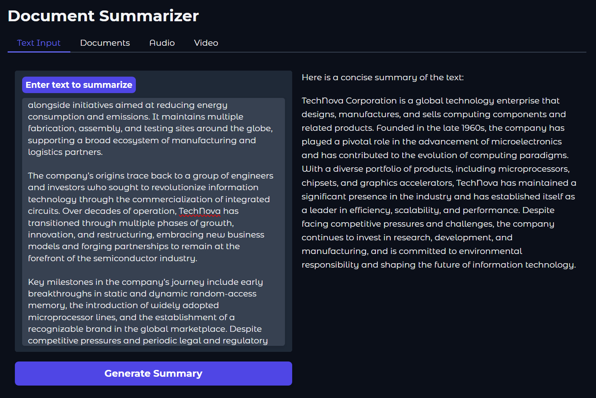

<!--
Copyright © Advanced Micro Devices, Inc., or its affiliates.

SPDX-License-Identifier: MIT
-->

# Document Summarization Interface

Interactive web UI for AI-powered content summarization. Processes text, documents, web pages, audio files and video.

## Getting Started

### 1. Build Container Image

From project root directory:

```bash
docker build -t summarizer-ui:latest -f docker/ui.Dockerfile docker/
```

Builds the UI container image with proxy support for corporate networks.

### 2. Launch Container

Run the UI container and connect to backend service:

```bash
cd docker
# Calculate Host IP
HOST_IP=$(hostname -I | awk '{print $1}')

export http_proxy https_proxy no_proxy

docker run -d --name summarizer-ui --ipc=host \
    -p 5173:5173 \
    --env http_proxy --env no_proxy --env https_proxy \
    -e SUMMARY_SERVICE_URL="http://${HOST_IP}:8888/v1/summarize" \
    summarizer-ui:latest

```

**Access UI**: Open `http://localhost:5173` in your browser.

### 3. Run with Python

For local development:

```bash
cd app-ui
python summarizer_ui.py --host 0.0.0.0 --port 5173
```

## Demo



## Capabilities

- **File Uploads** — Drag & drop PDFs, DOCX, MP3, WAV, MP4 files for automatic processing
- **Text Input** — Paste content directly into the text area and generate summaries instantly
- **Real-time Results** — Summaries appear immediately in the output panel

## Configuration

### Required Environment Variables

| Variable | Purpose | Example |
|----------|---------|---------|
| `SUMMARY_SERVICE_URL` | Backend API endpoint | `http://localhost:8888/v1/summarize` |
| `http_proxy` | HTTP proxy server | `http://proxy.company.com:8080` |
| `https_proxy` | HTTPS proxy server | `http://proxy.company.com:8080` |
| `no_proxy` | Proxy bypass list | `localhost,127.0.0.1,*.local` |

### System Requirements

- Docker 20+ (for container deployment)
- Python 3.11+ (for local development)
- Backend summarization service running on port 8888

## Usage Workflow

1. **Launch** the UI container or Python app
2. **Navigate** to `http://localhost:5173`
3. **Choose** input method (Text / URL / File)
4. **Submit** content — summary generates automatically
5. **Review** results in the output panel
