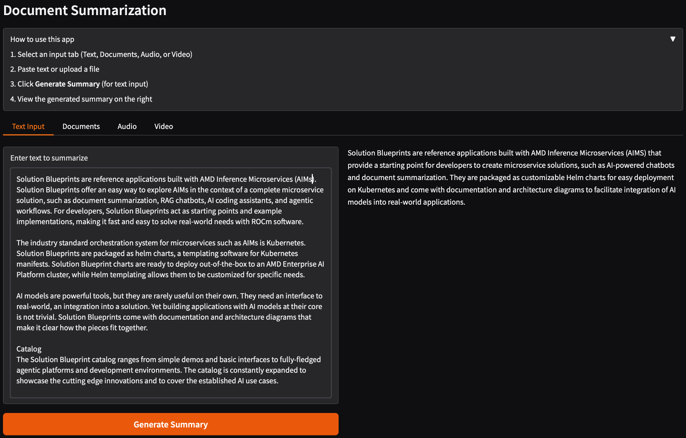

<!--
Copyright © Advanced Micro Devices, Inc., or its affiliates.

SPDX-License-Identifier: MIT
-->

# Document Summarization

## Overview



The Document Summarization (DocSum) Solution Blueprint uses LLMs to generate summaries from varied document types. It can process and summarize PDFs, DOCX files and plain text, as well as multimedia files (both audio and video), across a variety of domains such as customer service, scientific research and legal text.

AMD Solution Blueprints are packaged as [Helm charts](https://helm.sh/) for deployment on a Kubernetes cluster. For development or further exploration, the source code is public and available in the [Solution Blueprints GitHub repository](https://github.com/amd-enterprise-ai/solution-blueprints/tree/main/solution-blueprints/document-summarization).

## Architecture

<picture>
  <source media="(prefers-color-scheme: light)" srcset="assets/img/architecture-diagram-light-scheme.png">
  <source media="(prefers-color-scheme: dark)" srcset="assets/img/architecture-diagram-dark-scheme.png">
  
</picture>

| Component | Role |
|-----------|------|
| User Interface | Web interface for uploads, URLs, and viewing summaries |
| Backend API | DOCSUM backend integration between components |
| Whisper | Automatic transcription for audio and video inputs |
| AIM LLM | Summarization and language understanding (default: Llama 3.3 70B Instruct) |

### Key Features

- Multi-format support: PDF, DOCX, text, audio, and video
- Automatic transcription: Whisper-based speech-to-text for multimedia files
- LLM-powered summarization: Deploy with AIM
- Microservices Architecture: Modular design with independent, scalable components

## Getting Started

This is a quick start guide on how to deploy the blueprint. For advanced options, such as reusing an existing AIM, providing a Hugging Face token, or overriding storage classes, see [Deploying Solution Blueprints with Helm](https://enterprise-ai.docs.amd.com/en/latest/solution-blueprints/deployment.html) or explore the [advanced deployment guide](./DEPLOYMENT.md).

This blueprint supports **AMD Instinct** (default), **AMD EPYC**, and **AMD Radeon** platforms. The section below covers the default **Instinct** deployment. For EPYC and Radeon deployment and other advanced options, see:

- [Deploy on AMD Instinct](DEPLOYMENT.md#amd-instinct-gpu-default)
- [Deploy on AMD EPYC](DEPLOYMENT.md#amd-epyc-cpu)
- [Deploy on AMD Radeon](DEPLOYMENT.md#amd-radeon-gpu)

### Prerequisites

#### System Requirements

The blueprint requires the following cluster resources by default:

| Resource | Default Configuration |
|----------|-------------------------|
| GPUs | 1 |
| CPUs | 5 CPU cores |
| RAM | 65 Gi |

To deploy to the Kubernetes cluster, ensure the following prerequisites are met:

- [kubectl](https://kubernetes.io/docs/tasks/tools/): Installed and configured to communicate with the cluster
- [Helm](https://helm.sh/docs/intro/install/) 3.17 or higher: Installed on your local machine

### Deployment

Solution Blueprints are packaged as OCI-compliant Helm charts in the Docker Hub registry and can be deployed to a Kubernetes cluster with a single command. Define the `name` (deployment name) and the `namespace` (Kubernetes namespace), then pipe the output of `helm template` to `kubectl apply -f -`:

```bash
name="my-deployment"
namespace="my-namespace"
helm template $name oci://registry-1.docker.io/amdenterpriseai/aimsb-docsum \
  | kubectl apply -f - -n $namespace
```

Note: You can create a namespace using `kubectl create namespace $namespace`.

To check the status of the deployment, run:

```bash
kubectl get pods -n $namespace
```

Wait until all pods report `Running` and `Ready`. Summarization requires the LLM (and Whisper for media paths) to be up; the default AIM may take several minutes to start.

### Connect to UI

To connect to the UI, port-forward to 5173. The UI is then available at [http://localhost:5173](http://localhost:5173) in your browser.

```bash
kubectl port-forward services/aimsb-docsum-${name}-ui 5173:5173 -n $namespace
```

Once connected, use the application as follows:

1. Choose a source: Upload one or more supported files (Text, Documents, Audio, or Video)
2. Click "Generate Summary" to submit the request and wait for the summarization to finish
3. Review the generated summary in the UI

### Clean Up

When you are finished, remove the deployed resources:

```bash
helm template $name oci://registry-1.docker.io/amdenterpriseai/aimsb-docsum \
  | kubectl delete -f - -n $namespace
```

## Third-Party Components

This Solution Blueprint uses multiple third-party components. To see the full set of software and Python dependencies, explore the repository source and dependency files. For further license information, refer to each component's official documentation.

## Terms of Use

AMD Solution Blueprints are released under the [MIT License](https://opensource.org/license/mit), which governs the parts of the software and materials created by AMD. Third-party Software and Materials used within the Solution Blueprints are governed by their respective licenses.
