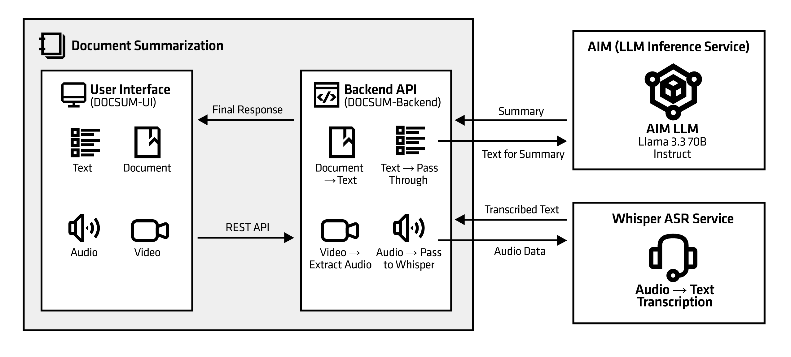

<!--
Copyright © Advanced Micro Devices, Inc., or its affiliates.

SPDX-License-Identifier: MIT
-->

# Document Summarization

The Document Summarization (DocSum) blueprint is an AMD Solution Blueprint that leverages Large Language Models (LLMs) to automatically generate summaries from various document types. This application can process and summarize PDFs, DOCX files, customer questions, multimedia files (audio/video), research papers, technical documents, legal documents, and other text-based content.

## Architecture

<picture>
  <source media="(prefers-color-scheme: light)" srcset="assets/img/architecture-diagram-light-scheme.png">
  <source media="(prefers-color-scheme: dark)" srcset="assets/img/architecture-diagram-dark-scheme.png">
  
</picture>

## Key Features

* Multi-format Support: Process PDFs, DOCX files, text files, audio, and video content
* Automatic Transcription: Whisper-based speech-to-text for audio/video files
* LLM-powered Summarization: Utilizes state-of-the-art language models (e.g., llama-3-3-70b-instruct)
* Microservices Architecture: Modular design with independent, scalable components
* AMD ROCm Support: Optimized for AMD GPU acceleration

## Software

AIM Solution Blueprints are Kubernetes applications packaged with [Helm](https://helm.sh/). It takes one click to launch them in an AMD Enterprise AI cluster and test them out.

This blueprint primarily uses the following components:

* AIMs - Large Language Model for summarization.
    * Default in this blueprint is llama-3-3-70b-instruct
* Whisper - Speech-to-text transcription service for audio/video files
* Gradio - provides the web-based user interface.

## System Requirements

Kubernetes cluster with AMD GPU nodes (exact number of GPUs depends on AIM LLM)

## Terms of Use

AMD Solution Blueprints are released under [MIT License](https://opensource.org/license/mit), which governs the parts of the software and materials created by AMD. Third party Software and Materials used within the Solution Blueprints are governed by their respective licenses.
