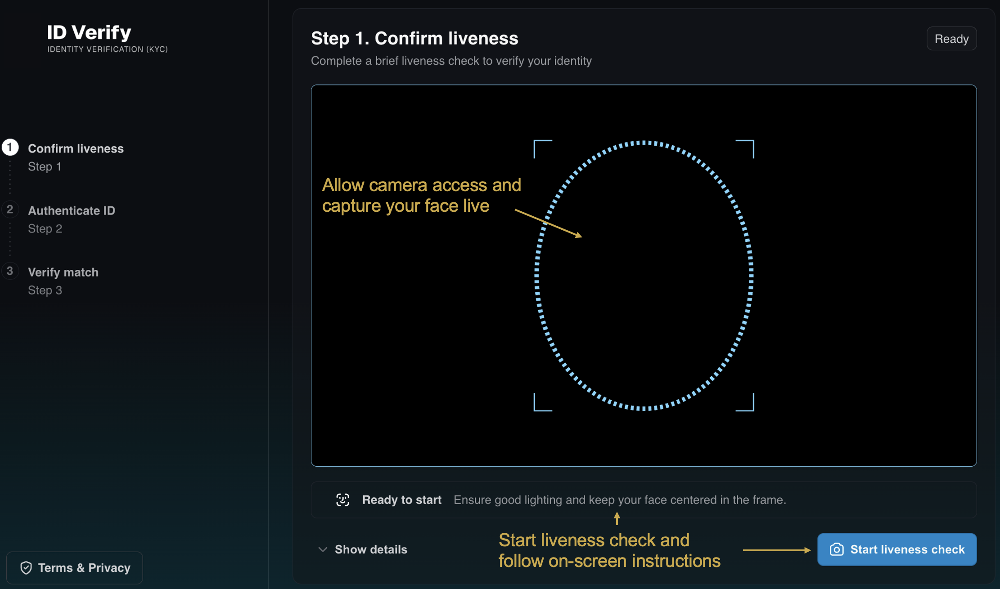

<!--
Copyright © Advanced Micro Devices, Inc., or its affiliates.

SPDX-License-Identifier: MIT
-->

# FinTech Onboarding

## Overview


*This is the landing page of the UI. Allow camera access to continue the onboarding.*

A lightweight **KYC (Know Your Customer)** prototype for face-based identity verification.
This service compares a live face captured via webcam with a face extracted from an uploaded ID document.

It uses [YuNet](https://github.com/opencv/opencv_zoo/tree/main/models/face_detection_yunet)
for face detection and [SFace](https://github.com/opencv/opencv_zoo/tree/main/models/face_recognition_sface) for face recognition and embedding extraction, both from [opencv_zoo](https://github.com/opencv/opencv_zoo).

The system is containerized using Docker and consists of the following services:

- **Web frontend**: User interface for live face capture via webcam and uploading documents
- **Backend**: Performs face detection and face recognition for comparison (see Model Notes section)
- **BFF (Backend For Frontend)**: Mediates access to backend infrastructure

AMD Solution Blueprints are packaged as [Helm charts](https://helm.sh/) for deployment on a Kubernetes cluster. For development or further exploration, the source code is public and available in the [Solution Blueprints GitHub repository](https://github.com/amd-enterprise-ai/solution-blueprints/tree/main/solution-blueprints/fintech-onboarding).

## Architecture

<picture>
  <source media="(prefers-color-scheme: light)" srcset="architecture-diagram-light-scheme.png">
  <source media="(prefers-color-scheme: dark)" srcset="architecture-diagram-dark-scheme.png">
  
</picture>

| Component | Role |
|-----------|------|
| BFF (Backend For Frontend) | FastAPI proxy alongside the frontend; mediates calls to the backend |
| Backend | Face detection and similarity comparison using YuNet and SFace |
| VLM | Vision–language model (default Mistral Small 3.2 24B) |

> ⚠️ **Restrictions:**
> The backend uses YuNet (face detection) and SFace (face recognition) models, which are deployed
> inside the Backend. The models are downloaded on first startup, which may cause slower initial
> launch times.

### Model Notes

The service uses **YuNet** (face detection) and **SFace** (face recognition) from
[opencv_zoo](https://github.com/opencv/opencv_zoo). Both models are licensed for commercial use
(MIT and Apache 2.0).

> ⚠️ **Known restrictions:**
> - SFace achieves competitive accuracy on standard benchmarks (LFW ~99.55%).
> - **Robustness to occlusions** (glasses, medical masks, etc.) is not formally documented for SFace; community reports indicate a drop in similarity scores under strong facial occlusions, especially around the eyes and lower face.

### Key Features

- Live face capture: Browser webcam flow with a guided liveness-style check before any match step
- Two-sided ID upload: Front image with face and back image with barcode, aimed at US driver’s license–style documents for the demo workflow
- Visual models (CV + VLM): OpenCV Zoo **YuNet** and **SFace** handle face detection/recognition
- End-to-end flow: Guided steps from live face capture through document processing to a final similarity score that compares the live face with the face on the uploaded document.

## Getting Started

This is a quick start guide on how to deploy the blueprint. For advanced options, such as reusing an existing AIM, providing a Hugging Face token, or overriding storage classes, see [Deploying Solution Blueprints with Helm](https://enterprise-ai.docs.amd.com/en/latest/solution-blueprints/deployment.html) or explore the [advanced deployment guide](./DEPLOYMENT.md).

### Prerequisites

#### System Requirements

This blueprint can be deployed on **AMD Instinct** (default) and **AMD Radeon**. The blueprint requires the following cluster resources by default, depending on the hardware being used:

| Resource | Instinct | Radeon |
|--|--|--|
| GPUs | 2 | 2 |
| CPUs | 4 CPU cores | 4 CPU cores |
| RAM | 64 Gi | 32 Gi |

To deploy to the Kubernetes cluster, ensure the following prerequisites are met:

- [kubectl](https://kubernetes.io/docs/tasks/tools/): Installed and configured to communicate with the cluster
- [Helm](https://helm.sh/docs/intro/install/) 3.17 or higher: Installed on your local machine

### Deployment

For advanced deployment options, explore the [advanced deployment guide](./DEPLOYMENT.md). Solution Blueprints are packaged as OCI-compliant Helm charts in the Docker Hub registry and can be deployed to a Kubernetes cluster with a single command. Define the `name` (deployment name) and the `namespace` (Kubernetes namespace), then pipe the output of `helm template` to `kubectl apply -f -`.

Find the deployment command below. Note: You can create a namespace using `kubectl create namespace <my-namespace>`.

<!-- platform-tabs:start -->

#### AMD Instinct (GPU, default)

```bash
name="my-deployment"
namespace="my-namespace"
helm template $name oci://registry-1.docker.io/amdenterpriseai/aimsb-fintech-onboarding \
  | kubectl apply -f - -n $namespace
```

#### AMD Radeon (GPU)

```bash
name="my-deployment"
namespace="my-namespace"
helm template $name oci://registry-1.docker.io/amdenterpriseai/aimsb-fintech-onboarding \
  --set global.platform=radeon \
  | kubectl apply -f - -n $namespace
```

<!-- platform-tabs:end -->

### Verify Deployment

To check the status of the deployment, run:

```bash
kubectl get pods -n $namespace
```

Wait until all pods report `Running` and `Ready`.

### Connect to UI

To connect to the UI, port-forward to 8080. The UI will then be available at [http://localhost:8080](http://localhost:8080) in your browser.

```bash
kubectl port-forward services/${name}-aimsb-fintech-onboarding-ui 8080:8080 -n $namespace
```

#### How to Use the Service

1. Allow camera access when prompted by the browser.
2. Live face capture: Click the `Start Liveness Check` button and follow the instructions.
3. If you don’t have a US driver’s license, you can create a **test version** of one.
   Use this [guide](https://github.com/amd-enterprise-ai/solution-blueprints/blob/main/solution-blueprints/fintech-onboarding/docs/create-test-driver-licenses.md).
   **Please note**: The test driver licenses you create should be used
   **only for testing this service**. Do not use them for any other purpose or in production environments.
4. `Upload front side (photo with face)`: Select a photo of your document that includes a face (currently supports driver’s licenses).
5. `Upload back side (barcode)`: Select a photo of your document that includes a barcode (currently supports driver’s licenses).
6. Click the `Process Documents` button and review how the data extracted from the front and back of your document compares.
7. Click the `Run match` button to see the similarity score between your live face and the face on the uploaded document.

### Clean Up

When you are finished, remove the deployed resources using the same deployment command, with `kubectl delete` instead of `kubectl apply`. For example, for Instinct use the following command:

```bash
helm template "$name" oci://registry-1.docker.io/amdenterpriseai/aimsb-fintech-onboarding | kubectl delete -f - -n "$namespace"
```

## Third-Party Components

This Solution Blueprint uses multiple third-party components. To see the full set of software and Python dependencies, explore the repository source and dependency files. The table below lists key components only. For further license information, refer to each component's official documentation.

| Component | License |
|---------|---------|
| FastAPI | MIT |
| OpenCV | Apache 2.0 |
| OpenCV Zoo (YuNet, SFace) | See the repositories |

## Terms of Use

AMD Solution Blueprints are released under the [MIT License](https://opensource.org/license/mit), which governs the parts of the software and materials created by AMD. Third-party Software and Materials used within the Solution Blueprints are governed by their respective licenses.
