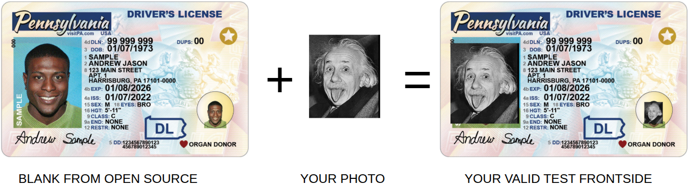
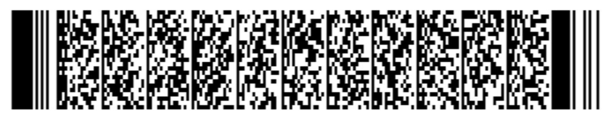
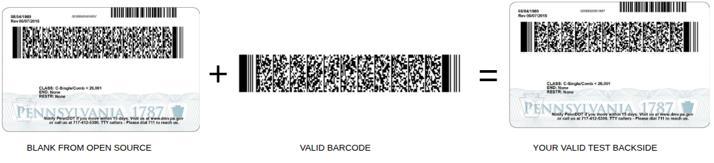
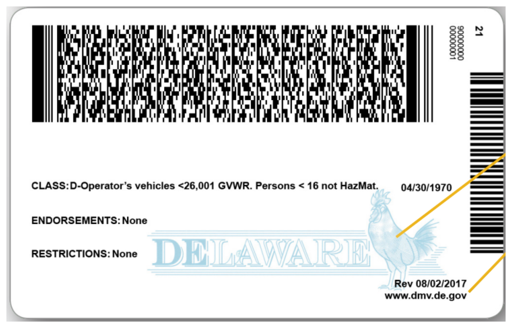
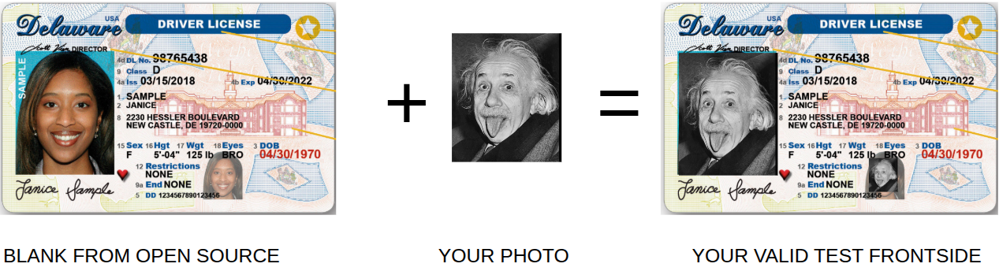
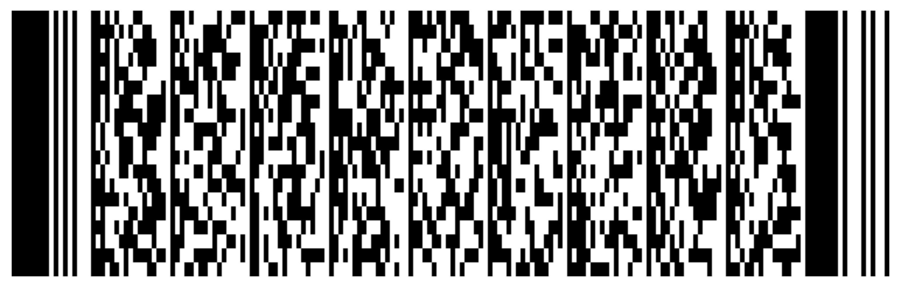
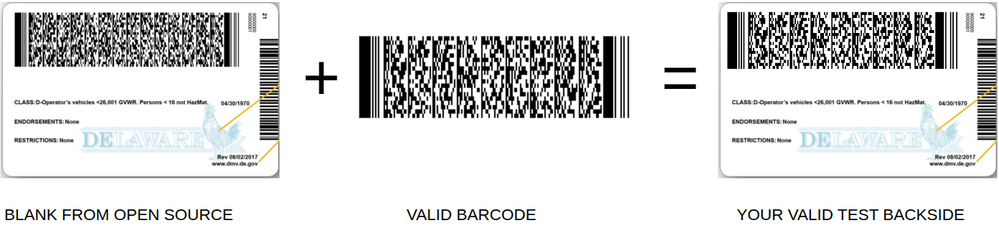

<!--
Copyright © Advanced Micro Devices, Inc., or its affiliates.

SPDX-License-Identifier: MIT
-->

# Creating a Test USA Driver’s license

If you don’t have a real USA driver’s license, you can create a **test version** specifically for
testing this service.

Use the instructions below to generate a realistic-looking test driver's license.

> **Important:**
> The test driver licenses created with this guide are intended **for testing purposes only**.
> Do not use them for any other purpose or in production environments.

---

## How to Create a Test Driver’s license

In this guide we let's consider two examples of US Driver’s license, two different states:

1) PENNSYLVANIA
2) DELAWARE

You can use any of them, it doesn't matter for testing purpose.

### 1) PENNSYLVANIA SAMPLE

1) For take a sample of front-side use this
   source [link](https://www.pa.gov/agencies/dmv/driver-services/real-id/real-id-images)
   You'll take this image like you a blank for future changes
   
2) For take a sample of back-side use this
   source [link](https://docs.strich.io/scanning-pdf417-barcodes-on-us-driving-licenses-for-age-verification.html#pdf417-in-us-driver-s-licenses)
   You'll take this image like you a blank for future changes
   
3) For creating a valid test front side of driving license you should replace your photo instead
   existing photo on front side.
   
4) For creating a valid test back side, you should create a correct barcode,
   which match with data from front side of driving license.
   ```
   @
   ANSI 636026080102DL00410288ZA03290015DL
   DAQA1234567
   DCSSAMPLE
   DACANDREW JASON
   DADJ
   DBB01071973
   DBA03152030
   DBD03152022
   DBC1
   DAU5-11
   DAG742 EVERGREEN TERRACE
   DAILOS ANGELES
   DAJCA
   DAK90017
   DAZBRN
   DCAC
   DCBNONE
   DCDNONE
   ```
   Use this data for creating barcode and any site which can create a PDF417 code - for
   example [this](https://www.onlinetoolcenter.com/barcode-generator/pdf417).
   After this action you'll take an image of barcode:
   
5) After that you should replace wrong barcode to valid barcode, which you got on previous step.
   
6) After these steps you will have a valid front side photo with your face, which you got at
   third step. And also you will have a valid back side photo which you can get:

- **Option A:** Execute steps 4 and 5 yourself to generate and replace the barcode.
- **Option B:** Use
  a [ready-made back side file](img/pennsylvania/pennsylvania_valid_test_backside.png) (if steps 4
  and 5 have already been completed for
  you).

### 2) DELAWARE SAMPLE

1) For take a sample of front-side and back-side use this
   source [link](https://news.delaware.gov/files/2018/05/New-DL-ID-Brochure-4-30-18_4.pdf)
   You should download PDF by this link. This PDF include these blanks for our purposes:
   
   
2) For creating a valid test front side of driving license you should replace your photo instead
   existing photo on front side.
   
3) For creating a valid test back side, you should create a correct barcode,
   which match with data from front side of driving license.
   ```
   @
   ANSI 636026080102DL00410288ZA03290015DL
   DAQA1234567
   DCSSAMPLE
   DACJANICE
   DADNONE
   DBB04301970
   DBA08042023
   DBD10052015
   DBC2
   DAU5-11
   DAG742 EVERGREEN TERRACE
   DAILOS ANGELES
   DAJCA
   DAK90017
   DAZBRN
   DCAC
   DCBNONE
   DCDNONE
   ```
   Use this data for creating barcode and any site which can create a PDF417 code - for
   example [this](https://www.onlinetoolcenter.com/barcode-generator/pdf417).
   After this action you'll take an image of barcode:
   
4) After that you should replace wrong barcode to valid barcode, which you got on previous step.
   
5) After these steps you will have a valid front side photo with your face, which you got at
   third step. And also you will have a valid back side photo which you can get:

- **Option A:** Execute steps 3 and 4 yourself to generate and replace the barcode.
- **Option B:** Use
  a [ready-made back side file](img/delaware/delaware_valid_test_backside.png) (if steps 3
  and 4 have already been completed for
  you).
