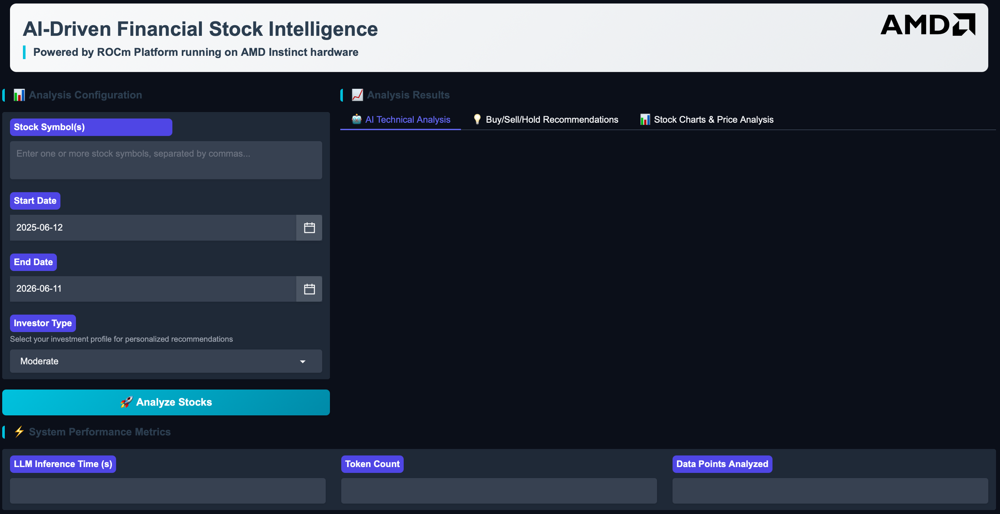

<!--
Copyright © Advanced Micro Devices, Inc., or its affiliates.

SPDX-License-Identifier: MIT
-->

# Financial Stock Intelligence (FSI)

## Overview



This Solution Blueprint provides a financial analysis workflow through a web interface. It combines real-time stock data, technical indicators, and Large Language Model (LLM) analysis to produce stock insights.

AMD Solution Blueprints are packaged as [Helm charts](https://helm.sh/) for deployment on a Kubernetes cluster. For development or further exploration, the source code is public and available in the [Solution Blueprints GitHub repository](https://github.com/amd-enterprise-ai/solution-blueprints/tree/main/solution-blueprints/fsi).

## Architecture

<picture>
  <source media="(prefers-color-scheme: light)" srcset="architecture-diagram-light-scheme.png">
  <source media="(prefers-color-scheme: dark)" srcset="architecture-diagram-dark-scheme.png">
  
</picture>

The blueprint provides a **Gradio** web application with a financial analysis pipeline and an **AIM** LLM service. By default, the Llama 3.3 70B AIM is deployed for analysis and commentary.

| Component | Role |
|-----------|------|
| Gradio UI | Web interface for entering symbols, date ranges, and reviewing results |
| Analysis pipeline | Market data retrieval, technical indicators, and visualization |
| AIM LLM | AI-generated stock insights (default: Llama 3.3 70B Instruct) |

### Key Features

- Real-time stock data: Live prices and history via Yahoo Finance
- Technical analysis: Simple Moving Average (SMA), Relative Strength Index (RSI), momentum, and price versus SMA comparisons
- AI-powered analysis: Uses Llama 3.3 70B Instruct for intelligent stock insights
- Interactive web interface: Gradio UI for easy interaction
- Historical visualization: Charts and graphs for trend analysis
- News integration: Incorporates relevant financial news for context

## Getting Started

This is a quick start guide on how to deploy the blueprint. For advanced options, such as reusing an existing AIM, providing a Hugging Face token, or overriding storage classes, see [Deploying Solution Blueprints with Helm](https://enterprise-ai.docs.amd.com/en/latest/solution-blueprints/deployment.html) or explore the [advanced deployment guide](./DEPLOYMENT.md).

This blueprint supports **AMD Instinct** (default), **AMD EPYC**, and **AMD Radeon** platforms. The section below covers the default **Instinct** deployment. For EPYC and Radeon deployment and other advanced options, see:

- [Deploy on AMD Instinct](DEPLOYMENT.md#amd-instinct-gpu-default)
- [Deploy on AMD EPYC](DEPLOYMENT.md#amd-epyc-cpu)
- [Deploy on AMD Radeon](DEPLOYMENT.md#amd-radeon-gpu)

### Prerequisites

#### System Requirements

The blueprint requires the following cluster resources by default:

| Resource | Default Configuration |
|--|-------------------|
| GPUs | 1 |
| CPUs | 5 CPU cores |
| RAM | 68 Gi |

To deploy to the Kubernetes cluster, ensure the following prerequisites are met:

- [kubectl](https://kubernetes.io/docs/tasks/tools/): Installed and configured to communicate with the cluster
- [Helm](https://helm.sh/docs/intro/install/) 3.17 or higher: Installed on your local machine

### Deployment

Solution Blueprints are packaged as OCI-compliant Helm charts in the Docker Hub registry and can be deployed to a Kubernetes cluster with a single command. Define the `name` (deployment name) and the `namespace` (Kubernetes namespace), then pipe the output of `helm template` to `kubectl apply -f -`:

```bash
name="my-deployment"
namespace="my-namespace"
helm template $name oci://registry-1.docker.io/amdenterpriseai/aimsb-fsi \
  | kubectl apply -f - -n $namespace
```

Note: You can create a namespace using `kubectl create namespace $namespace`.

To check the status of the deployment, run:

```bash
kubectl get pods -n $namespace
```

Wait until all pods report `Running` and `Ready`.

### Connect to UI

To connect to the UI, port-forward to 8081. The UI will then be available at [http://localhost:8081](http://localhost:8081) in your browser.

```bash
kubectl port-forward services/aimsb-fsi-${name} 8081:80 -n $namespace
```

Once connected, use the application as follows:

1. Enter a stock symbol/ticker
2. Set the date range for the analysis period
3. Click "Analyze Stock" to fetch data, compute indicators, and generate AI commentary
4. Review the results: Technical indicators, charts, AI-generated analysis, and more

### Clean Up

When you are finished, remove the deployed resources:

```bash
helm template $name oci://registry-1.docker.io/amdenterpriseai/aimsb-fsi \
  | kubectl delete -f - -n $namespace
```

## Disclaimer

This tool is for educational and research purposes only. It does not constitute financial advice.

## Third-Party Components

This Solution Blueprint uses multiple third-party components. To see the full set of software and Python dependencies, explore the repository source and dependency files. The table below highlights some of the main components. For further license information, refer to each component's official documentation.

| Component | License |
|---------|---------|
| Gradio | Apache 2.0 |
| LangChain | MIT |
| yfinance | Apache 2.0 |

## Terms of Use

AMD Solution Blueprints are released under the [MIT License](https://opensource.org/license/mit), which governs the parts of the software and materials created by AMD. Third-party Software and Materials used within the Solution Blueprints are governed by their respective licenses.
