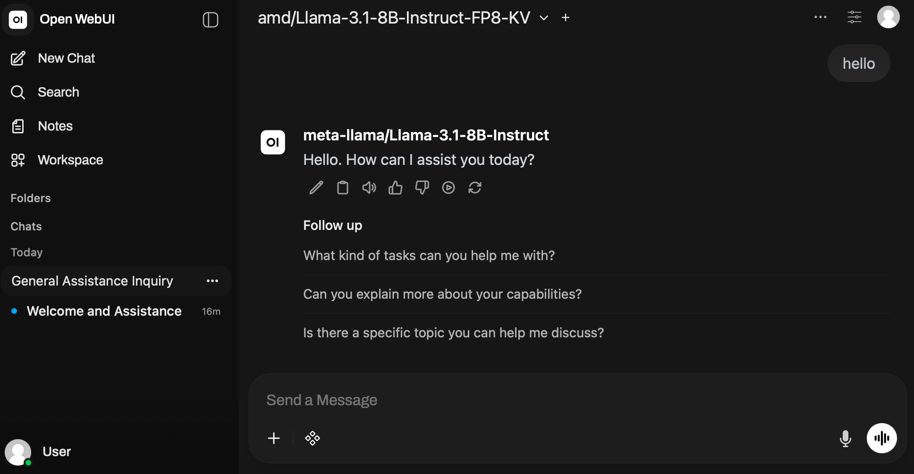

<!--
Copyright © Advanced Micro Devices, Inc., or its affiliates.

SPDX-License-Identifier: MIT
-->

# LLM-Chat

## Overview



Chatting with an LLM is often a good way to perform an initial evaluation. This is a sanity check that lets us quickly get a feel for what the LLM is capable of and what style of responses it tends to generate. Even before standardized test suites, we can explore prompting techniques and understand model behavior.

This Solution Blueprint combines two parts:

- The open-source [OpenWebUI](https://openwebui.com/) chat application. Open WebUI is a third‑party open-source project; trademarks belong to their respective owners.
- The user's chosen AIM deployed alongside it.

AMD Solution Blueprints are packaged as [Helm charts](https://helm.sh/) for deployment on a Kubernetes cluster. For development or further exploration, the source code is public and available in the [Solution Blueprints GitHub repository](https://github.com/amd-enterprise-ai/solution-blueprints/tree/main/solution-blueprints/llm-chat).

## Architecture

<picture>
  <source media="(prefers-color-scheme: light)" srcset="architecture-diagram-light-scheme.png">
  <source media="(prefers-color-scheme: dark)" srcset="architecture-diagram-dark-scheme.png">
  
</picture>

The blueprint integrates **OpenWebUI** with an **AIM** LLM service.

| Component | Role |
|-----------|------|
| OpenWebUI | Web chat interface and configuration |
| AIM LLM | Inference for chat completions (default: Llama 3.1 8B) |

### Key Features

- A feature-rich, user-friendly LLM chat platform provided by the open-source [OpenWebUI](https://openwebui.com/)
- Flexible AIM deployment:
  - AIM LLMs provide a robust, scalable inference runtime that is optimized for AMD hardware.
- Talk with the AIM in a back-and-forth classic chat interface and get access to a wide array of inference parameters like the system prompt, temperature and various other constraints.

## Getting Started

This is a quick start guide on how to deploy the blueprint. For advanced options, such as reusing an existing AIM, providing a Hugging Face token, or overriding storage classes, see [Deploying Solution Blueprints with Helm](https://enterprise-ai.docs.amd.com/en/latest/solution-blueprints/deployment.html) or explore the [advanced deployment guide](./DEPLOYMENT.md).

### Prerequisites

#### System Requirements

This blueprint can be deployed on **AMD Instinct** (default), **AMD EPYC**, and **AMD Radeon**. The blueprint requires the following cluster resources by default, depending on the hardware being used:

| Resource | Instinct | Radeon | EPYC |
|--|--|--|--|
| GPUs | 1 | 1 | — |
| CPUs | 5 CPU cores | 5 CPU cores | 189 CPU cores |
| RAM | 68 Gi | 36 Gi | 132 Gi |

To deploy to the Kubernetes cluster, ensure the following prerequisites are met:

- [kubectl](https://kubernetes.io/docs/tasks/tools/): Installed and configured to communicate with the cluster
- [Helm](https://helm.sh/docs/intro/install/) 3.17 or higher: Installed on your local machine

### Deployment

For advanced deployment options, explore the [advanced deployment guide](./DEPLOYMENT.md). Solution Blueprints are packaged as OCI-compliant Helm charts in the Docker Hub registry and can be deployed to a Kubernetes cluster with a single command. Define the `name` (deployment name) and the `namespace` (Kubernetes namespace), then pipe the output of `helm template` to `kubectl apply -f -`.

Find the deployment command below. Note: You can create a namespace using `kubectl create namespace <my-namespace>`.

<!-- platform-tabs:start -->

#### AMD Instinct (GPU, default)

```bash
name="my-deployment"
namespace="my-namespace"
helm template $name oci://registry-1.docker.io/amdenterpriseai/aimsb-llm-chat \
  | kubectl apply -f - -n $namespace
```

#### AMD EPYC (CPU)

EPYC runs the model on CPU (`gpus=0`, `bf16`, `AIM_ALLOW_UNOPTIMIZED=true`), sized via `llm.cpus`/`llm.memory`. The default EPYC AIM is a **gated** image, so provide a Hugging Face token through a Secret.

```bash
name="my-deployment"
namespace="my-namespace"
kubectl create namespace $namespace
kubectl create secret generic hf-token --from-literal=hf-token=<YOUR_HF_TOKEN> -n $namespace

helm pull oci://registry-1.docker.io/amdenterpriseai/aimsb-llm-chat --untar
helm template $name ./aimsb-llm-chat \
  --set global.platform=epyc \
  --set llm.cpus=188 \
  --set llm.memory=128 \
  --set llm.env_vars.HF_TOKEN.name=hf-token \
  --set llm.env_vars.HF_TOKEN.key=hf-token \
  | kubectl apply -f - -n $namespace
```

> **Performance note**: On multi-socket EPYC nodes, configure the kubelet for NUMA alignment (CPU Manager `static`, Topology Manager `single-numa-node`, Memory Manager `Static`); otherwise the LLM's CPUs and memory can land on different NUMA nodes and vLLM runs effectively single-threaded.

#### AMD Radeon (GPU)

```bash
name="my-deployment"
namespace="my-namespace"
helm template $name oci://registry-1.docker.io/amdenterpriseai/aimsb-llm-chat \
  --set global.platform=radeon \
  | kubectl apply -f - -n $namespace
```

<!-- platform-tabs:end -->

### Verify Deployment

To check the status of the deployment, run:

```bash
kubectl get pods -n $namespace
```

Wait until all pods report `Running` and `Ready`.

### Connect to UI

To connect to the UI, port-forward to 8080. The UI will then be available at [http://localhost:8080](http://localhost:8080) in your browser.

```bash
kubectl port-forward services/aimsb-llm-chat-${name} 8080:80 -n $namespace
```

Once connected, use the application as follows:

1. Open the chat interface in your browser
2. Adjust inference settings as needed (for example, system prompt and temperature)
3. Send messages and review the model's responses

### Clean Up

When you are finished, remove the deployed resources using the same deployment command, with `kubectl delete` instead of `kubectl apply`. For example, for Instinct use the following command:

```bash
helm template $name oci://registry-1.docker.io/amdenterpriseai/aimsb-llm-chat \
  | kubectl delete -f - -n $namespace
```

## Third-Party Components

To see the full set of software and Python dependencies, explore the repository source and dependency files. The table below lists key components only. For further license information, refer to each component's official documentation.

| Component | License |
|---------|---------|
| OpenWebUI | [License](https://docs.openwebui.com/license) |

## Terms of Use

AMD Solution Blueprints are released under the [MIT License](https://opensource.org/license/mit), which governs the parts of the software and materials created by AMD. Third-party Software and Materials used within the Solution Blueprints are governed by their respective licenses.
