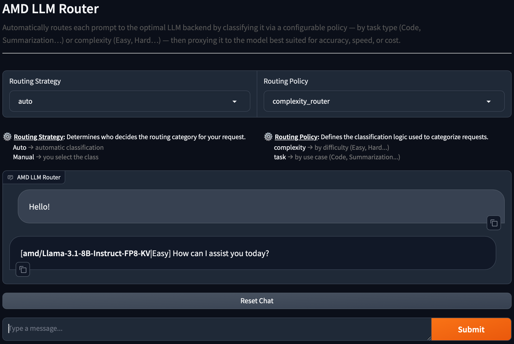

<!--
Copyright © Advanced Micro Devices, Inc., or its affiliates.

SPDX-License-Identifier: MIT
-->

# LLM Router

## Overview



Finding the right Large Language Model (LLM) for a task can be difficult. While the perfect model
would be accurate, fast, and inexpensive, real-world systems often force a choice between these
competing factors.

This blueprint design presents a routing system that automates this choice. When a user submits a prompt, the
system follows this process:

1. **Applies a Routing Policy**: The system uses a defined strategy, such as classifying the prompt by its
   task type or complexity level.
2. **Classifies the Prompt**: The system analyzes the incoming prompt and assigns it to the correct category from the policy. Two classification approaches are supported: embedding-based and LLM-based (described below).
3. **Routes to the Optimal LLM**: Based on this classification, the system automatically proxies the original prompt to the LLM backend best suited for that specific category—whether optimized for accuracy, speed, or cost.

For example, under a task classification policy, user prompts are analyzed, categorized, and
seamlessly sent to the most appropriate model for execution.

| User Prompt | Task Classification | Route To |
|--|--|--|
| "Create a quicksort in go language" | Code Generation | secondary-llm |
| "Based on these three facts: First, water boils at 100°C. Second, ice melts at 0°C. Third, evaporation occurs at various temperatures. What general conclusion can be drawn about states of matter and temperature?" | Summarization | primary-llm |
| "Hello" | Unknown | primary-llm |

AMD Solution Blueprints are packaged as [Helm charts](https://helm.sh/) for deployment on a Kubernetes cluster. For development or further exploration, the source code is public and available in the [Solution Blueprints GitHub repository](https://github.com/amd-enterprise-ai/solution-blueprints/tree/main/solution-blueprints/llm-router).

## Architecture

<picture>
  <source media="(prefers-color-scheme: light)" srcset="architecture-diagram-light-scheme.png">
  <source media="(prefers-color-scheme: dark)" srcset="architecture-diagram-dark-scheme.png">
  
</picture>

The LLM Router is composed of the following components:

| Component | Role |
|-----------|------|
| Router Controller | A proxy-like service responsible for routing OpenAI-compatible requests |
| Router Classifier | A service that analyzes and classifies the user's prompt. Supports two classification approaches: embedding-based and LLM-based |
| UI (Gradio) | Web interface for testing routing policies and sending prompts |
| Primary AIM | Lighter-workload backend (default demo deployment: Llama 3.1 8B) |
| Secondary AIM | Heavier-workload backend (default demo deployment: Llama 3.3 70B) |

When deployed with demonstration LLMs (`deployDemonstrationLLMs=true`), the chart deploys two AIM backends by default: **primary** (Llama 3.1 8B) and **secondary** (Llama 3.3 70B). You can point the models at existing external LLM endpoints instead.

## LLM Router Details

This section covers classification approaches, routing policies, and LLM backend configuration. There will be references to Helm template configuration parameters (e.g. `values.yaml`) and other details. If you prefer to deploy the blueprint and read about the details later go to [Getting Started](#getting-started).

### Classification Approaches

The Router Classifier supports two modes of operation, selected via `embedding.enabled` in
`values.yaml`.

#### Embedding-based Classification

When values: `embedding.enabled: true`.

The classifier loads class descriptions from the router-controller config, computes their embeddings
using an OpenAI-compatible vLLM embedding server (aim-base) with the
`intfloat/multilingual-e5-large-instruct` model, and classifies each incoming prompt by finding the
class with the highest cosine similarity to the query embedding.

**Pros:**

- Fast and lightweight — no LLM inference required for classification.
- Deterministic results.
- Works well even with smaller, less capable LLM backends.

**Cons:**

- Quality depends on how well the class descriptions are written.
- Requires an additional embedding service to be deployed.

#### LLM-based Classification

When values: `embedding.enabled: false`

The classifier sends the conversation and the list of class names to a configured LLM backend,
instructing it to return a structured JSON response with the chosen class.

**Pros:**

- Can handle nuanced or ambiguous prompts better in some cases.
- No additional embedding service required.

**Cons:**

- Slower — adds an extra LLM inference call to every request.
- Quality depends on the capability of the classifier LLM.
- Non-deterministic — results may vary between runs.

**Recommendation**: Based on practical experience, the **embedding-based approach** performs better
overall. It is faster, more consistent, and produces reliable results when class descriptions are
written clearly. The LLM-based approach may occasionally handle edge cases better, but the added
latency and non-determinism make it less suitable for production routing.

### Policies

The configuration file defines the available routing policies. Each class now includes both a
`backend` (which LLM to route to) and a `description` (used by the embedding classifier to match
incoming prompts).

The `task_router` categorizes prompts by task type:

- **Code Generation** → secondary LLM
- **Summarization** → primary LLM
- **Unknown** → primary LLM

The `complexity_router` categorizes prompts by complexity:

- **Hard** → secondary LLM
- **Middle** → secondary LLM
- **Easy** → primary LLM
- **Unknown** → primary LLM

### LLMs

The `models` configuration in `values.yaml` defines available LLM backends. Each class in a routing
rule references a backend by name.

Example configuration from `values.yaml`:

```yaml
models:
  - name: primary
    base_url: http://primary
    api_key: ""    # optional
    model_name: "" # optional
  - name: secondary
    base_url: http://secondary
    api_key: ""    # optional
    model_name: "" # optional

routing:
  rules:
    task_router:
      classifier_path: /classify
      classes:
        Code Generation:
          backend: secondary
          description: "Any request to create, write, generate, implement or provide code in any programming language, algorithm implementations, scripts, functions, or code examples."
        Summarization:
          backend: primary
          description: "Tasks related to summarizing text, condensing articles, conversations, documents, providing key points or brief overviews."
        Unknown:
          backend: primary
          description: "Requests that are completely unclear, off-topic, spam, or do not match ANY of the defined categories at all."

    complexity_router:
      classifier_path: /classify
      classes:
        Hard:
          backend: secondary
          description: "High-effort tasks: algorithms, complex math, deep multi-step reasoning, code writing, advanced technical topics."
        Middle:
          backend: secondary
          description: "Medium effort tasks: short explanations, standard how-to questions, everyday problem solving, moderate knowledge recall."
        Easy:
          backend: primary
          description: "Very low-effort interactions: greetings, simple yes/no questions, basic facts, casual chat."
        Unknown:
          backend: primary
          description: "Requests that are completely unclear, off-topic, spam, or do not match ANY of the defined categories at all."

classifier:
  llmBackend: secondary  # used only when embedding.enabled: false

embedding:
  enabled: true  # true = embedding approach, false = LLM approach
```

## Getting Started

This is a quick start guide on how to deploy the blueprint. For advanced options, such as connecting to existing LLM endpoints, configuring routing rules, or enabling HTTPRoute access, see [Deploying Solution Blueprints with Helm](https://enterprise-ai.docs.amd.com/en/latest/solution-blueprints/deployment.html) or explore the [advanced deployment guide](./DEPLOYMENT.md).

This blueprint supports **AMD Instinct** (default) and **AMD Radeon** platforms. The section below covers the default **Instinct** deployment. For Radeon deployment and other advanced options, see:

- [Deploy on AMD Instinct](DEPLOYMENT.md#amd-instinct-gpu-default)
- [Deploy on AMD Radeon](DEPLOYMENT.md#amd-radeon-gpu)

### Prerequisites

#### System Requirements

The blueprint requires the following cluster resources by default (with embedding-based classification enabled):

| Resource | Default Configuration |
|--|-------------------|
| GPUs | 1 (embedding service; router pods do not require GPUs) |
| CPUs | 4 CPU cores |
| RAM | 192 Gi |

For demo deployment with self-hosted LLMs (`deployDemonstrationLLMs=true`), plan for **3 GPUs** total (2 demonstration LLMs + 1 embedding service). If you use external LLM endpoints via `models` configuration, GPU requirements for those services are defined by their own deployments.

To deploy to the Kubernetes cluster, ensure the following prerequisites are met:

- [kubectl](https://kubernetes.io/docs/tasks/tools/): Installed and configured to communicate with the cluster
- [Helm](https://helm.sh/docs/intro/install/) 3.17 or higher: Installed on your local machine

### Deployment

Solution Blueprints are packaged as OCI-compliant Helm charts in the Docker Hub registry and can be deployed to a Kubernetes cluster with a single command. Define the `name` (deployment name) and the `namespace` (Kubernetes namespace), then pipe the output of `helm template` to `kubectl apply -f -`.

The example below sets `deployDemonstrationLLMs=true` to deploy with self-hosted AIM backends.

```bash
name="my-deployment"
namespace="my-namespace"
helm template $name oci://registry-1.docker.io/amdenterpriseai/aimsb-llm-router \
  --set deployDemonstrationLLMs=true \
  | kubectl apply -f - -n $namespace
```

Note: You can create a namespace using `kubectl create namespace $namespace`.

To check the status of the deployment, run:

```bash
kubectl get pods -n $namespace
```

Wait until all pods report `Running` and `Ready`.

### Connect to UI

To connect to the UI, port-forward to 8080. The UI will then be available at [http://localhost:8080](http://localhost:8080) in your browser.

```bash
kubectl port-forward services/${name}-aimsb-llm-router-ui 8080:8008 -n $namespace
```

### Using the Router

The LLM Router exposes an OpenAI-compatible API and can be used as a drop-in replacement for
existing OpenAI-based applications. Requests keep the standard OpenAI structure, while the router
transparently handles model selection based on configured routing logic.

The only required extension is the inclusion of `llm-router` metadata in the request body. This
metadata controls how the request is classified and routed:

- **policy**: Defines which classification policy should be applied (by default, `task_router` or
  `complexity_router`).
- **routing_strategy**: Specifies how routing decisions are made.
  - `auto` delegates classification to the router-classifier service.
  - `manual` skips classification and allows the client to explicitly control routing behavior.

#### Request format

```
POST /v1/chat/completions
Content-Type: application/json
Accept: application/json
{
  "model": "string | empty",
  "messages": [
    {
      "role": "user | system | assistant",
      "content": "string"
    }
  ],
  "max_tokens": integer,
  "stream": boolean,
  "llm-router": {
    "policy": "string",
    "routing_strategy": "auto | manual",
    "model": "string | empty"
  }
}
```

### Clean Up

When you are finished, remove the deployed resources:

```bash
helm template $name oci://registry-1.docker.io/amdenterpriseai/aimsb-llm-router \
  --set deployDemonstrationLLMs=true \
  | kubectl delete -f - -n $namespace
```

## Third-Party Components

This Solution Blueprint uses multiple third-party components. To see the full set of software and Python dependencies, explore the repository source and dependency files. The table below highlights some of the key components. For further license information, refer to each component's official documentation.

| Component | License |
|---------|---------|
| FastAPI | MIT |
| Gradio | Apache 2.0 |
| vLLM | Apache 2.0 |

## Terms of Use

AMD Solution Blueprints are released under the [MIT License](https://opensource.org/license/mit), which governs the parts of the software and materials created by AMD. Third-party Software and Materials used within the Solution Blueprints are governed by their respective licenses.
