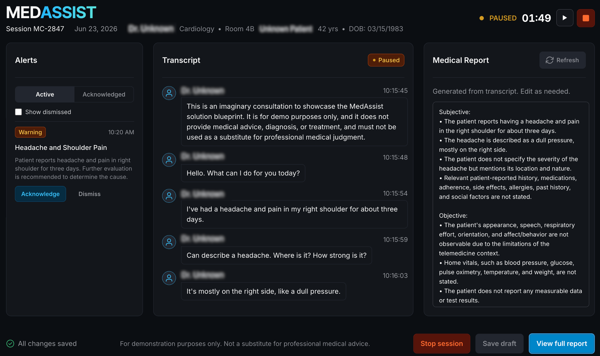

<!--
Copyright © Advanced Micro Devices, Inc., or its affiliates.

SPDX-License-Identifier: MIT
-->

# Med Assist Voice Consultation

## Overview



This Solution Blueprint provides an end-to-end real-time med-assist voice consultation workflow. It
deploys frontend and agent services with LiveKit media transport, Qwen ASR transcription, and an LLM
backend for consultation report generation.

It helps clinicians document voice consultations by transcribing doctor–patient conversations in
real time, generating structured SOAP-style (Subjective, Objective, Assessment, Plan) reports for
review, and surfacing potential clinical safety issues as categorized alerts (`critical` /
`warning` / `info`) during the session.

> **Disclaimer:**
> This project is a demonstration application intended for technical evaluation only.
> It does not provide medical advice, diagnosis, or treatment, and must not be used as a substitute
> for professional medical judgment.

AMD Solution Blueprints are packaged as [Helm charts](https://helm.sh/) for deployment on a
Kubernetes cluster. For development or further exploration, the source code is public and available
in
the [Solution Blueprints GitHub repository](https://github.com/amd-enterprise-ai/solution-blueprints/tree/main/solution-blueprints/med-assist/).

## Architecture

<picture>
  <source media="(prefers-color-scheme: light)" srcset="architecture-diagram-light-scheme.png">
  <source media="(prefers-color-scheme: dark)" srcset="architecture-diagram-dark-scheme.png">
  
</picture>

### STUNner Integration

Media traffic from the browser-based frontend to the **LiveKit** service now flows through **STUNner**,
a Kubernetes-native WebRTC media gateway. STUNner acts as a STUN/TURN gateway between external
clients and the LiveKit pods, simplifying NAT traversal and firewall configuration in cloud-native
environments. This replaces direct exposure of LiveKit media ports in many setups.

| Component                                    | Role                                                                                                                                                          |
|----------------------------------------------|---------------------------------------------------------------------------------------------------------------------------------------------------------------|
| STUNner ('stunner')                          | Kubernetes-native WebRTC media gateway (STUN/TURN server) that acts as a secure entry point for media traffic between the browser-based frontend and LiveKit. |
| LiveKit service (`livekit`)                  | WebRTC room and media transport.                                                                                                                              |
| Agent service (`pythonServices.agent`)       | Handles transcription and LLM interactions.                                                                                                                   |
| Frontend service (`pythonServices.frontend`) | Web UI on port 7860 for session interaction.                                                                                                                  |
| AIM                                          | Default LLM backend dependency using Llama 3.3 70B Instruct (can be replaced via `llm.existingService`).                                                      |
| ASR service (`qwen-asr`)                     | Default speech-to-text backend (can be replaced via `qwen-asr.existingService`).                                                                              |

### Key Features

- Real-time voice consultation flow over LiveKit with a browser-based frontend.
- Continuous transcription of the doctor–patient call via Qwen ASR during the session.
- LLM-powered generation of a structured SOAP-style consultation report (Subjective, Objective,
  Assessment, Plan) from the call transcript.
- Flexible deployment model: deploy bundled LLM/ASR dependencies or reuse existing OpenAI-compatible
  endpoints.

## Getting Started

### Prerequisites

Before deploying the Med Assist Voice Consultation blueprint, a cluster-admin must run
`./install-prerequisites.sh` **once per cluster**. This installs the **STUNner Operator** and
creates a shared cluster-wide `GatewayClass` named `stunner`. Requires cluster-admin privileges (
ClusterRole, ClusterRoleBinding, CRDs).

After the script has been run, regular users can deploy and remove the blueprint without
cluster-admin privileges and without errors.

> **Important:** The STUNner operator is shared cluster infrastructure — do not delete its pods or
> scale it to zero while blueprints are running. Use `./install-prerequisites.sh --uninstall` to
> remove it after all blueprints have been removed.

Requirements:

- [kubectl](https://kubernetes.io/docs/tasks/tools/) configured and pointing at your target cluster
- [Helm](https://helm.sh/docs/intro/install/) 3.17 or higher installed
- Cluster-admin or rights to create ClusterRole, ClusterRoleBinding, and CRDs

Clone the public
repository [https://github.com/amd-enterprise-ai/solution-blueprints/](https://github.com/amd-enterprise-ai/solution-blueprints/),
then run the provided script once per cluster:

```bash
git clone https://github.com/amd-enterprise-ai/solution-blueprints.git
cd solution-blueprints/solution-blueprints/med-assist
./install-prerequisites.sh
```

This is a quick start guide on how to deploy the blueprint. For advanced options, such as connecting
to existing LLM endpoints, configuring routing rules, enabling HTTPRoute access, STUNner
configuration details and more, see the docs at `docs/DEPLOYMENT.md`.

This blueprint supports **AMD Instinct** (default) and **AMD Radeon** platforms. The section below covers the default **Instinct** deployment. For Radeon and other advanced options, see:

- [Deploy on AMD Radeon](DEPLOYMENT.md#amd-radeon-gpu)

#### System Requirements

- Kubernetes cluster with GPU-capable worker nodes for LLM/ASR inference workloads.
- **STUNner Operator** must be installed on the cluster to provide the WebRTC media gateway
  functionality. You can install it manually or by running the provided `install-prerequisites.sh`
  script (requires `cluster-admin` privileges or rights to create `ClusterRole`,
  `ClusterRoleBinding`, and CRDs).
- Network configuration that allows client access to frontend and LiveKit endpoints (media traffic
  is routed through STUNner).
- LiveKit media traffic requires preliminary network/firewall configuration. With STUNner
  integration, direct exposure of LiveKit media ports on worker nodes is no longer required in most
  setups.
    - If you use **`livekit.exposure.mode=nodePort`**, you must still allow **inbound TCP** to the
      chosen **NodePort** (default `32080`) for WebSocket signaling.
    - For details on configuring STUNner, LiveKit media routing, and firewall rules, see
      `docs/DEPLOYMENT.md`.
- Resource requirements (defaults in `values.yaml` for `agent` and `frontend` services):
    - **Total CPU requests**: 1 CPU (agent: 500m, frontend: 500m)
    - **Total CPU limits**: 4 CPU (agent: 2, frontend: 2)
    - **Total memory requests**: 2Gi (agent: 1Gi, frontend: 1Gi)
    - **Total memory limits**: 4Gi (agent: 2Gi, frontend: 2Gi)
- Model serving resources (default bundled dependencies):
    - **LLM (`llm`)**: requests/limits `amd.com/gpu: 1`, `cpu: 4`, `memory: 64Gi`, plus ephemeral
      storage `512Gi`.
    - **ASR (`qwen-asr`)**: requests/limits `amd.com/gpu: 1` (for `Qwen/Qwen3-ASR-1.7B`), with
      memory sizing depending on your ASR image/config.
    - **GPU planning baseline**: plan for at least **2 GPUs total** when running both bundled model
      services (`1` for LLM + `1` for ASR).
    - If you use `llm.existingService` and/or `qwen-asr.existingService`, GPU requirements are
      defined by those external services.

### Deployment

See the deployment docs and follow the instructions (`docs/DEPLOYMENT.md`):
- Deploy from the OCI registry with `helm template ... | kubectl apply -f -`.
- Set `pythonServices.frontend.env.LIVEKIT_WS_URL` to your external LiveKit WebSocket URL.
- Optionally set `llm.existingService` and/or `qwen-asr.existingService` to reuse existing backends.
- Access the frontend via port-forwarding or HTTPRoute.

#### Connect to UI

The frontend UI is exposed on port `7860` by the `frontend` service. To access the UI, port-forward and then open [http://localhost:7860](http://localhost:7860) in the browser:

```bash
kubectl port-forward "svc/aimsb-med-assist-$name-frontend" 7860:7860 -n $namespace
```

#### Configuration Highlights

- **LLM**: set `llm.existingService` to reuse an external LLM; otherwise the chart deploys the
  default LLM via the `llm` dependency.
- **ASR (OpenAI-compatible)**: set `qwen-asr.existingService` to reuse an external ASR that exposes
  an OpenAI-compatible audio transcription API.
- **Agent Secrets**: configure LiveKit and model access under `pythonServices.agent.env`:
  - `LIVEKIT_API_KEY` / `LIVEKIT_API_SECRET` — LiveKit credentials used by the agent.
  - `LLM_API_KEY` — API key for the LLM backend when required by your `llm` deployment or external endpoint.
  - `STT_API_KEY` — API key for the external ASR service when using `qwen-asr.existingService`.
  - `STT_MODEL` — Model name for the external ASR service when using `qwen-asr.existingService`.
- **Frontend Secrets**: configure LiveKit and model access under `pythonServices.frontend.env`:
  - `LIVEKIT_WS_URL` — external LiveKit WebSocket URL; without this value, chart rendering fails. See `docs/DEPLOYMENT.md` for details and examples.
  - `LIVEKIT_API_KEY` / `LIVEKIT_API_SECRET` — LiveKit credentials used by the frontend.
- **Networking**:
    - `http_route.enabled=true` enables frontend HTTPRoute generation.
    - LiveKit HTTPRoute is created when `livekit.enabled=true`.
    - With **STUNner** integration, direct exposure of LiveKit UDP media ports (`50000-60000`) on
      worker nodes is usually **not required**. STUNner handles media traffic routing.
    - If you use **`livekit.exposure.mode=nodePort`**, you must still allow **inbound TCP** to the
      chosen **NodePort** (default `32080`) for WebSocket signaling.
    - For full details on STUNner configuration, Gateway/UDPRoute setup, and firewall rules, see
      `docs/DEPLOYMENT.md`.
- **Security**: default API keys/secrets in `values.yaml` are placeholders and must be overridden
  for production.

#### Model compatibility guidance

This blueprint is validated with:

- **LLM services** exposed via `llm.existingService` or the default `llm` dependency. The
  application is designed to operate correctly with models **of capability level not lower than
  Llama 3.3 70B**. Prompts and pipeline configuration have been tuned and tested for this class of
  models. Using smaller or less capable models may lead to issues such as incorrect or unstable
  structured output; in such cases, additional prompt or configuration tuning may be necessary.
- **ASR services** that expose an **OpenAI-compatible audio transcription API** and are wired via
  the bundled `qwen-asr` dependency or `qwen-asr.existingService`. The quality and latency of
  transcription will depend on the specific ASR model you choose and its configuration.

Production quality depends on model capability and prompt behavior. If you switch to different
models or ASR providers, validate transcription quality and generated SOAP consultation output in
your target domain.

## Third-party Components

This Solution Blueprint utilizes multiple components. For third-party license information, refer to each component's documentation. Key third-party components are listed below.

| Component | License |
|---------|---------|
| FastAPI | MIT |
| Gradio | Apache 2.0 |
| LiveKit | Apache 2.0 |
| STUNner | MIT |
| Pydantic | MIT |

The blueprint also relies on AMD Inference Microservices (AIMs) for the default LLM and Qwen ASR backends. These are governed by their respective model and image licenses; see the [catalog of available AIMs](https://enterprise-ai.docs.amd.com/en/latest/aims/catalog/models.html).

## Terms of Use

AMD Solution Blueprints are released under the [MIT License](https://opensource.org/license/mit),
which governs the parts of the software and materials created by AMD. Third-party Software and
Materials used within the Solution Blueprints are governed by their respective licenses.
