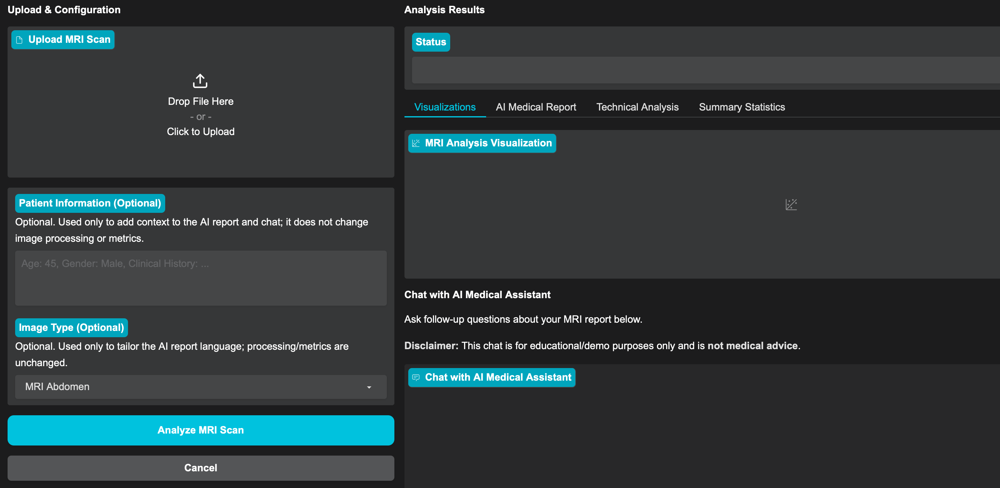
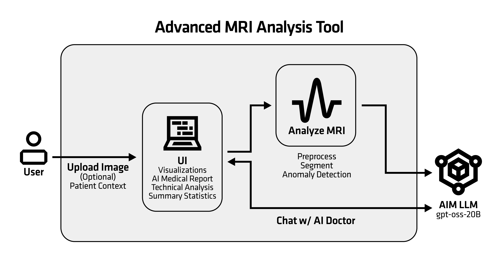

<!--
Copyright © Advanced Micro Devices, Inc., or its affiliates.

SPDX-License-Identifier: MIT
-->

# MRI Analysis Tool

## Overview



This Solution Blueprint provides an AI-assisted MRI analysis workflow through a web interface:

- Users upload a scan, optionally add patient context, and select the MRI type.
- The MRI is then analyzed using Computer Vision and Machine Learning tools, and a Large Language Model generates a medical report.
- Users can review visualizations and metrics alongside the report, and ask follow-up questions in an interactive chat.

AMD Solution Blueprints are packaged as [Helm charts](https://helm.sh/) for deployment on a Kubernetes cluster. For development or further exploration, the source code is public and available in the [Solution Blueprints GitHub repository](https://github.com/amd-enterprise-ai/solution-blueprints/tree/main/solution-blueprints/mri-doc).

## Architecture

<picture>
  <source media="(prefers-color-scheme: light)" srcset="Architecture_Diagram_Enterprise_AI_Solution_Blueprints_Light.png">
  <source media="(prefers-color-scheme: dark)" srcset="Architecture_Diagram_Enterprise_AI_Solution_Blueprints_Dark.png">
  
</picture>

The blueprint provides a **Gradio** web application for AI-powered MRI analysis with deep learning and LLM insights. By default, an AIM is deployed (GPT-OSS 20B) for draft medical report generation and follow-up Q&A.

| Component | Role |
|-----------|------|
| Gradio UI | Web interface for uploading scans, running analysis, and reviewing results |
| MRI analysis pipeline | Image loading, preprocessing, segmentation, anomaly detection |
| AIM LLM | Draft medical report generation and follow-up Q&A (default: GPT-OSS 20B) |

### Key Features

- Multi-format support: DICOM (`.dcm`), NIfTI (`.nii`, `.nii.gz`), and standard image formats (`.png`, `.jpg`, `.jpeg`)
- Robust loading and normalization: DICOM decoding (pydicom), NIfTI decoding (nibabel), image fallback (OpenCV); intensity normalization to 8-bit for consistent downstream processing
- Image preprocessing: Contrast enhancement using CLAHE and noise reduction using Gaussian filtering
- Tissue segmentation: K-means clustering (scikit-learn) with per-cluster pixel distribution statistics
- Anomaly detection: Statistical thresholding (mean + 2.5×std) with connected-component region counting (SciPy) and visualization overlays
- Quantitative measurements: Image dimensions, intensity statistics, signal-to-noise ratio, and optional physical size estimates when pixel spacing metadata is available
- LLM-assisted reporting: Draft medical report (Markdown) and follow-up Q&A chat
- Flexible LLM configuration: Deploy the bundled AIM or connect to an existing service

## Getting Started

This is a quick start guide on how to deploy the blueprint. For advanced options, such as reusing an existing AIM, providing a Hugging Face token, or overriding storage classes, see [Deploying Solution Blueprints with Helm](https://enterprise-ai.docs.amd.com/en/latest/solution-blueprints/deployment.html) or explore the [advanced deployment guide](./DEPLOYMENT.md).

This blueprint supports **AMD Instinct** (default) and **AMD Radeon** platforms. The section below covers the default **Instinct** deployment. For Radeon and other advanced options, see:

- [Deploy on AMD Radeon](DEPLOYMENT.md#amd-radeon-gpu)

### Prerequisites

#### System Requirements

The blueprint requires the following cluster resources by default:

| Resource | Default Configuration |
|--|-------------------|
| GPUs | 1 (AIM LLM; application pod does not require a GPU) |
| CPUs | ~5 CPU cores |
| RAM | 68 Gi |

To deploy to the Kubernetes cluster, ensure the following prerequisites are met:

- [kubectl](https://kubernetes.io/docs/tasks/tools/): Installed and configured to communicate with the cluster
- [Helm](https://helm.sh/docs/intro/install/) 3.17 or higher: Installed on your local machine

### Deployment

Solution Blueprints are packaged as OCI-compliant Helm charts in the Docker Hub registry and can be deployed to a Kubernetes cluster with a single command. Define the `name` (deployment name) and the `namespace` (Kubernetes namespace), then pipe the output of `helm template` to `kubectl apply -f -`:

```bash
name="my-deployment"
namespace="my-namespace"
helm template $name oci://registry-1.docker.io/amdenterpriseai/aimsb-mri-doc \
  | kubectl apply -f - -n $namespace
```

Note: You can create a namespace using `kubectl create namespace $namespace`.

To check the status of the deployment, run:

```bash
kubectl get pods -n $namespace
```

Wait until all pods report `Running` and `Ready`.

### Connect to UI

To connect to the UI, port-forward to 7861. The UI will then be available at [http://localhost:7861](http://localhost:7861) in your browser.

```bash
kubectl port-forward services/aimsb-mri-doc-${name} 7861:80 -n $namespace
```

Once connected, use the application as follows:

1. Upload an MRI scan file (DICOM `.dcm`, NIfTI `.nii`/`.nii.gz`, or standard images `.png`/`.jpg`/`.jpeg`).
2. Provide optional patient context.
3. Select the MRI type and run the analysis.
4. Review the visualization, metrics, and report output.

#### Example MRI scans

If you need sample MRI scans to test with, these public resources are a good starting point (always review each dataset's license/terms and any access requirements):

- The [DICOM Library](https://www.dicomlibrary.com/) has a few samples, e.g., [this abdomen scan](https://www.dicomlibrary.com/?manage=feb6447a72c9a0a31e1bb4459e547964)
- [The Cancer Imaging Archive (TCIA)](https://www.cancerimagingarchive.net/): Multiple MRI collections
- [OpenNeuro](https://openneuro.org/): Public neuroimaging datasets, often NIfTI
- [fastMRI (NYU/Facebook)](https://fastmri.org/): MRI dataset and tools; access may require agreement

### Clean Up

When you are finished, remove the deployed resources:

```bash
helm template $name oci://registry-1.docker.io/amdenterpriseai/aimsb-mri-doc \
  | kubectl delete -f - -n $namespace
```

## Disclaimer

This tool is for research and educational use only. It is not intended for clinical diagnosis or treatment.

## Third-Party Components

This Solution Blueprint uses multiple third-party components. To see the full set of software and Python dependencies, explore the repository source and dependency files. The table below highlights some of the key components. For further license information, refer to each component's official documentation.

| Component | License |
|---------|---------|
| Gradio | Apache 2.0 |
| LangChain | MIT |
| OpenCV | Apache 2.0 |

## Terms of Use

AMD Solution Blueprints are released under the [MIT License](https://opensource.org/license/mit), which governs the parts of the software and materials created by AMD. Third-party Software and Materials used within the Solution Blueprints are governed by their respective licenses.
