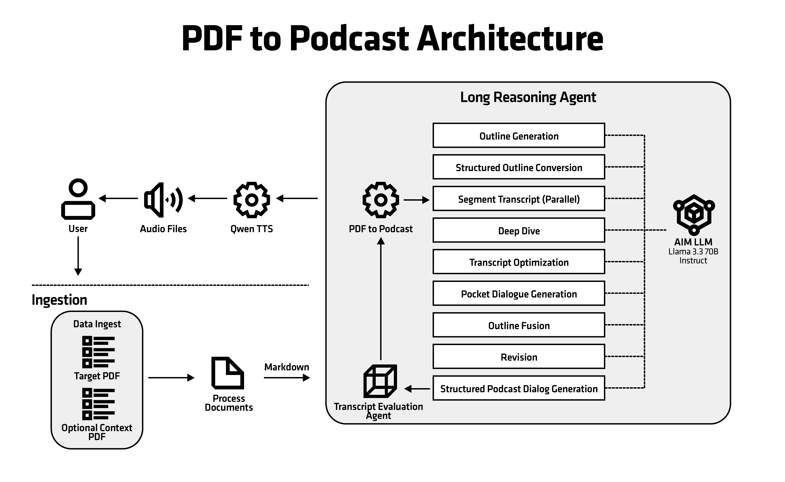

<!--
Copyright © Advanced Micro Devices, Inc., or its affiliates.

SPDX-License-Identifier: MIT
-->

# PDF to Podcast

This blueprint provides an end-to-end solution for converting PDF documents into podcast-style audio content. It leverages an agentic orchestration architecture with microservices for PDF processing, LLM-powered content generation, and text-to-speech synthesis. The solution is packaged as a Helm chart for easy deployment on Kubernetes clusters.

## Architecture

<picture>
  <source media="(prefers-color-scheme: light)" srcset="architecture-diagram-light-scheme.png">
  <source media="(prefers-color-scheme: dark)" srcset="architecture-diagram-dark-scheme.png">
  
</picture>

## Key Features

- End-to-end pipeline: ingest PDFs, extract text, summarize/plan, generate dialogue or monologue with LLM, synthesize audio via TTS, and store artifacts.
- Agentic orchestration: agent service coordinates PDF/TTS/LLM calls, uses Redis for tasks and MinIO for artifacts.
- LLM via `aimchart-llm` dependency by default; override with `llm.existingService` to reuse an existing endpoint.
- TTS via `aimchart-qwen-tts` dependency by default; override with `qwen-tts.existingService` to reuse an existing endpoint.
- Multiple modes: podcast dialogue or monologue, controlled via request parameters.

## Components

- **LLM service** (default from `aimchart-llm`; can point to external LLM via `llm.existingService`).
- **TTS service** (default from `aimchart-qwen-tts`; can point to external TTS via `qwen-tts.existingService`). Uses an OpenAI-compatible TTS API.
- **App service** (`app`) - Main API service running on port 8000, handles HTTP requests and coordinates the pipeline.
- **Celery worker** (`celery-worker`) - Background task processor for PDF processing, LLM calls, and TTS generation.
- **Frontend service** (`frontend`) - Web UI on port 7860 for uploading PDFs and managing conversions.
- **Redis** - Task queue and message broker for Celery.

## System Requirements

- Kubernetes cluster; GPU nodes recommended for LLM and TTS workloads.
- Persistent storage:
  - Ephemeral storage: 20Gi (ReadWriteOnce) for temporary workloads
  - App storage: 10Gi (ReadWriteMany) for shared PDF/temp data
  - Shared memory (dshm): 32Gi for /dev/shm
- Resource requirements (defaults in `values.yaml`):
  - **Total CPU requests**: 2 CPU (app: 500m, celery-worker: 1, frontend: 500m)
  - **Total CPU limits**: 8 CPU (app: 2, celery-worker: 4, frontend: 2)
  - **Total memory requests**: 12Gi (app: 2Gi, celery-worker: 8Gi, frontend: 2Gi)
  - **Total memory limits**: 24Gi (app: 4Gi, celery-worker: 16Gi, frontend: 4Gi)
  - Note: celery-worker resources are increased to handle OOM issues during heavy PDF processing and LLM tasks. The specified memory requests for celery-worker are suitable for processing PDF files up to 20 MB in size. For larger files, significantly more memory may be required (proportionally to file size).
- Model serving GPU requirements (default in this Blueprint):
  - **LLM model** (`amdenterpriseai/aim-meta-llama-llama-3-3-70b-instruct` via `aimchart-llm`): **1 GPU** (`amd.com/gpu: 1`)
  - **Speech model** (`Qwen/Qwen3-TTS-12Hz-1.7B-CustomVoice` via `aimchart-qwen-tts`): **1 GPU** (`amd.com/gpu: 1`)
  - **Total when both internal services are enabled**: **2 GPUs** (1 for LLM + 1 for TTS)
  - If you use `llm.existingService` and/or `qwen-tts.existingService`, GPU requirements for those external services are defined by their own deployments.

## Usage (overview)

1) Run `helm dependency build`, then `helm template … | kubectl apply -f -`. See `docs/DEPLOYMENT.md` for full commands.
2) Port-forward the frontend UI: `kubectl port-forward svc/aimsb-pdf-to-podcast-<release>-frontend 7860:7860 -n <namespace>` and open `http://localhost:7860`.

### Frontend options

The web UI lets you control the conversion with these flags:

- **Monologue Only** — Single speaker, no dialogue.
- **No TTS** — Skip audio generation; output is transcript only.
- **Full audio** — Generate the full podcast; otherwise audio is limited to 3000 characters.

If **No TTS** is selected, audio will not be generated even when **Full audio** is enabled.

### Target file and context files

- **Target file** — The main PDF document that will be converted into a podcast. Exactly one target file is required;
the pipeline extracts text from it, generates dialogue or monologue, and optionally synthesizes audio.
- **Context files** — Optional additional PDFs that provide extra information to the LLM. They are used as reference
when generating the podcast from the target document (e.g. terminology, or background). You can upload multiple context files.

## Configuration Highlights

- **LLM**: set `llm.existingService` to reuse an external LLM; otherwise the chart deploys the default via `aimchart-llm` dependency.
- **TTS**: set `qwen-tts.existingService` to reuse an external OpenAI-compatible TTS service; otherwise the chart deploys the default via `aimchart-qwen-tts` dependency. `APP_TTS_BASE_URL` is auto-configured from the subchart.
- **Secrets**: configure API and TTS keys under `pythonServices.app.env`:
  - `APP_TTS_API_KEY` - API key for the TTS service (if required by the TTS backend)
  - `APP_API_KEY` - Optional API key for authentication
  - `APP_CELERY_BROKER_URL` and `APP_CELERY_BACKEND_URL` - Auto-configured if not set
- **Storage**: adjust persistent volume settings in `values.yaml`:
  - `storage.ephemeral` - Temporary storage (20Gi default)
  - `storage.appStorage` - Shared storage for PDFs (10Gi default, ReadWriteMany)
  - `storage.dshm` - Shared memory size (32Gi default)
- **Resources**: adjust CPU and memory limits in `resources` section (default: 500m CPU requests, 4 CPU limits, 4Gi memory requests, 8Gi memory limits).

## LLM model compatibility

This Blueprint is validated with LLM backends exposed via `llm.existingService` or the default `aimchart-llm` dependency.
The application is designed to operate correctly with models **of capability level not lower than Llama 3.3 70B**.
Prompts and pipeline configuration have been tuned and tested for this class of models. Using smaller or less capable
models may lead to issues such as incorrect or unstable structured output; in such cases, additional prompt or
configuration tuning may be necessary.

## Terms of Use

AMD Solution Blueprints are released under [MIT License](https://opensource.org/license/mit), which governs the parts of the software and materials created by AMD. Third party Software and Materials used within the Solution Blueprints are governed by their respective licenses.
