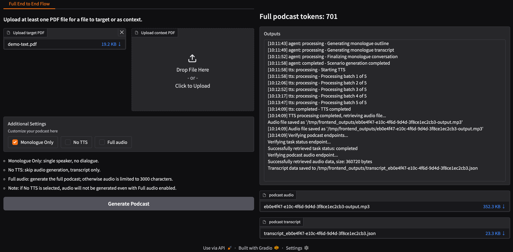

<!--
Copyright © Advanced Micro Devices, Inc., or its affiliates.

SPDX-License-Identifier: MIT
-->

# PDF to Podcast

## Overview



This Solution Blueprint provides an end-to-end pipeline for converting PDF documents into podcast-style audio content. It uses agentic orchestration with microservices for PDF processing, LLM-powered script generation, and Text-to-Speech synthesis.

AMD Solution Blueprints are packaged as [Helm charts](https://helm.sh/) for deployment on a Kubernetes cluster. For development or further exploration, the source code is public and available in the [Solution Blueprints GitHub repository](https://github.com/amd-enterprise-ai/solution-blueprints/tree/main/solution-blueprints/pdf-to-podcast).

## Architecture

<picture>
  <source media="(prefers-color-scheme: light)" srcset="architecture-diagram-light-scheme.png">
  <source media="(prefers-color-scheme: dark)" srcset="architecture-diagram-dark-scheme.png">
  
</picture>

The blueprint integrates a **Gradio** frontend, a **FastAPI** application with **Celery** workers, an **AIM** LLM service, a **Qwen TTS** service, and **Redis** for task queuing. By default, the AIM deploys Llama 3.3 70B for script generation and a Qwen TTS model for audio synthesis.

| Component | Role |
|-----------|------|
| Frontend (Gradio) | Web UI for uploading PDFs and managing conversions |
| App (FastAPI) | REST API that coordinates the pipeline |
| Celery worker | Background processing for PDF extraction, LLM calls, and TTS |
| AIM LLM | Script generation (default: Llama 3.3 70B) |
| Qwen TTS | Text-to-speech synthesis |
| Redis | Task queue and message broker |

### Key Features

- End-to-end pipeline: Ingest PDFs, extract text, summarize/plan, generate dialogue or monologue with LLM, synthesize audio via TTS, and store artifacts
- Agentic orchestration: Agent service coordinates PDF/TTS/LLM calls, uses Redis for tasks and MinIO for artifacts
- Multiple modes: Podcast dialogue or monologue, controlled via request parameters
- Flexible LLM and TTS configuration: Deploy bundled AIM services or connect to existing endpoints

## Getting Started

This is a quick start guide on how to deploy the blueprint. For advanced options, such as reusing an existing AIM, providing a Hugging Face token, or overriding storage classes, see [Deploying Solution Blueprints with Helm](https://enterprise-ai.docs.amd.com/en/latest/solution-blueprints/deployment.html) or explore the [advanced deployment guide](./DEPLOYMENT.md).

### Prerequisites

#### System Requirements

This blueprint can be deployed on **AMD Instinct** (default) and **AMD Radeon**. The blueprint requires the following cluster resources by default, depending on the hardware being used:

| Resource | Instinct | Radeon |
|--|--|--|
| GPUs | 2 | 2 |
| CPUs | 16 CPU cores | 16 CPU cores |
| RAM | 104 Gi | 72 Gi |

Model serving GPU requirements (default in this Blueprint):

- **LLM model** (`amdenterpriseai/aim-meta-llama-llama-3-3-70b-instruct` via `aimchart-llm`): **1 GPU** (`amd.com/gpu: 1`)
- **Speech model** (`Qwen/Qwen3-TTS-12Hz-1.7B-CustomVoice` via `aimchart-qwen-tts`): **1 GPU** (`amd.com/gpu: 1`)
- **Total when both internal services are enabled**: **2 GPUs** (1 for LLM + 1 for TTS)
- If you use `llm.existingService` and/or `qwen-tts.existingService`, GPU requirements for those external services are defined by their own deployments.

Persistent storage defaults (from `values.yaml` in the repository):

- **Ephemeral storage**: 20 Gi (ReadWriteOnce) for temporary workloads
- **App storage**: 10 Gi (ReadWriteMany) for shared PDF and temp data
- **Shared memory (dshm)**: 32 Gi for `/dev/shm`

Note: Celery-worker resources should be increased to handle OOM issues during heavy PDF processing and LLM tasks. The specified memory requests for celery-worker are suitable for processing PDF files up to 20 MB in size. For larger files, significantly more memory may be required (proportionally to file size).

To deploy to the Kubernetes cluster, ensure the following prerequisites are met:

- [kubectl](https://kubernetes.io/docs/tasks/tools/): Installed and configured to communicate with the cluster
- [Helm](https://helm.sh/docs/intro/install/) 3.17 or higher: Installed on your local machine

### Deployment

For advanced deployment options, explore the [advanced deployment guide](./DEPLOYMENT.md). Solution Blueprints are packaged as OCI-compliant Helm charts in the Docker Hub registry and can be deployed to a Kubernetes cluster with a single command. Define the `name` (deployment name) and the `namespace` (Kubernetes namespace), then pipe the output of `helm template` to `kubectl apply -f -`.

Find the deployment command below. Note: You can create a namespace using `kubectl create namespace <my-namespace>`.

<!-- platform-tabs:start -->

#### AMD Instinct (GPU, default)

```bash
name="my-deployment"
namespace="my-namespace"
helm template $name oci://registry-1.docker.io/amdenterpriseai/aimsb-pdf-to-podcast \
  | kubectl apply -f - -n $namespace
```

#### AMD Radeon (GPU)

```bash
name="my-deployment"
namespace="my-namespace"
helm template $name oci://registry-1.docker.io/amdenterpriseai/aimsb-pdf-to-podcast \
  --set global.platform=radeon \
  | kubectl apply -f - -n $namespace
```

<!-- platform-tabs:end -->

### Verify Deployment

To check the status of the deployment, run:

```bash
kubectl get pods -n $namespace
```

Wait until all pods report `Running` and `Ready`. The default AIM LLM is large and can take several minutes to start.

### Connect to UI

To connect to the UI, port-forward to 7860. The UI will then be available at [http://localhost:7860](http://localhost:7860) in your browser.

```bash
kubectl port-forward services/aimsb-pdf-to-podcast-${name}-frontend 7860:7860 -n $namespace
```

Once connected, use the application as follows:

1. Upload a **target file**: The main PDF document that will be converted into a podcast. Exactly one target file is required; the pipeline extracts text from it, generates dialogue or monologue, and optionally synthesizes audio.
2. Optionally upload **context files**: Optional additional PDFs that provide extra information to the LLM. They are used as reference when generating the podcast from the target document (e.g. terminology, or background). You can upload multiple context files.
3. Choose conversion options:
   - **Monologue Only**: Single speaker, no dialogue
   - **No TTS**: Skip audio generation; output is transcript only
   - **Full audio**: Generate the full podcast; otherwise audio is limited to 3000 characters
4. Start the conversion and download the transcript and audio when complete.

If **No TTS** is selected, audio will not be generated even when **Full audio** is enabled.

### Clean Up

When you are finished, remove the deployed resources using the same deployment command, with `kubectl delete` instead of `kubectl apply`. For example, for Instinct use the following command:

```bash
helm template $name oci://registry-1.docker.io/amdenterpriseai/aimsb-pdf-to-podcast \
  | kubectl delete -f - -n $namespace
```

### LLM model compatibility

This blueprint is validated with LLM backends exposed via `llm.existingService` or the default `aimchart-llm` dependency. The application is designed to operate correctly with models of capability level not lower than Llama 3.3 70B. Prompts and pipeline configuration have been tuned and tested for this class of models. Using smaller or less capable models may lead to issues such as incorrect or unstable structured output; in such cases, additional prompt or configuration tuning may be necessary.

## Third-Party Components

This Solution Blueprint uses multiple third-party components. To see the full set of software and Python dependencies, explore the repository source and dependency files. The table below highlights some of the key components. For further license information, refer to each component's official documentation.

| Component | License |
|---------|---------|
| Celery | BSD |
| FastAPI | MIT |
| Gradio | Apache 2.0 |
| LangChain | MIT |

## Terms of Use

AMD Solution Blueprints are released under the [MIT License](https://opensource.org/license/mit), which governs the parts of the software and materials created by AMD. Third-party Software and Materials used within the Solution Blueprints are governed by their respective licenses.
