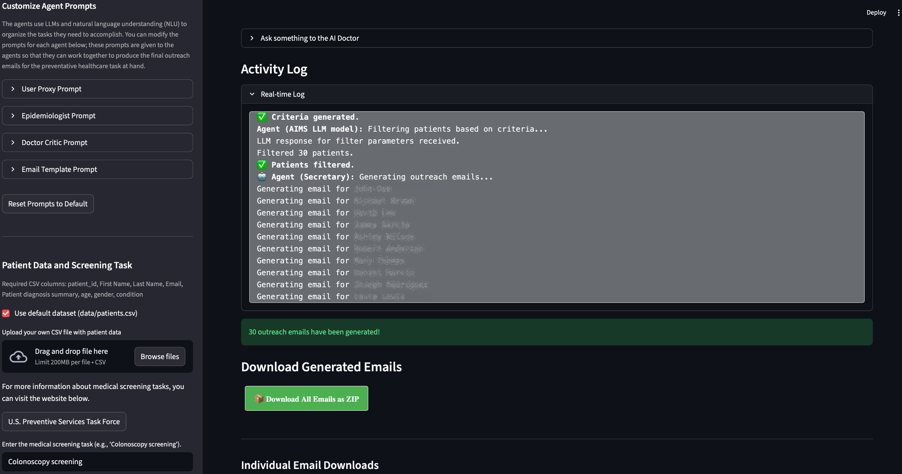

<!--
Copyright © Advanced Micro Devices, Inc., or its affiliates.

SPDX-License-Identifier: MIT
-->

# AutoGen Multi-Agent Preventative Healthcare Team

## Overview



This is a multi-agent system built on top of [AutoGen](https://github.com/microsoft/autogen) agents designed to automate and optimize preventative healthcare outreach. It uses multiple agents, Large Language Models (LLMs), and asynchronous programming to streamline the process of identifying patients who meet specific screening criteria and generating personalized outreach emails.

Credit: Though heavily modified, the original idea came from Mike Lynch's [Medium blog](https://medium.com/@micklynch_6905/hospitalgpt-managing-a-patient-population-with-autogen-powered-by-gpt-4-mixtral-8x7b-ef9f54f275f1).

AMD Solution Blueprints are packaged as [Helm charts](https://helm.sh/) for deployment on a Kubernetes cluster. For development or further exploration, the source code is public and available in the [Solution Blueprints GitHub repository](https://github.com/amd-enterprise-ai/solution-blueprints/tree/main/solution-blueprints/preventative-healthcare).

## Architecture

<picture>
  <source media="(prefers-color-scheme: light)" srcset="prev-healthcare-light-scheme.png">
  <source media="(prefers-color-scheme: dark)" srcset="prev-healthcare-dark-scheme.png">
  
</picture>

The blueprint integrates a **Streamlit** web application with a multi-agent **AutoGen** workflow and an **AIM** LLM service. By default, the AIM deploys Llama 3.3 70B for agent conversations and outreach email generation. The application pod does not require a GPU.

| Component | Role |
|-----------|------|
| Streamlit UI | Web interface for uploading patient data, running analysis, and downloading outreach emails |
| AutoGen agents | Multi-agent orchestration |
| AIM LLM | Inference for screening criteria, patient filtering, and email generation |

The workflow proceeds in three stages:

1. **Define screening criteria**: After getting the general screening task from the user, the User Proxy Agent starts a conversation between the Epidemiologist Agent and the Doctor Critic Agent to define the criteria for patient outreach based on the target screening type. The resulting criteria include age range (e.g., 40–70), gender, and relevant medical history.

2. **Select and identify patients based on the screening criteria**: The Assistant Agent filters patient data from a CSV file based on the defined criteria, including age range, gender, and medical conditions. The patient data were synthetically generated. You can find the sample data under [data/patients.csv](https://github.com/amd-enterprise-ai/solution-blueprints/tree/main/solution-blueprints/preventative-healthcare/src/data).

3. **Generate outreach emails**: The program generates outreach emails for the filtered patients using LLMs and saves them as text files.

### Key Features

- Multi-agent workflow
- Personalized outreach email generation using on-premises AIM LLMs
- Streamlit web UI for upload, analysis, and download of draft emails
- Flexible LLM configuration — deploy the bundled AIM or connect to an existing service

## Getting Started

This is a quick start guide on how to deploy the blueprint. For advanced options, such as reusing an existing AIM, providing a Hugging Face token, or overriding storage classes, see [Deploying Solution Blueprints with Helm](https://enterprise-ai.docs.amd.com/en/latest/solution-blueprints/deployment.html) or explore the [advanced deployment guide](./DEPLOYMENT.md).

This blueprint supports **AMD Instinct** (default) and **AMD Radeon** platforms. The section below covers the default **Instinct** deployment. For Radeon and other advanced options, see:

- [Deploy on AMD Radeon](DEPLOYMENT.md#amd-radeon-gpu)

### Prerequisites

#### System Requirements

The blueprint requires the following cluster resources by default:

| Resource | Default Configuration |
|--|-------------------|
| GPUs | 1 (AIM LLM; application pod does not require a GPU) |
| CPUs | 5 CPU cores |
| RAM | 68 Gi |

To deploy to the Kubernetes cluster, ensure the following prerequisites are met:

- [kubectl](https://kubernetes.io/docs/tasks/tools/): Installed and configured to communicate with the cluster
- [Helm](https://helm.sh/docs/intro/install/) 3.17 or higher: Installed on your local machine

### Deployment

Solution Blueprints are packaged as OCI-compliant Helm charts in the Docker Hub registry and can be deployed to a Kubernetes cluster with a single command. Define the `name` (deployment name) and `namespace` (Kubernetes namespace), then pipe the output of `helm template` to `kubectl apply -f -`:

```bash
name="my-deployment"
namespace="my-namespace"
helm template $name oci://registry-1.docker.io/amdenterpriseai/aimsb-preventative-healthcare \
  | kubectl apply -f - -n $namespace
```

Note: You can create a namespace using `kubectl create namespace $namespace`.

To check the status of the deployment, run:

```bash
kubectl get pods -n $namespace
```

Wait until all pods report `Running` and `Ready`.

### Connect to UI

To connect to the UI, port-forward to 8501. The UI will then be available at [http://localhost:8501](http://localhost:8501) in your browser.

```bash
kubectl port-forward services/aimsb-preventative-healthcare-${name} 8501:80 -n $namespace
```

Once connected, use the application as follows:

1. Upload a tabular dataset of patient records. A sample dataset is included by default.
2. Provide the context of the screening task, e.g., diabetes screening.
3. Run the analysis.
4. Click **Generate Outreach Emails** to create draft emails to patients (`.txt` files with email drafts) and download them.

### Clean Up

When you are finished, remove the deployed resources:

```bash
helm template $name oci://registry-1.docker.io/amdenterpriseai/aimsb-preventative-healthcare \
  | kubectl delete -f - -n $namespace
```

## Disclaimer

This tool is for research and educational use only. It is not intended for clinical diagnosis or treatment.

## Third-Party Components

This Solution Blueprint utilizes multiple components. For third-party license information, refer to each component's documentation. Key third-party components are listed below.

| Component | License |
|---------|---------|
| AutoGen | MIT |
| Streamlit | Apache 2.0 |

## Terms of Use

AMD Solution Blueprints are released under the [MIT License](https://opensource.org/license/mit), which governs the parts of the software and materials created by AMD. Third-party software and materials used within the Solution Blueprints are governed by their respective licenses.
