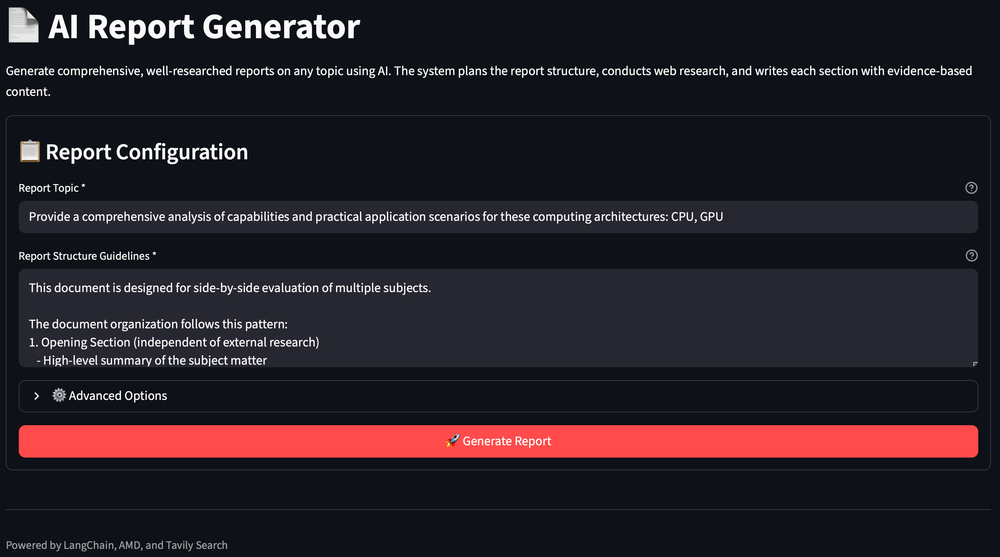

<!--
Copyright © Advanced Micro Devices, Inc., or its affiliates.

SPDX-License-Identifier: MIT
-->

# Report Generation Engine

## Overview



This Solution Blueprint illustrates how automated technical report generation can be implemented using AIMs. It employs a multi-stage LLM workflow with integrated web research, where the system plans, researches, writes, and compiles content to produce comprehensive, evidence-based technical documents on any topic.

The blueprint follows a four-stage pipeline:

- **Planning**: Generates search queries and creates a section outline
- **Research**: Conducts parallel web searches via the Tavily API
- **Writing**: Generates content for each section using the gathered research
- **Compilation**: Assembles the final markdown report with introduction and conclusion

AMD Solution Blueprints are packaged as [Helm charts](https://helm.sh/) for deployment on a Kubernetes cluster. For development or further exploration, the source code is public and available in the [Solution Blueprints GitHub repository](https://github.com/amd-enterprise-ai/solution-blueprints/tree/main/solution-blueprints/report-generation-engine).

## Architecture

<picture>
  <source media="(prefers-color-scheme: light)" srcset="architecture-diagram-light-scheme.png">
  <source media="(prefers-color-scheme: dark)" srcset="architecture-diagram-dark-scheme.png">
  
</picture>

The blueprint integrates a **Streamlit** web UI, a **FastAPI** backend, an **AIM** LLM service, and **Tavily** web search. LangChain orchestrates the multi-stage workflow across planning, research, writing, and compilation.

| Component | Role |
|-----------|------|
| Streamlit | Web-based user interface |
| FastAPI | REST API backend |
| AIM (LLM) | Technical writing and synthesis (default: Llama 3.3 70B Instruct) |
| LangChain | Orchestration of LLM calls |
| Tavily API | Web search for research integration |

### Key Features

- Generates comprehensive technical reports on any user-provided topic
- Users can customize the report structure or use intelligent defaults
- Real-time progress tracking shows each stage of the generation process
- Web research results are automatically integrated and cited in the final report

## Getting Started

This is a quick start guide on how to deploy the blueprint. For advanced options, such as reusing an existing AIM, configuring search parameters, or overriding storage classes, see [Deploying Solution Blueprints with Helm](https://enterprise-ai.docs.amd.com/en/latest/solution-blueprints/deployment.html) or explore the [advanced deployment guide](./DEPLOYMENT.md).

This blueprint supports **AMD Instinct** (default), **AMD Radeon**, and **AMD EPYC** platforms. The section below covers the default **Instinct** deployment. For Radeon, EPYC, and other advanced options, see:

- [Deploy on AMD Radeon](DEPLOYMENT.md#amd-radeon-gpu)
- [Deploy on AMD EPYC](DEPLOYMENT.md#amd-epyc-cpu)

### Prerequisites

#### System Requirements

The blueprint requires the following cluster resources by default:

| Resource | Default Configuration |
|--|-------------------|
| GPUs | 1 (for the LLM) |
| CPUs | 2 CPU cores |
| RAM | 68 Gi |

To deploy to the Kubernetes cluster, ensure the following prerequisites are met:

- [kubectl](https://kubernetes.io/docs/tasks/tools/): Installed and configured to communicate with the cluster
- [Helm](https://helm.sh/docs/intro/install/) 3.17 or higher: Installed on your local machine
- [Tavily API](https://tavily.com) key for web search integration (free tier: 1,000 requests/month)

### Deployment

Solution Blueprints are packaged as OCI-compliant Helm charts in the Docker Hub registry and can be deployed to a Kubernetes cluster with a single command. Define the `name` (deployment name) and `namespace` (Kubernetes namespace), set `config.tavily.apiKey` to your Tavily API key, then pipe the output of `helm template` to `kubectl apply -f -`:

```bash
name="my-deployment"
namespace="my-namespace"
helm template $name oci://registry-1.docker.io/amdenterpriseai/aimsb-report-generation-engine \
  --set config.tavily.apiKey=tvly-your-key-here \
  | kubectl apply -f - -n $namespace
```

Note: You can create a namespace using `kubectl create namespace $namespace`.

To check the status of the deployment, run:

```bash
kubectl get pods -n $namespace
```

Wait until all pods report `Running` and `Ready`.

### Connect to UI

To connect to the UI, port-forward to 8501. The UI will then be available at [http://localhost:8501](http://localhost:8501) in your browser.

```bash
kubectl port-forward services/aimsb-report-generation-engine-${name} 8501:8501 -n $namespace
```

Enter a topic, optionally customize the report structure, and start generation. Progress is shown for each pipeline stage.

### Clean Up

When you are finished, remove the deployed resources:

```bash
helm template $name oci://registry-1.docker.io/amdenterpriseai/aimsb-report-generation-engine \
  | kubectl delete -f - -n $namespace
```

## Third-party Components

This Solution Blueprint utilizes multiple components. For third-party license information, refer to each component's documentation. Key third-party components are listed below.

| Component | License |
|---------|---------|
| FastAPI | MIT |
| LangChain | MIT |
| Streamlit | Apache 2.0 |

Tavily API: Web search API for research integration

- Website: https://tavily.com
- Terms of Use: https://tavily.com/terms-of-service
- License: Commercial API service; requires API key


## Terms of Use

AMD Solution Blueprints are released under the [MIT License](https://opensource.org/license/mit), which governs the parts of the software and materials created by AMD. Third-party software and materials used within the Solution Blueprints are governed by their respective licenses.
