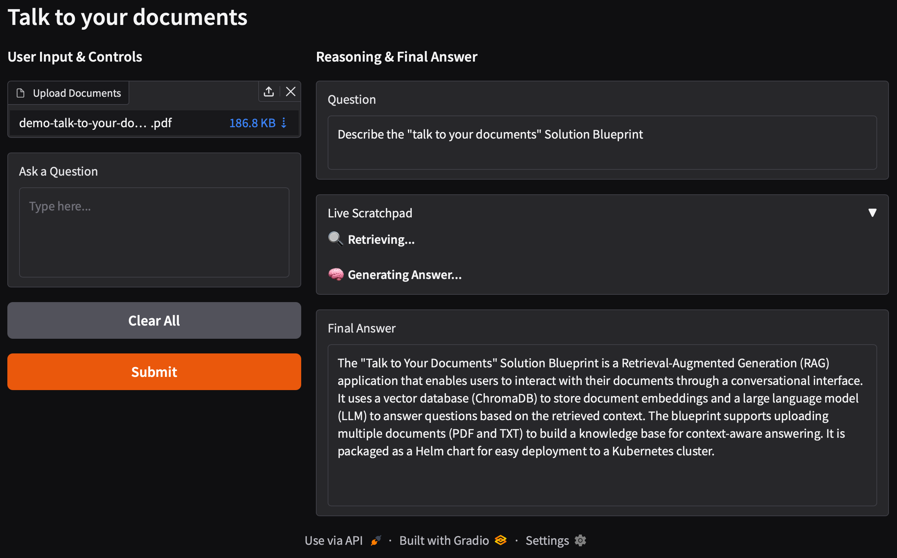

<!--
Copyright © Advanced Micro Devices, Inc., or its affiliates.

SPDX-License-Identifier: MIT
-->

# Talk to Your Documents

## Overview



This Solution Blueprint deploys a Retrieval-Augmented Generation (RAG) application that lets you chat with your documents. It uses a vector database (ChromaDB) to store document embeddings and a Large Language Model (LLM) to answer questions based on the retrieved context.

AMD Solution Blueprints are packaged as [Helm charts](https://helm.sh/) for deployment on a Kubernetes cluster. For development or further exploration, the source code is public and available in the [Solution Blueprints GitHub repository](https://github.com/amd-enterprise-ai/solution-blueprints/tree/main/solution-blueprints/talk-to-your-documents).

## Architecture

<picture>
  <source media="(prefers-color-scheme: light)" srcset="architecture-diagram-light-scheme.png">
  <source media="(prefers-color-scheme: dark)" srcset="architecture-diagram-dark-scheme.png">
  
</picture>

Users upload documents and ask questions through the web UI:

- Uploaded documents are chunked, embedded, and stored in ChromaDB.
- For each question, relevant chunks are retrieved from the vector store and passed as context to the LLM, which generates an answer.

| Component | Role |
|-----------|------|
| Talk to your documents UI | Web interface for uploading documents and asking questions. |
| AIM | Optimized LLM deployment for answer generation (default: Llama 3.3 70B Instruct). |
| Embedding model | A vLLM-based embedding server that generates document embeddings. See the [application chart](https://github.com/amd-enterprise-ai/solution-blueprints/blob/main/aimcharts/aimchart-embedding/README.md) for its documentation. |
| ChromaDB vector store | Vector database for storing and retrieving document embeddings. See the [application chart](https://github.com/amd-enterprise-ai/solution-blueprints/blob/main/aimcharts/aimchart-chromadb/README.md) for more information. |

### Key Features

- Document-Based Q&A: Supports uploading multiple documents (PDF and TXT) to build a knowledge base for context-aware answering.
- LLM-powered answers: Deployed with AIM (default: Llama 3.3 70B Instruct).

## Getting Started

This is a quick start guide on how to deploy the blueprint. For advanced options, such as reusing an existing AIM, providing a Hugging Face token, and more, see [Deploying Solution Blueprints with Helm](https://enterprise-ai.docs.amd.com/en/latest/solution-blueprints/deployment.html) or explore the [advanced deployment guide](./DEPLOYMENT.md).

This blueprint supports **AMD Instinct** (default), **AMD EPYC**, and **AMD Radeon** platforms. The section below covers the default **Instinct** deployment. For EPYC and Radeon deployment and other advanced options, see:

- [Deploy on AMD Instinct](DEPLOYMENT.md#amd-instinct-gpu-default)
- [Deploy on AMD EPYC](DEPLOYMENT.md#amd-epyc-cpu)
- [Deploy on AMD Radeon](DEPLOYMENT.md#amd-radeon-gpu)

### Prerequisites

#### System Requirements

The blueprint requires the following cluster resources by default:

| Resource | Default Configuration |
|--|-------------------|
| GPUs | 2 |
| CPUs | 11 CPU cores |
| RAM | 268 Gi |

To deploy to the Kubernetes cluster, ensure the following prerequisites are met:

- [kubectl](https://kubernetes.io/docs/tasks/tools/): Installed and configured to communicate with the cluster
- [Helm](https://helm.sh/docs/intro/install/) 3.17 or higher: Installed on your local machine

### Deployment

Solution Blueprints are packaged as OCI-compliant Helm charts in the Docker Hub registry and can be deployed to a Kubernetes cluster with a single command. Define the `name` (deployment name) and the `namespace` (Kubernetes namespace), then pipe the output of `helm template` to `kubectl apply -f -`:

```bash
name="my-deployment"
namespace="my-namespace"
helm template $name oci://registry-1.docker.io/amdenterpriseai/aimsb-talk-to-your-documents \
  | kubectl apply -f - -n $namespace
```

Note: You can create a namespace using `kubectl create namespace $namespace`.

To check the status of the deployment, run:

```bash
kubectl get pods -n $namespace
```

Wait until all pods report `Running` and `Ready`. The application will be fully functional once the LLM, embedding, and ChromaDB services are up and running.

### Connect to UI

To connect to the UI, port-forward to 7860. The UI will then be available at [http://localhost:7860](http://localhost:7860) in your browser.

```bash
kubectl port-forward services/$name-aimsb-talk-to-your-documents 7860:80 -n $namespace
```

### Clean Up

When you are finished, remove the deployed resources:

```bash
helm template $name oci://registry-1.docker.io/amdenterpriseai/aimsb-talk-to-your-documents \
  | kubectl delete -f - -n $namespace
```

## Third-Party Components

This Solution Blueprint utilizes multiple components. For third-party license information, refer to each component's documentation. Key third-party components can be seen below:

| Component | License |
|---------|---------|
| ChromaDB | Apache 2.0 |
| Gradio | Apache 2.0 |
| vLLM | Apache 2.0 |
| LangChain | MIT |

## Terms of Use

AMD Solution Blueprints are released under the [MIT License](https://opensource.org/license/mit), which governs the parts of the software and materials created by AMD. Third-party Software and Materials used within the Solution Blueprints are governed by their respective licenses.
