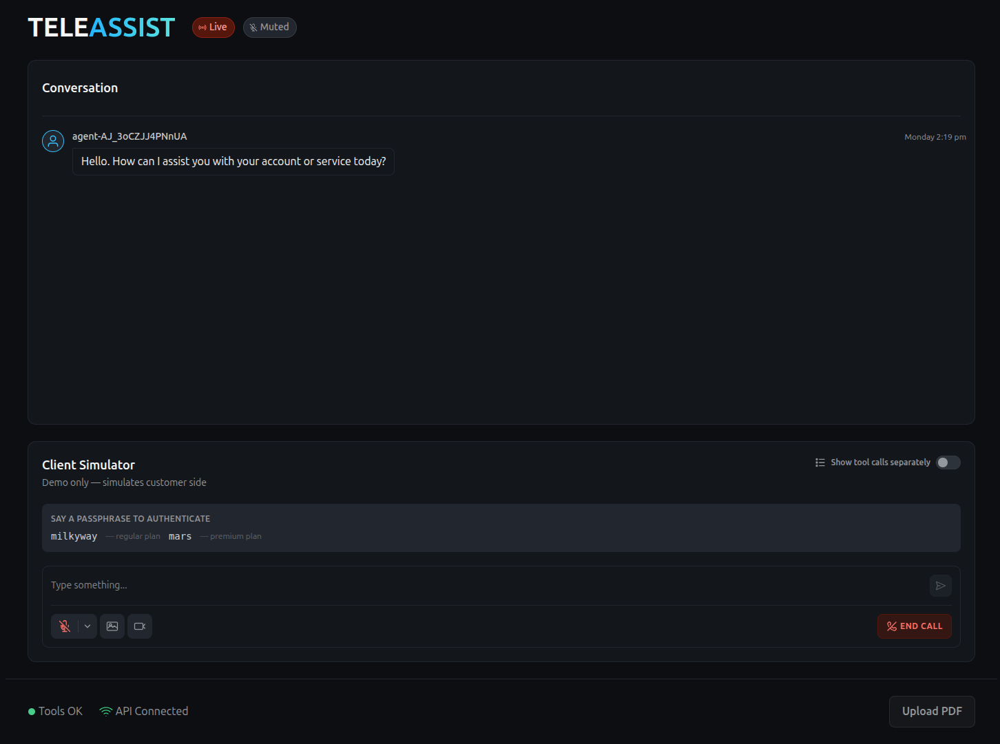

<!--
Copyright © Advanced Micro Devices, Inc., or its affiliates.

SPDX-License-Identifier: MIT
-->

# Telecom Assistant

## Overview



This blueprint provides an end-to-end conversational AI solution for telecom billing inquiries. It
leverages an agentic orchestration architecture with microservices for voice interaction, billing
data retrieval, document search, and support ticket escalation. The solution integrates with LiveKit
for real-time voice communication, BSS Gateway for billing information, and vector stores for FAQ
and plan documentation.

This blueprint is designed to run on **AMD Instinct** GPUs. For examples of deploying on **AMD EPYC** and **AMD Radeon**, see the other blueprints in the catalog.

## Architecture

<picture>
  <source media="(prefers-color-scheme: light)" srcset="architecture-diagram-light-scheme.png">
  <source media="(prefers-color-scheme: dark)" srcset="architecture-diagram-dark-scheme.png">
  
</picture>

| Component                   | Description                                                                                                                                                                                                                                            |
|-----------------------------|--------------------------------------------------------------------------------------------------------------------------------------------------------------------------------------------------------------------------------------------------------|
| **Frontend (Web UI)**       | React-based web application for telecom managers and engineers to explore and validate all blueprint capabilities. Provides chat, voice, media upload, and knowledge base management. This is a demonstration interface — not an end-user application. |
| **STUNner**                 | Kubernetes-native WebRTC media gateway (STUN/TURN) that routes browser media traffic to the LiveKit Agent Server.                                                                                                                                      |
| **LiveKit Agent Server**    | Real-time communication layer responsible for handling WebRTC audio/video streams and connecting user sessions with the Assistant Agent.                                                                                                               |
| **Assistant Agent**         | Core orchestration service that manages conversation flow, coordinates AI services, retrieves contextual information, executes troubleshooting workflows, and interacts with external systems.                                                         |
| **BSS Gateway**             | Integration service that provides access to customer account information, billing data, balances, payments, invoices, service plans, and usage quotas.                                                                                                 |
| **Helpdesk (LibreDesk)**    | Helpdesk platform used for creating and managing customer support tickets when issues require escalation.                                                                                                                                              |
| **Redis**                   | Data store used for session management, caching user media files (photos and videos), and storing agent evaluation results.                                                                                                                            |
| **Vector Store (ChromaDB)** | Vector database used to store embeddings and perform semantic retrieval of FAQs, product documentation, and troubleshooting guides.                                                                                                                    |
| **LLM Service**             | Large Language Model responsible for reasoning, response generation, tool invocation, and conversation management.                                                                                                                                     |
| **ASR Service**             | Automatic Speech Recognition service that converts user speech into text.                                                                                                                                                                              |
| **TTS Service**             | Text-to-Speech service that generates voice responses from text.                                                                                                                                                                                       |
| **VLM Service**             | Vision-Language Model used to analyze user-submitted photos and videos, as well as images contained within knowledge base documents.                                                                                                                   |
| **Embedding Model**         | Service that generates vector embeddings for documents and user queries to support semantic search and retrieval in ChromaDB.                                                                                                                          |

> STUNner Integration
>
> Media traffic from the browser-based frontend to the **LiveKit** service is routed through
**STUNner** — a Kubernetes-native WebRTC media gateway. STUNner acts as a STUN/TURN gateway,
> simplifying NAT traversal and firewall configuration. Direct exposure of LiveKit UDP media ports
> is
> no longer required in most setups.
>
> For configuration details, see `docs/DEPLOYMENT.md`.

### Key Features

- Realtime voice communication via LiveKit with media traffic routed through **STUNner** (
  Kubernetes-native WebRTC gateway).
- Conversational voice assistant for billing inquiries: authenticate users, retrieve plan details,
  balance, payments, invoices, quotas, and account information.
- Technical support and troubleshooting assistance powered by LLM workflows and domain-specific
  knowledge.
- Multimodal troubleshooting: users can upload photos and videos that are analyzed by the assistant
  to diagnose issues and recommend resolution steps.
- Agentic orchestration: the agent coordinates authentication, data retrieval from the BSS Gateway,
  knowledge retrieval from ChromaDB, troubleshooting workflows, and ticket creation in helpdesk
  systems.
- Voice integration via LiveKit: supports ASR (Automatic Speech Recognition), TTS (Text-to-Speech),
  and real-time conversations.
- Knowledge retrieval: hybrid RAG architecture powered by ChromaDB for FAQs, plan information,
  operational procedures, and troubleshooting guides.
- Runtime knowledge base management: upload and ingest PDF documents directly from the web UI to
  continuously extend and update the RAG knowledge base without system redeployment.
- Support escalation: automatically create tickets in LibreDesk for unresolved issues or cases
  requiring human intervention.
- Redis caching and session management: store conversation history, cache user media files during
  active sessions, and persist agent evaluation metrics for performance monitoring.
- Demonstration web interface: a staff-facing frontend for telecom managers and engineers to explore
  all blueprint capabilities, including chat, voice interactions, document ingestion, and knowledge
  base management.

## Getting Started

### Prerequisites

- Access to a Kubernetes cluster with `cluster-admin` rights (or permissions to create CRDs,
  ClusterRole, and ClusterRoleBinding).
- STUNner Operator installed on the cluster (run `./install-prerequisites.sh` once per cluster).
- Persistent storage available for ChromaDB and Redis.
- LLM, VLM, ASR, TTS, and Embedding model endpoints (self-hosted or external).

### System Requirements

#### Infrastructure

- Kubernetes cluster
- **STUNner Operator** installed on the cluster
- Persistent storage for ChromaDB and Redis

#### Application Layer (excluding AI model inference)

| Resource | Requirement |
|----------|-------------|
| CPU      | 2–4 vCPUs   |
| Memory   | 4–8 GB RAM  |
| Storage  | 10–20 GB    |

#### Self-Hosted AI Models

If hosting AI models locally instead of using external endpoints:

- 1–5 GPUs depending on the selected models, quantization strategy, and expected concurrency.
- Additional storage for model weights and embeddings.

### Deployment

Solution Blueprints are packaged as OCI-compliant Helm charts in the Docker Hub registry and can be
deployed to a Kubernetes cluster with a single command. Define the `name` (deployment name) and the
`namespace` (Kubernetes namespace) and also `frontend_livekit_ws_url` - variable with url to access
to livekit, then pipe the output of `helm template` to `kubectl apply -f -`:

```bash
name="my-deployment"
namespace="my-namespace"
frontend_livekit_ws_url="wss://livekit.example.com"
helm template $name oci://registry-1.docker.io/amdenterpriseai/aimsb-telecom-assistant \
  --namespace $namespace \
  --set "mainServices.frontend.env.LIVEKIT_URL=$frontend_livekit_ws_url" \
  | kubectl apply -f - -n $namespace
```

Note: You can create a namespace using `kubectl create namespace $namespace`

To check the status of the deployment, run:

```bash
kubectl get pods -n $namespace
```

Wait until all pods report `Running` and `Ready`.

> Refer to `docs/DEPLOYMENT.md` for full deployment instructions, including STUNner and LiveKit
configuration details.

### Connect to the UI

To connect to the UI, port-forward to any chosen port, e.g., 3000. The UI will then be available
at [http://localhost:3000](http://localhost:3000) in your browser.

```bash
kubectl port-forward "svc/aimsb-telecom-assistant-$name-frontend" 3000:3000 -n $namespace
```

After deployment, open the web interface URL in your browser. The frontend supports:

- **Chat** — text-based conversation with the assistant.
- **Voice** — real-time voice interaction via LiveKit (WebRTC).
- **Media upload** — send photos or videos for multimodal troubleshooting.
- **Document ingestion** — upload PDF files via the "Upload PDF" button (bottom right) to extend the
  RAG knowledge base without redeployment.

> Refer to `docs/DEPLOYMENT.md` for full Connect to the UI instructions.

### Clean Up

When you are finished, remove the deployed resources:

```bash
helm template $name oci://registry-1.docker.io/amdenterpriseai/aimsb-telecom-assistant \
  --namespace $namespace \
  --set "mainServices.frontend.env.LIVEKIT_URL=$frontend_livekit_ws_url" \
  # ... (same parameters as deployment) ...
  | kubectl delete -f - -n $namespace
```

## Usage

### Authentication Flow

- User provides a secret passphrase for authentication.
- The agent normalizes and verifies it via the BSS Gateway.
- Once authenticated, the agent can access user-specific billing data.
- Authentication is not required for technical support cases.

### Tool Usage

The assistant agent can invoke the following tools during conversations:

- Retrieve user info, balance, payments, plans, and quotas.
- Search billing documents for FAQs and policies.
- Search troubleshooting guides in the knowledge base (ChromaDB).
- Retrieve user media files to analyze and diagnose issues.
- Escalate to helpdesk by creating tickets in LibreDesk.

### Ticket Escalation

If the agent cannot resolve the user's inquiry, it can escalate the issue by creating a support
ticket in the helpdesk system (LibreDesk).

#### Viewing Tickets in LibreDesk

Once a ticket is created, the agent provides the ticket ID. To view the ticket in the LibreDesk web
interface:

1. Log in to the LibreDesk web interface at your configured LibreDesk URL with username `System` and
   the password from the environment variable `LIBREDESK_SYSTEM_USER_PASSWORD`
> You can check the value of this default password using the command:
> ```helm show values oci://registry-1.docker.io/amdenterpriseai/aimsb-telecom-assistant --jsonpath='{.infraServices.libredesk.env.LIBREDESK_SYSTEM_USER_PASSWORD}'```
2. Navigate to the **Unassigned** section and select **ALL**.
3. Search for the ticket using the provided ticket ID or filter by user details. Newly created
   tickets appear first in the list.

## Example Scenarios

This section demonstrates typical conversation flows and agent capabilities with real-world
examples.

### Scenario 1: Plan Inquiry and Upgrade Request

- **Bot:** "Hello. How can I assist you with your account or service today?"
- **Client:** "Tell me about my current plan."
- **Bot:** "For security, please say your secret passphrase for your account."
- **Client:** "mars"
- **Tool:** `get_user_by_pass_phrase("mars")`
- **Bot:** "Confirmed. One moment while I check your plan."
- **Tool:** `get_user_plan_name(user_id)`
- **Tool:** `billing_docs_search("PlanName price inclusions roaming calls SMS")`
- **Bot:** "You're on the PlanName plan. It's X dollars per month and includes Y gigabytes plus
  unlimited national calls and texts. What should I clarify?"
- **Client:** "Is roaming included?"
- **Tool:** `billing_docs_search("PlanName roaming limit rate destinations")`
- **Bot:** "Yes. You get X megabytes of roaming per month, then it's Y dollars per megabyte. Want
  the destinations list?"
- **Client:** "That's too expensive, I want something cheaper."
- **Tool:** `billing_docs_search("available plans cheaper than PlanName")`
- **Bot:** "Option A is X dollars per month and could save you about Y dollars monthly, with less
  data but unlimited calls. Want to switch?"
- **Client:** "For sure."
- **Bot:** "What date should the new plan start, for example next month or on a specific day?"
- **Client:** "Since next month."
- **Bot:** "Understood. I'll request a switch to Option A starting next month. Please confirm."
- **Client:** "That's right."
- **Tool:**
  `create_ticket(user_id, "Plan change request: switch from PlanName to Option A starting next month. User confirmed.")`
- **Bot:** "All set. I've filed a request for your account manager, and they'll get back to you
  soon."

### Scenario 2: Slow Internet Due to High-Speed Quota Exhaustion

- **Bot:** "Hello. How can I assist you with your account or service today?"
- **Client:** "My internet is super slow, basically unusable. Apps won't load, videos buffer
  forever. What's going on?"
- **Bot:** "I understand how frustrating that is. For security, please tell me your secret
  passphrase for the account."
- **Client:** "milkyway"
- **Tool:** `get_user_by_pass_phrase("[milkyway]")`
- **Bot:** "Confirmed. One moment while I check your plan and data limits."
- **Tool:** `get_user_plan_name(user_id)`
- **Tool:** `get_plan_quotas(user_id, plan_name)`
- **Tool:**
  `billing_docs_search("throttling reduced speed after high-speed quota exhausted; renewal date; how to restore speed")`
- **Bot:** "Thanks — I checked your account. You're on the **[PlanName]** plan. You've used up your
  included high-speed data for this month, so your connection was automatically moved to a **reduced
  speed** (around **[slow] Mbps**). That's why everything feels slow. Your plan will reset on
  **[next renewal date]**, but I can help you get fast internet back immediately. Would you like to
  proceed?"
- **Client:** "Please go on."
- **Tool:**
  `billing_docs_search("available data boost options for PlanName price GB; plan upgrade options vs current plan")`
- **Bot:** "You have two quick options:
    1. **One-time data boost**: adds **[extra] GB** of high-speed data right now for **[amount]** (
       one-time charge on your next bill or deducted from prepaid credit). It activates in under 60
       seconds and lasts until your plan renews.
    2. **Upgrade your plan**: better if you often run out. Switch to **[ProPlan]** for
       **[more expensive] / month** (that's **[delta]** more than now). You'll get **[large] GB**
       high-speed data monthly plus additional benefits.

  Which would you prefer right now — the quick **[extra] GB** boost, the plan upgrade, or should I
  check other options?"

- **Client:** "I don't want to pay more every month. Just give me some extra data for now."
- **Tool:** `billing_docs_search("PlanName one-time data boost confirmation terms price validity")`
- **Bot:** "Got it — the one-time boost makes sense. I can activate **[extra] GB** extra high-speed
  data for **[amount]** (one-time).
  Just to confirm:
    - Adds **[extra] GB** immediately
    - Cost: **[amount]** (next invoice / deducted if prepaid)
    - No change to your current plan
    - Valid until **[renewal date]**

  Is it OK to go ahead?"

- **Client:** "Yes, do it."
- **Tool:** `add_extra_quota(user_id, plan_name, quota=[extra])`
- **Tool:**
  `create_ticket(user_id, "quota_upsale_event: user_id=..., plan=..., extra_gb=..., amount=..., confirmed=true")`
- **Bot:** "Perfect — activating now… Done. Your high-speed data is live again. You should notice
  the improvement within **30–60 seconds**. Anything else I can help you with today (for example,
  check current usage or recommend a plan that avoids running out)?"

> **PREREQUISITES FOR CORRECT EXECUTION OF SCENARIOS 3 AND 4**
>
> 1. Upload a PDF with troubleshooting guides using the UI (you can find the "Upload PDF" button at
     >    the bottom right). In these scenarios, you — as the person evaluating this blueprint — play the
     >    role of an operator populating the knowledge base. This step demonstrates how easily new
     >    documents can be added to the RAG knowledge base without redeployment. In a real deployment,
     >    this document would be uploaded in advance by an engineer, not provided by the end user during a
     >    support session.
> 2. All files used in these scenarios (including the troubleshooting guides PDF) are available in
     >    the [demo directory](../docs/demo).

### Scenario 3: Wi-Fi and fiber internet troubleshooting (success)

- **Bot:** "Hello. How can I assist you with your account or service today?"
- **Client:** "My internet is not working"
- **Bot:** "Could you send me a photo of the back of your router? I need to identify the model
  before we start."
- **Client:** (upload file Router_Back.jpg) "I've uploaded photo"
- **Tool:** `get_uploaded_files() Uploaded files: File 'Router_Back.jpg'`
- **Tool:** `identify_router_model`
- **Bot:** "I can see you have a ZTE ZXHN H3600P router. I have a troubleshooting guide for this
  model. Could you send me a photo of the front panel so I can see the indicator lights?"
- **Client:** (upload file No Broad_Band.jpg) "I've uploaded photo"
- **Tool:** `get_uploaded_files() Uploaded files: File 'No Broad_Band.jpg'`
- **Tool:** `troubleshooting_search`
- **Bot:** "Your Broadband LED is off, which means the router is not detecting any cable in the WAN
  port. The Ethernet cable between the ONT and the router's WAN port is likely missing, loose, or
  faulty. Could you send me a photo of the back of the router so I can see whether a cable is
  plugged into the WAN port?"
- **Client:** (upload file Router_Back.jpg) "I've uploaded photo"
- **Tool:** `get_uploaded_files() Uploaded files: File 'Router_Back.jpg'`
- **Bot:** "Your back‑panel photo shows no Ethernet cable plugged into the WAN port. Please connect
  an Ethernet cable from the ONT's LAN port to the router's WAN port. Then power‑cycle both devices:
  unplug each for 30 seconds, plug the ONT back in first, wait about 1 minute, and finally plug the
  router back in. After they restart, could you send a new photo of the front panel so I can check
  whether the Broadband LED has turned green?"
- **Client:** (upload file Broad_Band_OK_No_Internet.jpg) "I've uploaded photo"
- **Tool:** `get_uploaded_files() Uploaded files: File 'Broad_Band_OK_No_Internet.jpg'`
- **Tool:** `troubleshooting_search`
- **Bot:** "The router has a connection but can't reach the internet — this points to a problem with
  the ONT, the optical terminal box. Could you send me a VIDEO of the ONT? If any lights are
  flashing, a video will capture that better than a photo."
- **Client:** (upload file No_Fibra.mp4) "I've uploaded video"
- **Tool:** `get_uploaded_files() Uploaded files: File 'No_Fibra.mp4'`
- **Tool:** `troubleshooting_search`
- **Bot:** "Your ONT shows a solid red LOS light, which means it has lost the fiber signal.
  Please:
    - Unplug the thin yellow fiber cable from the ONT.
    - Check the connector tip for dust and gently clean it.
    - Plug the cable back in firmly until it clicks.
    - Unplug the ONT's power supply, wait 30 seconds, then plug it back in.
    - Wait about 3 minutes for the ONT to restart.

  After it's back on, could you send me a new video of the ONT so I can confirm the LOS light has
  changed?"
- **Client:** (upload file ONT_OK.mp4) "I've uploaded video"
- **Tool:** `get_uploaded_files() Uploaded files: File 'ONT_OK.mp4'`
- **Bot:** "The LOS light is now solid blue, so the fiber signal has been restored and the ONT is
  reconnecting. Could you send me a photo of the router's front panel so I can check whether the
  Internet LED has turned green?"
- **Client:** (upload file All is OK.jpg) "I've uploaded photo"
- **Tool:** `get_uploaded_files() Uploaded files: File 'All is OK.jpg'`
- **Bot:** "Both the Broadband and Internet lights are green, which means the connection is
  restored. Is your internet working now?"
- **Client:** "Yes, now internet is working"
- **Tool:** `end_session`
- **Evaluation modal window** — evaluation of the agent's work

### Scenario 4: Wi-Fi and fiber internet troubleshooting (escalate to support)

- **Bot:** "Hello. How can I assist you with your account or service today?"
- **Client:** "My internet is not working"
- **Bot:** "Could you send me a photo of the back of your router? I need to identify the model
  before we start."
- **Client:** (upload file Router_Back.jpg) "I've uploaded photo"
- **Tool:** `get_uploaded_files() Uploaded files: File 'Router_Back.jpg'`
- **Tool:** `identify_router_model`
- **Bot:** "I can see you have a ZTE ZXHN H3600P router. I have a troubleshooting guide for this
  model. Could you send me a photo of the front panel so I can see the indicator lights?"
- **Client:** (upload file No Broad_Band.jpg) "I've uploaded photo"
- **Tool:** `get_uploaded_files() Uploaded files: File 'No Broad_Band.jpg'`
- **Tool:** `troubleshooting_search`
- **Bot:** "Your Broadband LED is off, which means the router isn't detecting a cable in the WAN
  port. Could you send me a photo of the back of the router so I can check whether a cable is
  plugged into the WAN port?"
- **Client:** (upload file Router_Back.jpg) "I've uploaded photo"
- **Tool:** `get_uploaded_files() Uploaded files: File 'Router_Back.jpg'`
- **Bot:** "I can see the WAN port has no cable plugged in. Please connect an Ethernet cable from
  the ONT's LAN port into the router's WAN port. Then power‑cycle both devices: unplug each for 30
  seconds, plug the ONT back in first, wait about one minute, and plug the router back in. After it
  powers up, could you send a new photo of the front panel so I can check the LED status?"
- **Client:** (upload file Router_Back.jpg) "I've uploaded photo"
- **Tool:** `get_uploaded_files() Uploaded files: File 'Router_Back.jpg'`
- **Tool:** `troubleshooting_search`
- **Bot:** "Your front‑panel photo still shows Broadband LED off and Internet LED off. Please try a
  different Ethernet cable between the ONT and the router's WAN port. Then power‑cycle both devices:
  unplug each for 30 seconds, plug the ONT back in first, wait about 1 minute, and plug the router
  back in. After it restarts, could you send another photo of the front panel so I can see whether
  the Broadband LED has turned green?"
- **Client:** (upload file No Broad_Band.jpg) "I've uploaded photo"
- **Tool:** `get_uploaded_files() Uploaded files: File 'No Broad_Band.jpg'`
- **Bot:** "Your Broadband LED is still off. Please check the WAN port again – make sure an Ethernet
  cable is firmly connected (try a different cable if you have one) and power‑cycle both the ONT and
  the router (unplug each for 30 seconds, plug the ONT back in first, wait one minute, then plug the
  router back in). After doing that, could you send a new photo of the back of the router so I can
  verify the WAN cable connection?"
- **Client:** "I've done it but it doesn't help, the problem is still here."
- **Bot:** "Please send a photo of the back of the router, focusing on the WAN port, so I can verify
  that the Ethernet cable is properly connected."
- **Client:** "Sorry, now I can't"
- **Tool:** `escalate_to_support`
- **Bot:** "Your issue has been escalated to our support team. They will review the details and get
  back to you shortly. Goodbye."
- **Tool:** `end_session`
- **Evaluation modal window** — evaluation of the agent's work

## Model Compatibility

This Blueprint has been validated with:

- LLM: aim-openai-gpt-oss-120b
- VLM: mistralai/Mistral-Small-3.2-24B-Instruct-2506

The solution is designed for models of equivalent or greater capability. Prompts and agent workflows
have been optimized and tested for this class of language and vision-language models, including tool
calling, RAG retrieval, and multimodal troubleshooting scenarios.

## Third-Party Components

This blueprint integrates the following third-party open-source components:

| Component                                  | Purpose                                            |
|--------------------------------------------|----------------------------------------------------|
| [LiveKit](https://livekit.io/)             | Real-time voice/video communication (WebRTC)       |
| [STUNner](https://github.com/l7mp/stunner) | Kubernetes-native WebRTC media gateway (STUN/TURN) |
| [ChromaDB](https://www.trychroma.com/)     | Vector store for semantic search and RAG           |
| [Redis](https://redis.io/)                 | Session management, media caching, metrics storage |
| [LibreDesk](https://libredesk.io/)         | Helpdesk platform for support ticket management    |

Each third-party component is governed by its own respective license.

## Terms of Use

AMD Solution Blueprints are released under [MIT License](https://opensource.org/license/mit), which
governs the parts of the software and materials created by AMD. Third party Software and Materials
used within the Solution Blueprints are governed by their respective licenses.
