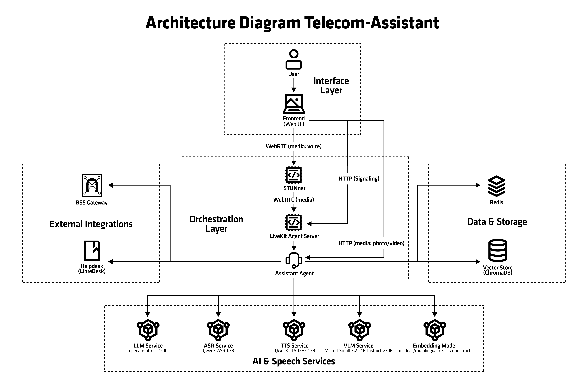

<!--
Copyright © Advanced Micro Devices, Inc., or its affiliates.

SPDX-License-Identifier: MIT
-->

# Telecom

This blueprint provides an end-to-end conversational AI solution for telecom billing inquiries. It leverages an agentic orchestration architecture with microservices for voice interaction, billing data retrieval, document search, and support ticket escalation. The solution integrates with LiveKit for real-time voice communication, BSS Gateway for billing information, and vector stores for FAQ and plan documentation.

## Architecture

<picture>
  <source media="(prefers-color-scheme: light)" srcset="architecture-diagram-light-scheme.png">
  <source media="(prefers-color-scheme: dark)" srcset="architecture-diagram-dark-scheme.png">
  
</picture>

## STUNner Integration

Media traffic from the browser-based frontend to the **LiveKit** service is routed through **STUNner** — a Kubernetes-native WebRTC media gateway.
STUNner acts as a STUN/TURN gateway, simplifying NAT traversal and firewall configuration. Direct exposure of LiveKit UDP media ports is no longer required in most setups.

For configuration details, see `docs/DEPLOYMENT.md`.

## Key Features

- Realtime voice communication via LiveKit with media traffic routed through **STUNner** (Kubernetes-native WebRTC gateway).
- Conversational voice assistant for billing inquiries: authenticate users, retrieve plan details, balance, payments, invoices, quotas.
- Agentic orchestration: agent coordinates authentication, data retrieval from BSS Gateway, document search via vector store, and ticket creation in helpdesk systems.
- Voice integration via LiveKit: supports ASR (Automatic Speech Recognition), TTS (Text-to-Speech), and real-time conversation.
- Document search: hybrid vector store with ChromaDB for FAQ and plan information.
- Support escalation: create tickets in LibreDesk for unresolved issues.
- Redis caching: store user conversation history.
- Web interface: frontend provides a user-friendly web UI for chat and voice interactions.

## Components

- **STUNner** - Kubernetes-native WebRTC media gateway (STUN/TURN) that routes browser media traffic to LiveKit.
- **Agent Service** - Main agent running on LiveKit, handles user interactions, tool calls, and orchestration.
- **BSS Gateway Service** - Mock implementation of BSS API providing billing data (balance, payments, invoices, user info, plans, quotas).
- **BSS Gateway Client** - Client for retrieving billing data (balance, payments, invoices, user info, plans, quotas).
- **Vector Store** - ChromaDB-based hybrid store for document embeddings and search.
- **Helpdesk Clients** - Clients for LibreDesk to create support tickets.
- **Relational Database** - PostrgreSQL instance for Libredesk data.
- **Redis Cache** - Caching for LibreDesk.
- **Configuration** - Settings for all services (LLM, ASR, TTS, BSS, etc.).
- **Ingestion Script** - Script to populate vector store with FAQ and plan documents.
- **Frontend Service** - Web UI built with Vite and React for user interaction with the conversational AI.

## System Requirements

- Python 3.12
- Node.js (for frontend)
- Access to external services: BSS Gateway, ChromaDB, Redis, LLM/ASR/TTS endpoints, Helpdesk APIs.
- **STUNner Operator** must be installed on the cluster (run `./install-prerequisites.sh` once per cluster; requires `cluster-admin` rights or permissions to create CRDs, ClusterRole and ClusterRoleBinding).
- Resource requirements (approximate):
  - CPU: 1-2 cores
  - Memory: 4-8 GB
  - Storage: 10-20 GB for vector store and cache

### Authentication Flow

- User provides secret passphrase for authentication.
- Agent normalizes and verifies via BSS Gateway.
- Once authenticated, agent can access user-specific billing data.

### Tool Usage

- Retrieve user info, balance, payments, plans, quotas.
- Search billing documents for FAQ and policies.
- Escalate to helpdesk by creating tickets.

## Ticket Escalation

If the agent cannot resolve the user's inquiry, it can escalate the issue by creating a support ticket in the helpdesk system (LibreDesk).

### Viewing Tickets in LibreDesk

Once a ticket is created, the agent provides the ticket ID. To view the ticket in the LibreDesk web interface:

1. Log in to the LibreDesk web interface at your configured LibreDesk URL with username 'System' and password from environment variable LIBREDESK_SYSTEM_USER_PASSWORD.
2. Navigate to the Inbox section and select "ALL".
3. Search for the ticket using the provided ticket ID or filter by user details. Note that newly created tickets appear first in the list.

## Example Scenarios

This section demonstrates typical conversation flows and agent capabilities with real-world examples.

### Scenario 1: Plan Inquiry and Upgrade Request

- **Bot:** "Hi, this is your billing assistant. How can I help you today?"
- **Client:** "Tell me about my current plan."
- **Bot:** "For security, please say your secret passphrase for your account."
- **Client:** "mars"
- **Tool:** `get_user_by_pass_phrase("mars")`
- **Bot:** "Confirmed. One moment while I check your plan."
- **Tool:** `get_user_plan_name(user_id)`
- **Tool:** `billing_docs_search("PlanName price inclusions roaming calls SMS")`
- **Bot:** "You're on the PlanName plan. It's X dollars per month and includes Y gigabytes plus unlimited national calls and texts. What should I clarify?"
- **Client:** "Is roaming included?"
- **Tool:** `billing_docs_search("PlanName roaming limit rate destinations")`
- **Bot:** "Yes. You get X megabytes of roaming per month, then it's Y dollars per megabyte. Want the destinations list?"
- **Client:** "That's too expensive, I want something cheaper."
- **Tool:** `billing_docs_search("available plans cheaper than PlanName")`
- **Bot:** "Option A is X dollars per month and could save you about Y dollars monthly, with less data but unlimited calls. Want to switch?"
- **Client:** "For sure."
- **Bot:** "What date should the new plan start, for example next month or on a specific day?"
- **Client:** "Since next month."
- **Bot:** "Understood. I'll request a switch to Option A starting next month. Please confirm."
- **Client:** "That's right."
- **Tool:** `create_ticket(user_id, "Plan change request: switch from PlanName to Option A starting next month. User confirmed.")`
- **Bot:** "All set. I've filed a request for your account manager, and they'll get back to you soon."

### Scenario 2: Slow Internet Due to High-Speed Quota Exhaustion

- **Bot:** "Hi, this is your [Operator Name] assistant. How can I help you today?"
- **Client:** "My internet is super slow, basically unusable. Apps won't load, videos buffer forever. What's going on?"
- **Bot:** "I understand how frustrating that is. For security, please tell me your secret passphrase for the account."
- **Client:** "milkyway"
- **Tool:** `get_user_by_pass_phrase("[milkyway]")`
- **Bot:** "Confirmed. One moment while I check your plan and data limits."
- **Tool:** `get_user_plan_name(user_id)`
- **Tool:** `get_plan_quotas(user_id, plan_name)`
- **Tool:** `billing_docs_search("throttling reduced speed after high-speed quota exhausted; renewal date; how to restore speed")`
- **Bot:** "Thanks — I checked your account. You're on the **[PlanName]** plan. You've used up your included high-speed data for this month, so your connection was automatically moved to a **reduced speed** (around **[slow] Mbps**). That's why everything feels slow. Your plan will reset on **[next renewal date]**, but I can help you get fast internet back immediately. Would you like to proceed?"
- **Client:** "Please go on."
- **Tool:** `billing_docs_search("available data boost options for PlanName price GB; plan upgrade options vs current plan")`
- **Bot:** "You have two quick options:
  1. **One-time data boost**: adds **[extra] GB** of high-speed data right now for **[amount]** (one-time charge on your next bill or deducted from prepaid credit). It activates in under 60 seconds and lasts until your plan renews.
  2. **Upgrade your plan**: better if you often run out. Switch to **[ProPlan]** for **[more expensive] / month** (that's **[delta]** more than now). You'll get **[large] GB** high-speed data monthly plus additional benefits.

  Which would you prefer right now — the quick **[extra] GB** boost, the plan upgrade, or should I check other options?"

- **Client:** "I don't want to pay more every month. Just give me some extra data for now."
- **Tool:** `billing_docs_search("PlanName one-time data boost confirmation terms price validity")`
- **Bot:** "Got it — the one-time boost makes sense. I can activate **[extra] GB** extra high-speed data for **[amount]** (one-time).
  Just to confirm:
  - Adds **[extra] GB** immediately
  - Cost: **[amount]** (next invoice / deducted if prepaid)
  - No change to your current plan
  - Valid until **[renewal date]**

  Is it OK to go ahead?"

- **Client:** "Yes, do it."
- **Tool:** `add_extra_quota(user_id, plan_name, quota=[extra])`
- **Tool:** `create_ticket(user_id, "quota_upsale_event: user_id=..., plan=..., extra_gb=..., amount=..., confirmed=true")`
- **Bot:** "Perfect — activating now… Done. Your high-speed data is live again. You should notice the improvement within **30–60 seconds**. Anything else I can help you with today (for example, check current usage or recommend a plan that avoids running out)?"

## LLM Model Compatibility

This Blueprint is validated with LLM backends. Designed for models of capability level not lower than aim-openai-gpt-oss-120b. Prompts tuned for this class of models.

## Terms of Use

AMD Solution Blueprints are released under [MIT License](https://opensource.org/license/mit), which governs the parts of the software and materials created by AMD. Third party Software and Materials used within the Solution Blueprints are governed by their respective licenses.
